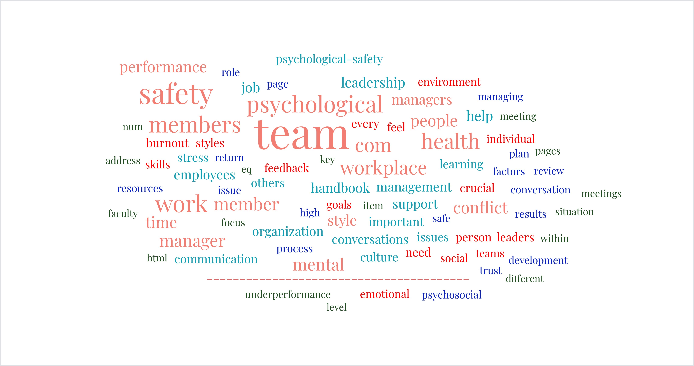
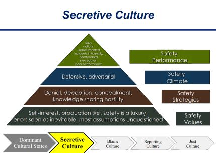
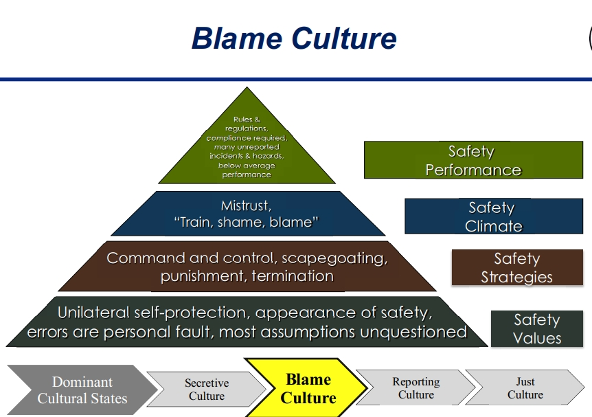
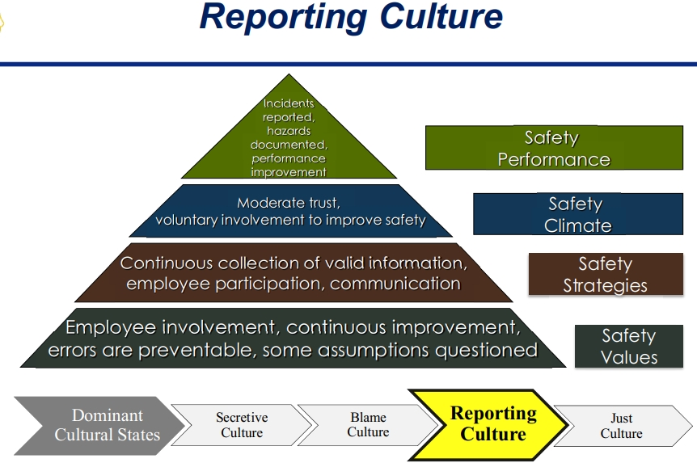
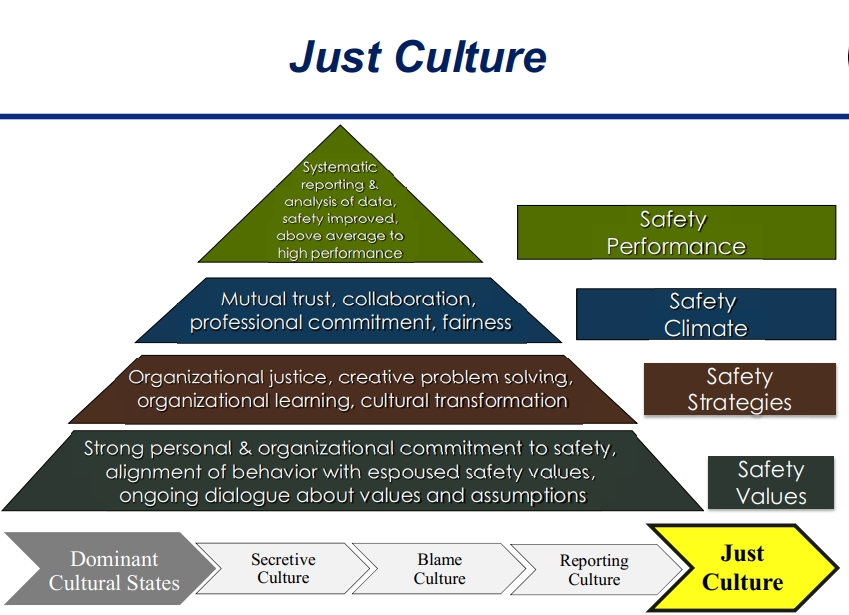
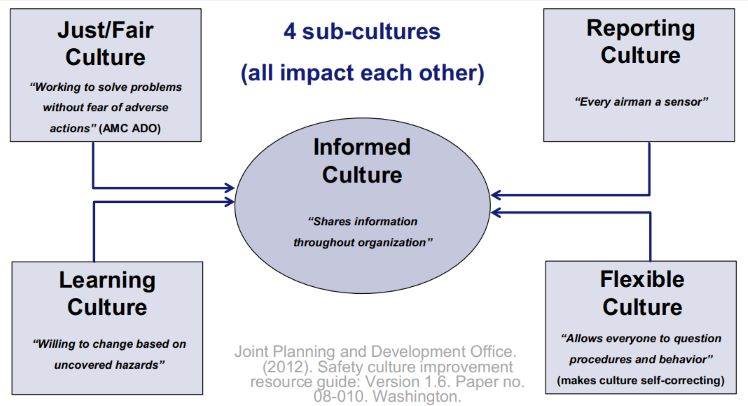
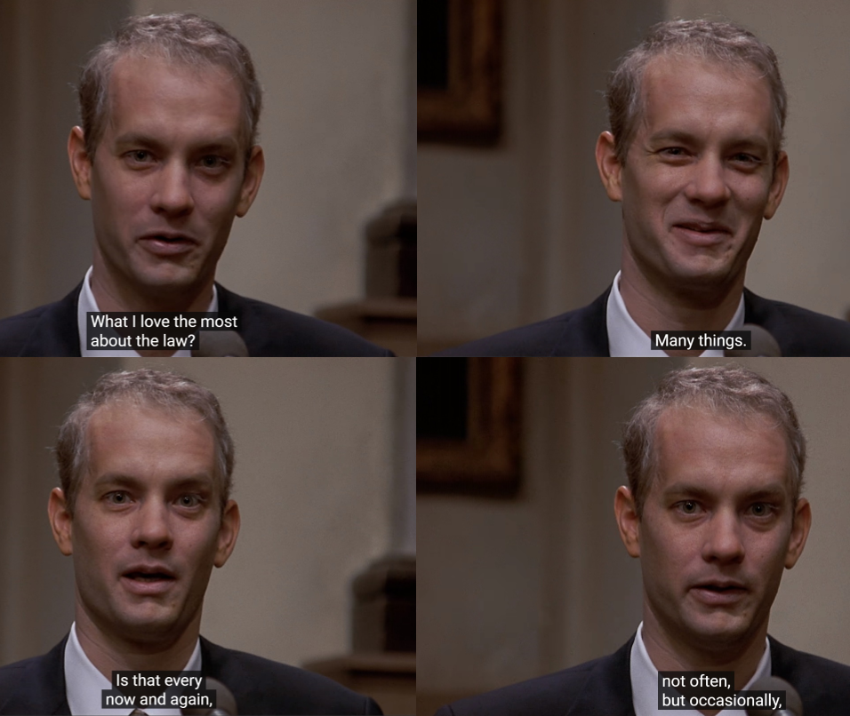
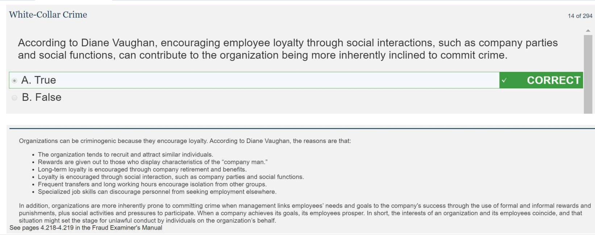
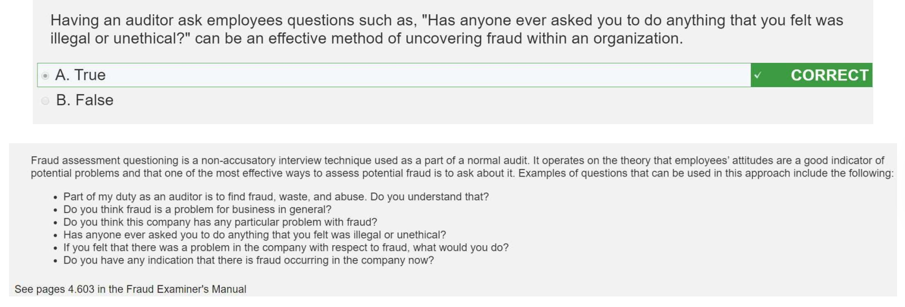

<div align="center"></div>

This page was built using [Github Pages](https://docs.github.com/en/pages/quickstart) and [Github Awesome](https://github.com/sindresorhus/awesome#readme), using [Awesome Data Science](https://awesome-datascience.academic.io/) as a [source](https://github.com/academic/awesome-datascience) template.  Our source repository is [here](https://github.com/psychological-safety-yogis/awesome-psych-safety).  

# AWESOME PSYCHOLOGICAL SAFETY
[](https://github.com/sindresorhus/awesome) 

# An awesome open-source list of ways to make your environment more psychologically safe . . . and coincidentally more successful"

```
"Garr, Joe's be the only place safe for Steve."
      /| _________~~~~~
O|===|* >_____________/
      \|
````
<div align="center"></div>

## Table of Contents
- [Table of Contents (You Are Here)](https://github.com/psychological-safety-yogis/awesome-psych-safety/blob/live/README.md#table-of-contents)
- [How to edit Github READMEs and request changes](https://github.com/psychological-safety-yogis/awesome-psych-safety/blob/live/README.md#preamble-guide-to-github-and-editing-readmes)
* #### [SECTION A - How to psych the safety](https://github.com/psychological-safety-yogis/awesome-psych-safety/blob/live/README.md#section-a---how-to-psych-the-safety)
- [What is Psychological Safety?](https://github.com/psychological-safety-yogis/awesome-psych-safety/blob/live/README.md#what-is-psychological-safety)
- [Where do I start?  Article by Denise Cooper and Katrina Hardie in Psychology Today](https://github.com/psychological-safety-yogis/awesome-psych-safety/blob/live/README.md#where-do-i-start)
- [WORD CLOUD BABY](https://github.com/psychological-safety-yogis/awesome-psych-safety/blob/live/README.md#word-cloud-of-this-readme-page-less-a-few)
- [Cheat sheet, best to worst](https://psychological-safety-yogis.github.io/awesome-psych-safety/#cheat-sheet-worst-to-best)
- [Every now and again, not often, but occasionally, you get to be a part of justice being done](https://github.com/psychological-safety-yogis/awesome-psych-safety/tree/live#the-best-sources)
- [The Best Psych Safety Resources](https://github.com/psychological-safety-yogis/awesome-psych-safety/tree/live#the-best-sources)
  - [Gitlab guide](https://github.com/psychological-safety-yogis/awesome-psych-safety/blob/live/README.md#gitlab-example)
  - [Canada's guide](https://github.com/psychological-safety-yogis/awesome-psych-safety/tree/live#canadian-centre-on-occupational-health-and-safety-guide)
  - [Psych Safety online community](https://github.com/psychological-safety-yogis/awesome-psych-safety/tree/live#psych-safety-community)
  - [Government Sources](https://github.com/psychological-safety-yogis/awesome-psych-safety/tree/live#psych-safety-community)
  - [Other good ones](https://github.com/psychological-safety-yogis/awesome-psych-safety/tree/live#other-good-ones)
- [Quotes from key leaders](https://github.com/psychological-safety-yogis/awesome-psych-safety/tree/live#quotes-from-key-business-leaders)
- [Videos](https://github.com/psychological-safety-yogis/awesome-psych-safety/blob/live/README.md#videos)
- [Articles, webpages, etc.](https://github.com/psychological-safety-yogis/awesome-psych-safety/blob/live/README.md#articles)
- [Academic sources](https://github.com/psychological-safety-yogis/awesome-psych-safety/blob/live/README.md#academic-sources)
- [O'Reilly Learning videos, playlists, books. Free through Mil OneSource, MWR Digital Libraries](https://github.com/psychological-safety-yogis/awesome-psych-safety/blob/live/README.md#oreilly-learning-videos-playlists-books-free-through-mil-onesource-mwr-digital-libraries)
- [HBR / HBS (Harvard)](https://github.com/psychological-safety-yogis/awesome-psych-safety/blob/live/README.md#hbr--hbs-harvard)
- [Podcasts](https://github.com/psychological-safety-yogis/awesome-psych-safety/blob/live/README.md#podcasts)
- [Emotional Intelligence (EQ) assessments](https://github.com/psychological-safety-yogis/awesome-psych-safety/blob/live/README.md#emotional-intelligence-eq-assessments)
- [Consulting Firm articles](https://github.com/psychological-safety-yogis/awesome-psych-safety/blob/live/README.md#consulting-firm-contributions)
- [Goodreads Lists](https://github.com/psychological-safety-yogis/awesome-psych-safety/blob/live/README.md#goodreads-lists)
- [Psych Safety Origins and Science from Flight Safety](https://github.com/psychological-safety-yogis/awesome-psych-safety/blob/live/README.md#psych-safety-origins-and-science-from-flight-safety)
  - [PDFs from Skybrary, "Bookshelf"](https://github.com/psychological-safety-yogis/awesome-psych-safety/blob/live/README.md#skybrary-bookshelf-pdfs)
- [Awesome Mental Health List (like this one! Bonus!)](https://github.com/psychological-safety-yogis/awesome-psych-safety/blob/live/README.md#bonus-awesome-mental-health-list):
  - [Awesome Mental Health](https://dreamingechoes.github.io/awesome-mental-health/#/)
  - [Source for their Github Pages / github.io page](https://github.com/dreamingechoes/awesome-mental-health)
* #### [SECTION B - Copy Pasta](https://github.com/psychological-safety-yogis/awesome-psych-safety/blob/live/README.md#section-b---copy-pasta)
- [Excerpts from Canada's Occupational Health](https://github.com/psychological-safety-yogis/awesome-psych-safety/blob/live/README.md#excerpts-from-ccoh)
  - [Fact sheets](https://github.com/psychological-safety-yogis/awesome-psych-safety/blob/live/README.md#mental-health-fact-sheets)
    - [Active Listening](https://www.ccohs.ca/oshanswers/psychosocial/mh/mentalhealth_activelistening.html)
    - [Addressing Conflicts](https://www.ccohs.ca/oshanswers/psychosocial/mh/mentalhealth_conflicts.html)
    - [Dealing with Stress in the Workplace](https://www.ccohs.ca/oshanswers/psychosocial/mh/stress_workplace.html)
    - [Having Courageous Conversations](https://www.ccohs.ca/oshanswers/psychosocial/mh/mentalhealth_conversations.html)
    - [Mental Health Introduction](https://www.ccohs.ca/oshanswers/psychosocial/mh/mentalhealth_address.html)
    - [Job Burnout](https://www.ccohs.ca/oshanswers/psychosocial/mh/mentalhealth_jobburnout.html)
    - [Psychosocial Risk Factors in the Workplace](https://www.ccohs.ca/oshanswers/psychosocial/mh/mentalhealth_risk.html) 
    - [Return to Work](https://www.ccohs.ca/oshanswers/psychosocial/mh/return_to_work.html)
    - [Recognizing and Addressing Stigma at Work](https://www.ccohs.ca/oshanswers/psychosocial/mh/mentalhealth_stigma.html)
- [The Gitlab Handbook](https://handbook.gitlab.com/)
  - [Leadership Table of Contents](https://github.com/psychological-safety-yogis/awesome-psych-safety/blob/live/README.md#gitlab-leadership-toc)


<div align="center"></div>

### Preamble guide to Github and editing READMEs

| Github how-to's | Link |
| ------------- | ------------- |
| Github Repository Search Tips | [Github Repository Search Tips](https://www.freecodecamp.org/news/github-search-tips/) |
| Github Search (Official) | [github.com/features/code-search](https://github.com/features/code-search) |
| Stack Exchange answers on searching  | [stackoverflow.com/questions/3616221/search-code-inside-a-github-project](https://stackoverflow.com/questions/3616221/search-code-inside-a-github-project) |
| Github Search updated | [github.blog/changelog/2023-05-08-the-new-code-search-and-code-view-is-now-generally-available/](https://github.blog/changelog/2023-05-08-the-new-code-search-and-code-view-is-now-generally-available/) |
| Make it your own | [Fork](https://github.com/psychological-safety-yogis/awesome-psych-safety/fork) this repo, make your changes |
| Tutorial | [How to pull request](https://github.com/psychological-safety-yogis/awesome-psych-safety/blob/live/pull_request_guide.md) |  
| How to request changes | Then create a [pull (change) request](https://github.com/psychological-safety-yogis/awesome-psych-safety/pulls) |
| Something broken? | [Create issue](https://github.com/psychological-safety-yogis/awesome-psych-safety/issues) |
| Grow the Psych Safety Wiki here | [Wiki](https://github.com/psychological-safety-yogis/awesome-psych-safety/wiki) |
| Love Psychological Safety as much as we do? | [Sponsor us!](https://github.com/sponsors/psychological-safety-yogis) | 

<br>

# SECTION A - How to psych the safety

<br>

## What is Psychological Safety?
“Psychological safety is a cornerstone for collaboration and risk-taking, essential elements for driving innovation and success in our rapidly evolving industry.” -Sundar Pichai (Alphabet/Google).

<div align="center"></div>

**[`^        back to top        ^`](#awesome-psychological-safety)**

## Where do I Start?
[Splashy psych safety attachment from the UK MOD](https://assets.publishing.service.gov.uk/government/uploads/system/uploads/attachment_data/file/1099704/Psychological_Safety_in_MOD_Major_Programmes_Report.pdf)

[Psychology Today: Creating Psychological Safety in the Workplace, by Denise Cooper](https://www.psychologytoday.com/us/blog/brain-reboot/202309/creating-psychological-safety-in-the-workplace)

"KEY POINTS: 
- Psychological safety boosts well-being, productivity, innovation, and job satisfaction, benefiting business.

- Commitment, communication, diversity, and a culture embracing improvement foster well-being and success.

Have you ever found yourself holding back a brilliant idea out of fear of ridicule or dismissal by your colleagues? This hesitation signifies a lack of psychological safety in the workplace. But imagine a different scenario—a workplace where you feel comfortable expressing your opinions openly, regardless of their imperfections. A place where you trust that your team members will listen respectfully and be receptive to your feedback. This is the kind of workplace where psychological safety thrives, the kind needed for employees and businesses in times of transformational change.

Psychological safety in the workplace is a critical factor for promoting employee well-being, job satisfaction, and productivity. Practically speaking, it means individuals can share opinions, ask questions, and express concerns without facing negative consequences. When employees feel psychologically safe, they proactively solve problems. Executives see innovation, job satisfaction, and higher returns. But how can an organization achieve psychological safety?

According to a study by Rockmann and colleagues (2019), workplace psychological safety is closely related to brain functions, enzymes, and processes that regulate emotions and cognitive processes. The amygdala, prefrontal cortex, and hypothalamus are key brain areas involved in psychological safety and emotional regulation. The amygdala, an almond-shaped structure located deep within the temporal lobe, plays a crucial role in processing emotional information, particularly fear and threat detection (Phelps & LeDoux, 2005). When employees feel psychologically unsafe in a workplace, the amygdala can become overactive, leading to heightened emotional responses and a heightened sense of threat.

The prefrontal cortex, located in the front of the brain, involves cognitive processes such as decision-making, impulse control, and working memory. It regulates emotions, particularly negative emotions such as anxiety and fear (Davidson, Putnam, & Larson, 2000). When employees feel psychologically unsafe in the workplace, the prefrontal cortex can become less active, impairing their ability to regulate their emotions and making it more challenging to think clearly and make effective decisions.

The hypothalamus, located in the brain's center, is critical in regulating the stress response (Ulrich-Lai & Herman, 2009). When employees feel psychologically unsafe, the hypothalamus can activate, releasing stress hormones such as cortisol and adrenaline. Over time, chronic activation of the stress response can lead to physical and mental health problems, such as anxiety, depression, and burnout (McEwen, 2007). Therefore, promoting workplace psychological safety is not only crucial for employees' well-being, but it can also lead to increased productivity and organizational success (Edmondson, 2018).

Enzymes such as monoamine oxidase and catechol-O-methyltransferase (COMT) regulate emotional responses in the brain. Monoamine oxidase breaks down neurotransmitters such as serotonin, dopamine, and norepinephrine, crucial in regulating mood and emotional responses. COMT breaks down dopamine, which regulates emotional responses and reward-based learning. These enzymes can be influenced by environmental factors such as stress and social support, which can impact emotional regulation and psychological safety in the workplace.

The Practical Value of Psychological Safety
Businesses operate in an ever-changing landscape and a heightened level of transition. To manage the speed of change and keep costs in control, the best executives want every employee working as part of a team. They want teams to become more engaged in error prevention and for solutions to challenges to quickly emerge. To achieve that kind of speed and focus, psychological safety encourages honest feedback, quick adaptation, and personal growth to remain relevant in the market. Consequently, employees are more likely to contribute and help without needing to be asked to do so.

Strategies for Creating Psychological Safety
Creating psychological safety requires ongoing effort and commitment. Here are some tips to help you achieve it:

Start with Leadership. Leaders set the tone. Effective leaders play a crucial role in fostering psychological safety by modeling desired behaviors, including acknowledging their own mistakes and demonstrating vulnerability.
Encourage Open Communication. Active listening, non-judgmental feedback, and respectful communication contribute to an environment of psychological safety. Share stories and examples of how psychological safety has improved workplaces, recognize and encourage open communication, and engage employees in collaborative problem-solving.
Foster Inclusivity. Encourage cognitive diversity as a driving factor for innovation. Create a workplace that celebrates and embraces cognitive differences, where everyone feels capable of sharing their ideas. Train employees to recognize and mitigate cognitive biases that can hinder critical thinking and data processing.
Continuously Improve. Create an environment where it's acceptable to make mistakes and learn from them. Regularly evaluate policies and practices to ensure that they support psychological safety, making changes when necessary.
Remember, creating psychological safety is an ongoing process that requires commitment from employers and employees alike. To foster a workplace culture that values psychological safety, promotes well-being, and drives business success is an intentional act of leadership."

**[`^        back to top        ^`](#awesome-psychological-safety)**

## Word Cloud of this README page, less a few

<br/>
<div align="center"></div>
<br/>

# Cheat sheet, worst to best

## Worst, secretive culture: 

<br/>
<div align="center"></div>
<br/>

## Second-worst, blame culture:

<br/>
<div align="center"></div>
<br/>

## Second-best, reporting culture: 

<br/>
<div align="center"></div>
<br/>

## The winner: JUST culture, as in justice.  Dharma.  You get it . . . 
*Read more on just as in justice culture in the [Skybrary files](https://github.com/psychological-safety-yogis/awesome-psych-safety/blob/live/README.md#skybrary-bookshelf-pdfs)*

<br/>
<div align="center"></div>
<br/>

## Overview: 
<br/>
<div align="center"></div>
<br/>

## Every now and again, not often, but occasionally, you get to be a part of justice being done
<br/>
<div align="center"></div>

<div align="center"></div>
<br/>


## The Best Sources

### Gitlab guide

[handbook.gitlab.com/handbook/leadership/emotional-intelligence/](https://handbook.gitlab.com/handbook/leadership/emotional-intelligence/)

[handbook.gitlab.com/handbook/leadership/emotional-intelligence/psychological-safety-short-course/](https://handbook.gitlab.com/handbook/leadership/emotional-intelligence/psychological-safety-short-course/) 

[handbook.gitlab.com/handbook/leadership/emotional-intelligence/psychological-safety/](https://handbook.gitlab.com/handbook/leadership/emotional-intelligence/psychological-safety/) 

[https://handbook.gitlab.com/handbook/leadership/emotional-intelligence/social-styles/](handbook.gitlab.com/handbook/leadership/emotional-intelligence/social-styles/) 

### Canadian Centre on Occupational Health and Safety guide 

Similarly, Canada’s occupational safety agency has a great guide, not just for psychological safety (or psychosocial safety), but all safety factors.

[ccohs.ca/oshanswers/psychosocial/phs/mentalhealth_checklist_phs.html](https://www.ccohs.ca/oshanswers/psychosocial/phs/mentalhealth_checklist_phs.html)

[ccohs.ca/oshanswers/psychosocial/phs/phs_controllinghazards.html](https://www.ccohs.ca/oshanswers/psychosocial/phs/phs_controllinghazards.html)

[ccohs.ca/oshanswers/psychosocial/phs/phs_evaluation.html](https://www.ccohs.ca/oshanswers/psychosocial/phs/phs_evaluation.html)

[ccohs.ca/oshanswers/psychosocial/](https://www.ccohs.ca/oshanswers/psychosocial/) 

[ccohs.ca/oshanswers/](https://www.ccohs.ca/oshanswers/)

[ccohs.ca/oshanswers/psychosocial/mh/mentalhealth_risk.html](https://www.ccohs.ca/oshanswers/psychosocial/mh/mentalhealth_risk.html) 

### Psych Safety community
UK-based Psychological Safety community, ready to field your questions and familiar with psych safety as it relates to military.

[Join the Psychological Safety Community – Psychological Safety, powered by Iterum Ltd (psychsafety.co.uk)](https://psychsafety.co.uk/psychological-safety-community/)

[Their Slack community direct link](https://join.slack.com/t/psychsafety/shared_invite/zt-p0xlx85u-vjkgxHkrpQw4r7C0wU3tAA)

[What is Psychological Safety? History and Research – Psychological Safety, powered by Iterum Ltd (psychsafety.co.uk)](https://psychsafety.co.uk/about-psychological-safety/)

[Psychological Safety Tool Kit – Psychological Safety, powered by Iterum Ltd (psychsafety.co.uk)](https://psychsafety.co.uk/tool-kit/)

[psychsafety.co.uk/five-key-elements-of-high-performing-teams-and-psychological-safety/](https://psychsafety.co.uk/five-key-elements-of-high-performing-teams-and-psychological-safety/) 

### Government Sources

[Leadership_Guide-How_listening_and_learning_are_our_best_defence-_May_2022.pdf](https://assets.publishing.service.gov.uk/media/628e2e998fa8f55618cd3700/Leadership_Guide-How_listening_and_learning_are_our_best_defence-_May_2022.pdf)

[assets.publishing.service.gov.uk/government/uploads/system/uploads/attachment_data/file/1099704/Psychological_Safety_in_MOD_Major_Programmes_Report.pdf](https://assets.publishing.service.gov.uk/government/uploads/system/uploads/attachment_data/file/1099704/Psychological_Safety_in_MOD_Major_Programmes_Report.pdf)

[ideas-in-action.lbl.gov/inclusion/psychological-safety](https://ideas-in-action.lbl.gov/inclusion/psychological-safety)

[appel.nasa.gov/2022/10/24/critical-knowledge-insight-psychological-safety-for-effective-team-communication/](https://appel.nasa.gov/2022/10/24/critical-knowledge-insight-psychological-safety-for-effective-team-communication/)

[research.iscrr.com.au/prevention/workplace-risks/safety-culture-and-climate](https://research.iscrr.com.au/prevention/workplace-risks/safety-culture-and-climate)

[Navy and Marine Corps Psychological and Emotional Well-being Psychological and Emotional Well Being (navy.mil)](https://www.med.navy.mil/Navy-and-Marine-Corps-Force-Health-Protection-Command/Population-Health/Health-Promotion-and-Wellness/Psychological-and-Emotional-Well-Being/)


[Relaxation (navy.mil)](https://www.med.navy.mil/Navy-and-Marine-Corps-Force-Health-Protection-Command/Population-Health/Health-Promotion-and-Wellness/-RELAXATION/)

### Other good ones

[humanfactors101.com/topics/safety-leadership/](https://humanfactors101.com/topics/safety-leadership/)

[betterup.com/blog/why-psychological-safety-at-work-matters](https://www.betterup.com/blog/why-psychological-safety-at-work-matters)

[amycedmondson.com/psychological-safety/](https://amycedmondson.com/psychological-safety/)

**[`^        back to top        ^`](#awesome-psychological-safety)**

## Quotes from [Key business Leaders](https://newyorkimprovtheater.com/2023/11/21/10-business-leaders-endorse-psychological-safety-corporate-culture-leadership-team-building/)

- Satya Nadella (Microsoft): “Psychological safety is crucial for fostering a culture of innovation, where every team member feels empowered to contribute.”

- Sheryl Sandberg (Facebook): “Creating a workplace with psychological safety encourages employees to share their ideas and perspectives without fear of judgment.”

- Tim Cook (Apple): “Open communication and trust are foundational to psychological safety, enabling teams to collaborate effectively and drive success.”

- Susan Wojcicki (YouTube): “In a psychologically safe environment, employees are more likely to take risks, learn from failures, and contribute to a culture of continuous improvement.”

- Reed Hastings (Netflix): “A culture of candor and openness is essential for psychological safety, allowing teams to thrive and adapt in a fast-paced business landscape.”

- Ginni Rometty (IBM): “Psychological safety is key to fostering a climate of innovation, where employees feel encouraged to experiment and embrace change.”

- Brian Chesky (Airbnb): “Fostering a workplace culture that values diverse perspectives and encourages open communication is fundamental to psychological safety.”

- Arvind Krishna (IBM): “Continuous innovation is closely tied to psychological safety, where employees feel secure to challenge the status quo and propose new ideas.”

- Marc Benioff (Salesforce): “Trust and psychological safety go hand in hand, creating an environment where employees feel supported in taking risks and pushing boundaries.”

- Sundar Pichai (Alphabet/Google): “Psychological safety is a cornerstone for collaboration and risk-taking, essential elements for driving innovation and success in our rapidly evolving industry.”

**[`^        back to top        ^`](#awesome-psychological-safety)**

## Videos: 


| Title | Link |
| ------ | ----- |
| Building a psychologically safe workplace Amy Edmondson TEDxHGSE | [youtube.com/watch?v=LhoLuui9gX8](https://www.youtube.com/watch?v=LhoLuui9gX8) |
| What is Psychological Safety, and How do you create Psychological Safety at Work? | [youtube.com/watch?v=73FfNvGePMg](https://www.youtube.com/watch?v=73FfNvGePMg) |
| How Google builds the perfect team, with Charles Duhigg | [youtube.com/watch?v=v2PaZ8Nl2T4](https://www.youtube.com/watch?v=v2PaZ8Nl2T4) |
| Leading Psychological Safety: Obligations and Opportunities with Dr Hillary Bennett | [youtube.com/watch?v=waD9K4MQG_U](https://www.youtube.com/watch?v=waD9K4MQG_U) |
| Just Culture in an Organization | [skybrary.aero/video/just-culture-organization](https://www.skybrary.aero/video/just-culture-organization) |
| Safety Culture Evolution General Introduction | [skybrary.aero/video/safety-culture-evolution-general-introduction](https://www.skybrary.aero/video/safety-culture-evolution-general-introduction) |
| Safety Culture Evolution Episode 1 | [skybrary.aero/video/safety-culture-evolution-episode-1](https://www.skybrary.aero/video/safety-culture-evolution-episode-1) |
| Safety Culture Evolution Episode 2 | [skybrary.aero/video/safety-culture-evolution-episode-2](https://www.skybrary.aero/video/safety-culture-evolution-episode-2) |
| Safety Culture Evolution Episode 3 | [skybrary.aero/video/safety-culture-evolution-episode-3](https://www.skybrary.aero/video/safety-culture-evolution-episode-3) |
| The Case for Psychological Safety and Better Teams Rafael Chiuzi TEDxMcMasterU | [youtube.com/watch?v=MO3k6eGEJ5w](https://www.youtube.com/watch?v=MO3k6eGEJ5w) |
| Psychological health - Is the work safe? Do I feel safe? | [youtube.com/watch?v=UkccLEzaPTI](https://www.youtube.com/watch?v=UkccLEzaPTI) |
| What a Trusting Team Feels Like Simon Sinek | [youtube.com/watch?v=0ui9rxIUKxg](https://www.youtube.com/watch?v=0ui9rxIUKxg) |
| Emotional Safety: How to Improve Relationships and Communication #2 | [youtube.com/watch?v=hEfCxEdDtGU](https://www.youtube.com/watch?v=hEfCxEdDtGU) |
| What is psychological safety? | [youtube.com/watch?v=GZgmoxOgfig](https://www.youtube.com/watch?v=GZgmoxOgfig) |
| How Psychological Safety has been the bedrock of key innovation programs at Google | [youtube.com/watch?v=-zrLI-Osg88](https://www.youtube.com/watch?v=-zrLI-Osg88) |
| What is Psychological Safety, and why is it important? | [youtube.com/watch?v=eHJN6rAMVQI](https://www.youtube.com/watch?v=eHJN6rAMVQI) | 
| Why we (like Google) should strive for team psychological safety | [youtube.com/watch?v=IH67P7EMnt0](https://www.youtube.com/watch?v=IH67P7EMnt0) |
| How does psychological safety impact performance? | [youtube.com/watch?v=2630mnn3U5Y](https://www.youtube.com/watch?v=2630mnn3U5Y) |
| The Neuroscience of Psychological Safety | [youtube.com/watch?v=ugQuuHoI-zw](https://www.youtube.com/watch?v=ugQuuHoI-zw) |


**[`^        back to top        ^`](#awesome-psychological-safety)**

## Articles: 
[psychsafety.co.uk/psychological-safety-books/](https://psychsafety.co.uk/psychological-safety-books/)

[Lessons Learned from Alcoa: Establishing a Safety Culture to Improve Business Performance](https://orionrisk.com/lessons-learned-from-alcoa/)

"Clear accountability. Anytime a worker was injured, the unit president had to report it to O’Neill within 24 hours and present a plan to ensure the injury never happened again. **That meant that vice presidents had to be in constant communication with floor managers,** and floor managers needed to get workers to raise warnings as soon as they saw a problem. **Workers learned to keep a list of suggestions nearby so that when the vice presidents asked for a plan, there was an idea box already full of possible solutions. Any employee at any level had a channel for getting their ideas in front of the highest levels of leadership."**

[How Paul O’Neill Fought For Safety At Alcoa](https://davidburkus.com/2020/04/how-paul-oneill-fought-for-safety-at-alcoa/)

"It wasn’t an overnight transformation, but Paul O’Neill’s internal fight against accidents—his fight for worker safety gradually changed the systems and the culture. **Since prioritizing worker safety meant studying the production process, the improvements made also made the plants run more efficiently.** Since monitoring and responding to accidents meant constantly communicating safety numbers and ideas for increasing safety, **eventually executives began sharing other data and other ideas more rapidly as well."**

[The Power of Safety Leadership: Paul O’Neill, Safety and Alcoa](https://aerossurance.com/helicopters/paul-oneill-safety-alcoa-power-safety-leadership/)

"Employees were told not to be afraid to suggest proactive maintenance. And **O’Neill sent a note to every worker telling them call him at home if managers didn’t follow up on their safety suggestions.**

#### The Essence of Safety Leadership

And what happened?  **That focus on *seeking suggestions* and acting on them helped give permission not only for safety improvements but a whole range of continuous improvements (observation, identification, analysis and action) across all aspects of their operations: 
'Workers started calling, but they didn’t want to talk about accidents,' O’Neill told me. *'They wanted to talk about all these other great ideas.*'"**

[workclout.com/blog/how-alcoa-quintupled-their-revenue-by-focusing-on-worker-safety](https://www.workclout.com/blog/how-alcoa-quintupled-their-revenue-by-focusing-on-worker-safety)

[Alcoa's Paul O'Neill Relied On Analysis And Safety To Boost His Company To The Forefront](https://www.investors.com/news/management/leaders-and-success/alcoas-paul-oneill-relied-on-analysis-and-safety-to-boost-his-company-to-the-forefront/)

[gallup.com/workplace/236198/create-culture-psychological-safety.aspx](https://www.gallup.com/workplace/236198/create-culture-psychological-safety.aspx)

[hrmagazine.co.uk/content/features/hr-must-build-psychological-safety-so-employees-feel-safe-speaking-up](https://www.hrmagazine.co.uk/content/features/hr-must-build-psychological-safety-so-employees-feel-safe-speaking-up)

[hrmagazine.co.uk/content/features/the-importance-of-psychological-safety](https://www.hrmagazine.co.uk/content/features/the-importance-of-psychological-safety)

[Creating Psychological Safety in the Workplace - Psychology Today](https://www.psychologytoday.com/us/blog/brain-reboot/202309/creating-psychological-safety-in-the-workplace)

[army.mil/article/245626/how_psychological_safety_creates_cohesion_a_leaders_guide](https://www.army.mil/article/245626/how_psychological_safety_creates_cohesion_a_leaders_guide)

[Leaders or Commanders?  By Carl Hartford on LinkedIn](https://www.linkedin.com/pulse/leaders-commanders-carl-hartford)

[greatplacetowork.com/resources/blog/psychological-safety-workplace](https://www.greatplacetowork.com/resources/blog/psychological-safety-workplace)

[apa.org/topics/healthy-workplaces/psychological-safety](https://www.apa.org/topics/healthy-workplaces/psychological-safety)

[nytimes.com/2016/02/28/magazine/what-google-learned-from-its-quest-to-build-the-perfect-team.html](https://www.nytimes.com/2016/02/28/magazine/what-google-learned-from-its-quest-to-build-the-perfect-team.html)

[knowledge.insead.edu/leadership-organisations/psychological-safety-unlocks-potential-diverse-teams](https://knowledge.insead.edu/leadership-organisations/psychological-safety-unlocks-potential-diverse-teams)

[Trend Watch: Rise of the Chief Wellness Officer - WebMD Health Services](https://www.webmdhealthservices.com/blog/trend-watch-rise-of-the-chief-wellness-officer/)

[behavioralscientist.org/the-intelligent-failure-that-led-to-the-discovery-of-psychological-safety/](https://behavioralscientist.org/the-intelligent-failure-that-led-to-the-discovery-of-psychological-safety/)

[accelerate.uofuhealth.utah.edu/improvement/psychological-safety-for-teams](https://accelerate.uofuhealth.utah.edu/improvement/psychological-safety-for-teams)

[safetyandhealthmagazine.com/articles/21201-psychological-safety-hot-concept-workplace-safety](https://www.safetyandhealthmagazine.com/articles/21201-psychological-safety-hot-concept-workplace-safety)

[sciencedirect.com/science/article/abs/pii/S1053482217300013](https://www.sciencedirect.com/science/article/abs/pii/S1053482217300013)

**[`^        back to top        ^`](#awesome-psychological-safety)**

## Academic Sources
[cipp.ug.edu.pl/The-model-of-psychological-safety-of-a-soldier-s-personality,140500,0,2.html](https://cipp.ug.edu.pl/The-model-of-psychological-safety-of-a-soldier-s-personality,140500,0,2.html)

[researchgate.net/publication/276002402_Team_Training_Team_Learning_Leadership_and_Psychology_Safety_A_Study_of_Team_Training_and_Team_Learning_Behavior_during_a_Swedish_Military_Staff_Exercise](https://www.researchgate.net/publication/276002402_Team_Training_Team_Learning_Leadership_and_Psychology_Safety_A_Study_of_Team_Training_and_Team_Learning_Behavior_during_a_Swedish_Military_Staff_Exercise)

[research.iscrr.com.au/__data/assets/pdf_file/0004/474439/Union-comparison-safety-climate-OHS-leadership-and-worker-engagement.pdf](https://research.iscrr.com.au/__data/assets/pdf_file/0004/474439/Union-comparison-safety-climate-OHS-leadership-and-worker-engagement.pdf)

[Psychological safety: A systematic review of the literature - ScienceDirect](https://www.sciencedirect.com/science/article/abs/pii/S1053482217300013)

[https://web.mit.edu/curhan/www/docs/Articles/15341_Readings/Group_Performance/Edmondson%20Psychological%20safety.pdf](https://web.mit.edu/curhan/www/docs/Articles/15341_Readings/Group_Performance/Edmondson%20Psychological%20safety.pdf)

[How Psychological Safety Affects Team Performance: Mediating Role of Efficacy and Learning Behavior - PMC (nih.gov)](https://www.ncbi.nlm.nih.gov/pmc/articles/PMC7393970/)

[The interactive effects of conscientiousness, work effort, and psychological climate on job performance - ScienceDirect](https://www.sciencedirect.com/science/article/abs/pii/S000187910400096X)

[research-collection.ethz.ch/bitstream/handle/20.500.11850/385339/Dissertation_SonjaFoerster_2019.pdf](https://www.research-collection.ethz.ch/bitstream/handle/20.500.11850/385339/Dissertation_SonjaFoerster_2019.pdf)

**[`^        back to top        ^`](#awesome-psychological-safety)**

## O'Reilly Learning videos, playlists, books. Free through Mil OneSource, MWR Digital Libraries
[Psychological Safety and Workplace Inclusion, by Daniel Rust](https://learning.oreilly.com/playlists/bdd33cce-7d13-43ec-b22c-e1b03a935ef7/)

[Psychological Safety by Heather Roby](https://learning.oreilly.com/playlists/82c0f645-0c73-456a-b79e-07de1d8f74b1/)

[Fostering Ethical Conduct Through Psychological Safety](https://learning.oreilly.com/library/view/fostering-ethical-conduct/53863MIT63402/)

[Vertical Growth by Michael Bunting, Carl Lemieux](https://learning.oreilly.com/library/view/vertical-growth/9780730395515/)

[How to Heal a Workplace, by Kerry Howard](https://learning.oreilly.com/library/view/how-to-heal/9781394154470/)

[Teaming: How Organizations Learn, Innovate, and Compete in the Knowledge Economy, by Amy C. Edmondson, Edgar H. Schein](https://learning.oreilly.com/library/view/teaming-how-organizations/9781118216767/)

[Why Innovation Depends on Intellectual Honesty](https://learning.oreilly.com/library/view/why-innovation-depends/53863MIT64303/)

[Workplace Well-being: How to Build Psychologically Healthy Workplaces](https://learning.oreilly.com/library/view/workplace-well-being-how/9781118469439/)

[How to Engage Skeptics in Culture Interventions by Amy C. Edmondson, Per Hugander](https://learning.oreilly.com/library/view/how-to-engage/53863MIT64329/)

[13,088 Search results for psychological safety](https://learning.oreilly.com/search/?q=psychological%20safety&type=article&type=book&type=journal&type=shortcut&rows=10)

[Connectable, by Ryan Jenkins, George Newbern, Steven Van Cohen](https://learning.oreilly.com/videos/connectable/9781638411611/)

[How Microsoft applied human factors ideas to software development by Jessica DeVita](https://learning.oreilly.com/videos/how-microsoft-applied/0636920423782/)

[Building engineering teams under pressure at Slack, by Julia Grace](https://learning.oreilly.com/videos/building-engineering-teams/0636920459668/)

[Future Human: Empathy](https://learning.oreilly.com/videos/future-human-empathy/2411202305FH/)

[The People Equation by Deborah Perry Piscione, David Crawley](https://learning.oreilly.com/library/view/the-people-equation/9781626566439/)

**[`^        back to top        ^`](#awesome-psychological-safety)**

## HBR / HBS (Harvard)
[hbr.org/2023/02/what-is-psychological-safety](https://hbr.org/2023/02/what-is-psychological-safety )

[4 Steps to Boost Psychological Safety at Your Workplace (hbr.org)](https://hbr.org/2021/06/4-steps-to-boost-psychological-safety-at-your-workplace)

[hbs.edu/recruiting/insights-and-advice/blog/post/how-to-create-a-psychologically-safe-workplace](https://www.hbs.edu/recruiting/insights-and-advice/blog/post/how-to-create-a-psychologically-safe-workplace)

[hbs.edu/recruiting/insights-and-advice/blog/post/leading-in-tough-times](https://www.hbs.edu/recruiting/insights-and-advice/blog/post/leading-in-tough-times)

[hbs.edu/recruiting/insights-and-advice/blog/post/creating-inclusive-recruiting-events-in-a-time-of-innovation](https://www.hbs.edu/recruiting/insights-and-advice/blog/post/creating-inclusive-recruiting-events-in-a-time-of-innovation)

[hbr.org/2018/04/the-two-traits-of-the-best-problem-solving-teams](https://hbr.org/2018/04/the-two-traits-of-the-best-problem-solving-teams)

[hbswk.hbs.edu/item/four-steps-to-build-the-psychological-safety-that-high-performing-teams-need-today](https://hbswk.hbs.edu/item/four-steps-to-build-the-psychological-safety-that-high-performing-teams-need-today)

[hbr.org/2022/03/research-to-excel-diverse-teams-need-psychological-safety](https://hbr.org/2022/03/research-to-excel-diverse-teams-need-psychological-safety)

| Link | Description |
| --- | --- | 
| [hbs.edu/faculty/Pages/item.aspx?num=61676](https://www.hbs.edu/faculty/Pages/item.aspx?num=61676) | Feeling Seen: Leader Eye Gaze Promotes Psychological Safety, Participation, and Voice |
| [hbs.edu/faculty/Pages/item.aspx?num=20682](https://www.hbs.edu/faculty/Pages/item.aspx?num=20682) | Explaining Psychological Safety in Innovation Teams |
| [hbs.edu/faculty/Pages/item.aspx?num=50683](https://www.hbs.edu/faculty/Pages/item.aspx?num=50683) | Understanding Psychological Safety in Healthcare and Education Organizations: A Comparative Perspective |
| [hbs.edu/faculty/Pages/item.aspx?num=23399](https://www.hbs.edu/faculty/Pages/item.aspx?num=23399) | Overcoming Barriers to Collaboration: Psychological Safety and Learning in Diverse Teams |
| [hbs.edu/faculty/Pages/item.aspx?num=62294](https://www.hbs.edu/faculty/Pages/item.aspx?num=62294) | Psychological Safety and Fearless Organisations |
| [hbs.edu/faculty/Pages/item.aspx?num=62296](https://www.hbs.edu/faculty/Pages/item.aspx?num=62296) | Creating Psychological Safety in the Workplace |
| [hbs.edu/faculty/Pages/item.aspx?num=58211](https://www.hbs.edu/faculty/Pages/item.aspx?num=58211) | The Psychological Safety Imperative |
| [hbs.edu/faculty/Pages/item.aspx?num=61993](https://www.hbs.edu/faculty/Pages/item.aspx?num=61676) | Exploring the Relationship between Team Diversity, Psychological Safety and Team Performance: Evidence from Pharmaceutical Drug Development |
| [hbs.edu/faculty/Pages/item.aspx?num=62287](https://www.hbs.edu/faculty/Pages/item.aspx?num=62287) | How to Build Psychological Safety in Your Workplace with The Fearless Organization Author, Amy C. Edmondson |
| [hbs.edu/faculty/Pages/item.aspx?num=60426](https://www.hbs.edu/faculty/Pages/item.aspx?num=60426) | The Impact of Covid-19 on Psychological Safety in the Workplace (Interview) |
| [hbs.edu/faculty/Pages/item.aspx?num=54851](https://www.hbs.edu/faculty/Pages/item.aspx?num=54851) | The Fearless Organization: Creating Psychological Safety in the Workplace for Learning, Innovation, and Growth |
| [hbs.edu/faculty/Pages/item.aspx?num=62225](https://www.hbs.edu/faculty/Pages/item.aspx?num=62225) | How Psychological Safety and Feeling Heard Relate to Burnout and Adaptation Amid Uncertainty |
| [hbs.edu/faculty/Pages/item.aspx?num=23401](https://www.hbs.edu/faculty/Pages/item.aspx?num=23401) | Psychological Safety |
| [hbs.edu/faculty/Pages/item.aspx?num=62297](https://www.hbs.edu/faculty/Pages/item.aspx?num=62297) | How to Build Psychological Safety, with Amy Edmondson |
| [hbs.edu/faculty/Pages/item.aspx?num=50688](https://www.hbs.edu/faculty/Pages/item.aspx?num=50688) | Psychological Safety |
| [hbs.edu/faculty/Pages/item.aspx?num=57981](https://www.hbs.edu/faculty/Pages/item.aspx?num=57981) | Psychological Safety and Near Miss Events in Radiation Oncology |
| [hbs.edu/faculty/Pages/item.aspx?num=63309](https://www.hbs.edu/faculty/Pages/item.aspx?num=63309) | Psychological Safety Comes of Age: Observed Themes in an Established Literature |
| [hbs.edu/faculty/Pages/item.aspx?num=53934](https://www.hbs.edu/faculty/Pages/item.aspx?num=53934) | The Strategic Imperative of Psychological Safety and Organizational Error Management |
| [hbs.edu/faculty/Pages/item.aspx?num=60423](https://www.hbs.edu/faculty/Pages/item.aspx?num=60423) | From Orientation to Behavior: The Interplay Between Learning Orientation, Open-mindedness, and Psychological Safety in Team Learning |
| [hbs.edu/faculty/Pages/item.aspx?num=2959](https://www.hbs.edu/faculty/Pages/item.aspx?num=2959) | Psychological Safety and Learning Behavior in Work Teams |
| [hbs.edu/faculty/Pages/item.aspx?num=36470](https://www.hbs.edu/faculty/Pages/item.aspx?num=36470) | Varied Experience, Team Familiarity, and Learning: The Mediating Role of Psychological Safety |
| [hbs.edu/faculty/Pages/item.aspx?num=22109](https://www.hbs.edu/faculty/Pages/item.aspx?num=22109) | Workplace Safety at Alcoa (A) |

**[`^        back to top        ^`](#awesome-psychological-safety)**

## Podcasts: 
[podcasts.apple.com/us/podcast/live-brave-with-dr-margie-warrell/id1435730743?i=1000623994998](https://podcasts.apple.com/us/podcast/live-brave-with-dr-margie-warrell/id1435730743?i=1000623994998) 

[hbr.org/podcast/2019/01/creating-psychological-safety-in-the-workplace](https://hbr.org/podcast/2019/01/creating-psychological-safety-in-the-workplace)

[hbr.org/podcast/2021/12/psychological-safety-in-theory-and-in-practice](https://hbr.org/podcast/2021/12/psychological-safety-in-theory-and-in-practice)

**[`^        back to top        ^`](#awesome-psychological-safety)**

<div align="center"></div>

## Emotional intelligence (EQ) assessments
[Color Code Personality Test](https://www.colorcode.com/free_personality_test/?timestamp=1588009250.89&hash=667424d7d32a031b41b6896af6ab1ad7)

[Global Leadership Foundation EQ Test]( https://globalleadershipfoundation.com/geit/eitest.html)

[Mind Tools EQ Quiz](https://www.mindtools.com/pages/article/ei-quiz.htm)

[University of California at Berkley EQ Assessment](https://greatergood.berkeley.edu/quizzes/ei_quiz/take_quiz)

[Psychology Today EQ Test](https://www.psychologytoday.com/us/tests/personality/emotional-intelligence-test)

[Growth versus Fixed Mindset Assessment]( https://blog.mindsetworks.com/what-s-my-mindset)

**[`^        back to top        ^`](#awesome-psychological-safety)**


<div align="center"></div>

## Consulting Firm articles: 


[mckinsey.com/featured-insights/mckinsey-explainers/what-is-psychological-safety](https://www.mckinsey.com/featured-insights/mckinsey-explainers/what-is-psychological-safety)

[Psychological safety and leadership development McKinsey](https://www.mckinsey.com/capabilities/people-and-organizational-performance/our-insights/psychological-safety-and-the-critical-role-of-leadership-development)

[Psychological Safety: A Cornerstone Key to Leading an Innovative Team (getlighthouse.com)](https://getlighthouse.com/blog/psychological-safety-innovative-teams/)

[mckinsey.com/featured-insights/mckinsey-explainers/what-is-psychological-safety](https://www.mckinsey.com/featured-insights/mckinsey-explainers/what-is-psychological-safety)

[Manager's Toolkit: Actionable 'How To' Blog Posts (getlighthouse.com)](https://getlighthouse.com/blog/category/how-tos-for-managers/)

[Toxic Positivity in the Workplace: Why & How to Deal with it (getlighthouse.com)](https://getlighthouse.com/blog/toxic-positivity-in-the-workplace/)

[Protection from Harm – Surgeon General Essential #1 kgopm.com)](https://www.kgopm.com/essential-1-protection-from-harm/)

[trainingindustry.com/articles/diversity-equity-and-inclusion/the-business-of-learning-episode-42-building-psychological-safety-in-learning-programs/](https://trainingindustry.com/articles/diversity-equity-and-inclusion/the-business-of-learning-episode-42-building-psychological-safety-in-learning-programs/)

[forum.org.nz/resources/mental-wellbeing-at-work/psychologicalsafety/](https://www.forum.org.nz/resources/mental-wellbeing-at-work/psychologicalsafety/)

[forum.org.nz/assets/Factsheet-Psychological-safety-at-work-final.pdf](https://www.forum.org.nz/assets/Factsheet-Psychological-safety-at-work-final.pdf)

**[`^        back to top        ^`](#awesome-psychological-safety)**


<div align="center"></div>

## Goodreads Lists
[goodreads.com/list/show/146945.Best_Leadership_Books_Nonprofits_Religious](https://www.goodreads.com/list/show/146945.Best_Leadership_Books_Nonprofits_Religious_)

[goodreads.com/list/show/169217.Developing_Emotional_Intelligence](https://www.goodreads.com/list/show/169217.Developing_Emotional_Intelligence)

[goodreads.com/list/show/109343.I_O_Psychology_Books](https://www.goodreads.com/list/show/109343.I_O_Psychology_Books)

[goodreads.com/list/show/157325.Best_Books_on_Thinking_and_Decision_Making](https://www.goodreads.com/list/show/157325.Best_Books_on_Thinking_and_Decision_Making)

[goodreads.com/list/show/3886.Books_Every_Businessperson_Should_Read](https://www.goodreads.com/list/show/3886.Books_Every_Businessperson_Should_Read)

[goodreads.com/list/show/128460.psychology_the_power_of_the_mind](https://www.goodreads.com/list/show/128460.psychology_the_power_of_the_mind)

[goodreads.com/list/show/143532.Healthcare_Reading_](https://www.goodreads.com/list/show/143532.Healthcare_Reading_)

**[`^        back to top        ^`](#awesome-psychological-safety)**


<div align="center"></div>

## Psych Safety Origins and Science from Flight Safety

[skybrary.aero/articles/organisational-culture](https://www.skybrary.aero/articles/organisational-culture)

[skybrary.aero/articles/safety-culture](https://www.skybrary.aero/articles/safety-culture)

[skybrary.aero/articles/safety-culture-enhancement-toolbox-atm](https://www.skybrary.aero/articles/safety-culture-enhancement-toolbox-atm)

[skybrary.aero/articles/safety-culture-atm](https://www.skybrary.aero/articles/safety-culture-atm)

[skybrary.aero/articles/just-culture](https://www.skybrary.aero/articles/just-culture)

[skybrary.aero/articles/building-just-culture](https://www.skybrary.aero/articles/building-just-culture)

[skybrary.aero/enhancing-safety/just-culture/about-just-culture/just-culture-manifesto](https://www.skybrary.aero/enhancing-safety/just-culture/about-just-culture/just-culture-manifesto)

[skybrary.aero/enhancing-safety/just-culture](https://www.skybrary.aero/enhancing-safety/just-culture)

[skybrary.aero/tutorials/safety-and-justice](https://www.skybrary.aero/tutorials/safety-and-justice)

[skybrary.aero/articles/just-culture-day-day-operations](https://www.skybrary.aero/articles/just-culture-day-day-operations)

[skybrary.aero/enhancing-safety/just-culture/just-culture-knowledge-centre](https://www.skybrary.aero/enhancing-safety/just-culture/just-culture-knowledge-centre)

[skybrary.aero/articles/safety-and-justice-online-toolkit](https://www.skybrary.aero/articles/safety-and-justice-online-toolkit)

[skybrary.aero/articles/verbal-communication](https://skybrary.aero/articles/verbal-communication)

[skybrary.aero/articles/socio-cultural-effects-flight-deck](https://skybrary.aero/articles/socio-cultural-effects-flight-deck)

[skybrary.aero/articles/trust](https://skybrary.aero/articles/trust)

[skybrary.aero/articles/pilot-mental-health](https://skybrary.aero/articles/pilot-mental-health)

[skybrary.aero/enhancing-safety/just-culture/just-culture-aviation](https://www.skybrary.aero/enhancing-safety/just-culture/just-culture-aviation)

[skybrary.aero/enhancing-safety/just-culture/just-culture-healthcare](https://www.skybrary.aero/enhancing-safety/just-culture/just-culture-healthcare)

[skybrary.aero/enhancing-safety/just-culture/just-culture-maritime](https://www.skybrary.aero/enhancing-safety/just-culture/just-culture-maritime)

[skybrary.aero/enhancing-safety/just-culture/just-culture-rail](https://www.skybrary.aero/enhancing-safety/just-culture/just-culture-rail)

[skybrary.aero/articles/situational-awareness](https://skybrary.aero/articles/situational-awareness)

[skybrary.aero/articles/pilot-workload](https://skybrary.aero/articles/pilot-workload)

[skybrary.aero/articles/stress](https://skybrary.aero/articles/stress)

[skybrary.aero/articles/fatigue-risk-maintenance](https://skybrary.aero/articles/fatigue-risk-maintenance)

[skybrary.aero/articles/fatigue-management-guidance-air-traffic-controllers-and-air-traffic-engineers](https://skybrary.aero/articles/fatigue-management-guidance-air-traffic-controllers-and-air-traffic-engineers)

[skybrary.aero/articles/mood](https://skybrary.aero/articles/mood)

[skybrary.aero/articles/human-factor-emergencies](https://skybrary.aero/articles/human-factor-emergencies)

[skybrary.aero/articles/human-error-types](https://skybrary.aero/articles/human-error-types)

[skybrary.aero/articles/surprise](https://skybrary.aero/articles/surprise)

[skybrary.aero/articles/startle-reflex](https://skybrary.aero/articles/startle-reflex)

[skybrary.aero/articles/risk-perception](https://skybrary.aero/articles/risk-perception) 

[skybrary.aero/articles/recovery-failure](https://skybrary.aero/articles/recovery-failure)

[skybrary.aero/articles/error-reporting](https://skybrary.aero/articles/error-reporting)

[skybrary.aero/articles/complacency](https://skybrary.aero/articles/complacency)

[skybrary.aero/articles/confirmation-bias](https://skybrary.aero/articles/confirmation-bias)

[skybrary.aero/articles/flight-crew-expectation-bias](https://skybrary.aero/articles/flight-crew-expectation-bias)

[skybrary.aero/articles/skill-fade](https://skybrary.aero/articles/skill-fade)

[skybrary.aero/articles/recency-bias](https://skybrary.aero/articles/recency-bias)

[skybrary.aero/articles/human-factors-dirty-dozen](https://skybrary.aero/articles/human-factors-dirty-dozen)

[skybrary.aero/articles/single-person-operations-atc](https://skybrary.aero/articles/single-person-operations-atc)

[skybrary.aero/articles/stress-air-traffic-control](https://skybrary.aero/articles/stress-air-traffic-control)

**[`^        back to top        ^`](#awesome-psychological-safety)**

## Skybrary Bookshelf (PDFs)

| Description | Link |
| --- | --- |
| WHY WON’T WORKERS SPEAK UP? THE DIFFERENCE BETWEEN PSYCHOLOGICAL SAFETY AND TRUST | [skybrary.aero/sites/default/files/bookshelf/6104.pdf](https://skybrary.aero/sites/default/files/bookshelf/6104.pdf) |
| APPLYING JUST CULTURE IN RAIL: DRAWING PARALLELS FROM AVIATION | [skybrary.aero/sites/default/files/bookshelf/34360.pdf](https://skybrary.aero/sites/default/files/bookshelf/34360.pdf) |
| WELLBEING, CULTURE AND THE NEED FOR A PSYCHOLOGICALLY SAFE ENVIRONMENT | [skybrary.aero/sites/default/files/bookshelf/5670.pdf](https://skybrary.aero/sites/default/files/bookshelf/5670.pdf) | 
| The Flight Safety Foundation Safety Forum | [skybrary.aero/sites/default/files/bookshelf/34209.pdf](https://skybrary.aero/sites/default/files/bookshelf/34209.pdf) |
| THE WAY WE DO THINGS AROUND HERE: CONVERSATIONS ABOUT NORMS | [skybrary.aero/sites/default/files/bookshelf/6087.pdf](https://skybrary.aero/sites/default/files/bookshelf/6087.pdf) |
| Systems Thinking for Safety: Ten Principles | [skybrary.aero/sites/default/files/bookshelf/5026.pdf](https://skybrary.aero/sites/default/files/bookshelf/5026.pdf) | 
| ESTABLISHMENT OF ‘JUST CULTURE’ PRINCIPLES IN ATM SAFETY DATA REPORTING AND ASSESSMENT | [skybrary.aero/sites/default/files/bookshelf/235.pdf](https://www.skybrary.aero/sites/default/files/bookshelf/235.pdf) |
| Just culture in Europe and Beyond Setting the scene | [https://www.skybrary.aero/sites/default/files/bookshelf/4793.pdf](https://www.skybrary.aero/sites/default/files/bookshelf/4793.pdf) |
| European Organisation for the Safety of Air Navigation The JUST CULTURE Deliverables: Model Prosecution Policy, Support and Communication | [skybrary.aero/sites/default/files/bookshelf/4794.pdf](https://www.skybrary.aero/sites/default/files/bookshelf/4794.pdf) |
| CAN WE SERVE THE INTERESTS OF AVIATION SAFETY and JUST CULTURE? | [skybrary.aero/sites/default/files/bookshelf/4811.pdf](https://www.skybrary.aero/sites/default/files/bookshelf/4811.pdf) |
| Do You Have a Safety Culture? | [skybrary.aero/sites/default/files/bookshelf/234.pdf](https://www.skybrary.aero/sites/default/files/bookshelf/234.pdf) |
| A Roadmap to a Just Culture: Enhancing the Safety Environment | [skybrary.aero/sites/default/files/bookshelf/233.pdf](https://www.skybrary.aero/sites/default/files/bookshelf/233.pdf) |

**[`^        back to top        ^`](#awesome-psychological-safety)**

## Bonus Awesome Mental Health List:
  - [Awesome Mental Health](https://dreamingechoes.github.io/awesome-mental-health/#/)
  - [Source for their Github Pages / github.io page](https://github.com/dreamingechoes/awesome-mental-health/#/)

----------------------------------------------------------------------------------------------------------------------------------

<br>

# SECTION B - Copy Pasta
------------------------------------------
<br>

## Excerpts from Canadian Centre on Occupational Health and Safety, or CCOHS

### Mental Health Fact Sheets

[View all fact sheets A-Z](https://www.ccohs.ca/oshanswers/az.html)

[Search fact sheets](https://www.ccohs.ca/search/?section=oshanswers)

1.	[Mental Health - Active Listening]( https://www.ccohs.ca/oshanswers/psychosocial/mh/mentalhealth_activelistening.html)

2.	[Mental Health - Addressing Conflicts](https://www.ccohs.ca/oshanswers/psychosocial/mh/mentalhealth_conflicts.html)

3.	[Mental Health - Dealing with Stress in the Workplace](https://www.ccohs.ca/oshanswers/psychosocial/mh/stress_workplace.html)

4.	[Mental Health - Having Courageous Conversations](https://www.ccohs.ca/oshanswers/psychosocial/mh/mentalhealth_conversations.html)

5.	[Mental Health - How to Address and Support](https://www.ccohs.ca/oshanswers/psychosocial/mh/mentalhealth_address.html)

6.	[Mental Health - Introduction](https://www.ccohs.ca/oshanswers/psychosocial/mh/mentalhealth_intro.html)

7.	[Mental Health - Job Burnout](https://www.ccohs.ca/oshanswers/psychosocial/mh/mentalhealth_jobburnout.html)

8.	[Mental Health - Psychosocial Risk Factors in the Workplace](https://www.ccohs.ca/oshanswers/psychosocial/mh/mentalhealth_risk.html)

9.	[Mental Health - Return to Work](https://www.ccohs.ca/oshanswers/psychosocial/mh/return_to_work.html)

10.	[Mental health - Recognizing and Addressing Stigma at Work](https://www.ccohs.ca/oshanswers/psychosocial/mh/mentalhealth_stigma.html)

•	Why is good communication an important skill?

•	What are some tips for follow for active listening?

•	What are tips when looking for body language?

•	What are other tips for positive communication in a workplace?
________________________________________
Why is good communication an important skill?
 
Good communication is more than just talking. It involves active listening, being genuine, and having empathy. As part of communication, active listening is a structured way of listening and responding to others. When actively listening, your attention is focused on the other person in an attempt to understand, interpret, and evaluate what they are telling you. The key is to communicate without judgment. In a workplace setting, you may collaborate with people to set individual, realistic performance goals, establish dates for giving feedback, and measure progress toward reaching those goals. These techniques will help create a more effective and positive working relationship.
________________________________________
What are some tips for follow for active listening?
 
•	Make eye contact. Note that in some cultures, excessive eye contact can be seen as inappropriate, aggressive, or rude. Be intent, but don’t stare.

•	Focus on what is being said. Do not do other activities at the same time such as monitor for e-mails, answer the telephone, etc.

•	Listen and allow the person to speak. Do not interrupt. You may want to “fix” things, but if you have not heard the entire situation, you may be fixing the wrong issue.

•	Allow pauses. Some people may need time to think about and formulate their answers. Do not pressure someone to answer quickly.

•	Ask questions. If something is not clear, asking for more detail about it in a friendly and non-judgmental way shows interest and concern.

•	Repeat for confirmation. When you repeat what you heard, you reduce the chance of misperceptions and confusion. Give the other person a chance to correct any misunderstanding of what you think you heard.

•	Reflect on what you heard.

•	Listen between the lines. Look for clues in body language that may reveal how the person is feeling about whatever you are talking about (posture, facial expressions, eye contact, etc.)
________________________________________
What are tips when looking for body language?
 
Pay attention to:
•	Proximity – standing too close or too far away

•	Posture – disapproval or dislike versus interest

•	Gestures – eye contact, hand movements

•	Facial expressions – nodding, smiling, shaking your head

•	Silence – interest, concern, stimulation of further talk; or disapproval, disinterest, disbelief

•	Actions supporting the words that the person is saying

Don’t forget that your tone of voice and body language are also part of the message.
Please see the OSH Answers on Mental Health - Having Courageous Conversations for more information about verbal and non-verbal communication.
________________________________________
What are other tips for positive communication in a workplace?
 
Other tips include to:
•	Look for solutions. Do not rehash an old problem.

•	Think about “what else” can be discussed or learned. If you give yourself time to hear the whole story, you are less likely to jump to conclusions or assumptions.

•	Do not focus on providing solutions immediately. Time may be needed for both parties to come to a solution that works best for both sides. If the decision or solution is reached with consensus, it is more likely that people will be committed to its success.

•	Allow a person to clarify their comments. Sometimes what we say is not what we mean. Take the time to clarify what you heard and determine if htat matches what they intended to say.
________________________________________

•	Fact sheet first published: 2018-10-30

•	Fact sheet confirmed current: 2022-01-25

•	Fact sheet last revised: 2018-10-30

2.	Mental Health - Addressing Conflicts
Why do people have conflicts?
•	Why do people have conflicts?

•	What can an employer do?

•	What are some ways of informally resolving conflicts?

•	What are more tips for resolving conflicts?

•	What is mediation?

•	What steps are involved in mediation?

 
Conflicts are inevitable. Having different goals and styles can actually promote innovative solutions, creativity, and help bring about change. However negative results happen when conflicts are associated with blame, anger, and grudges. No matter what the source of the conflict is, resolution before the situation escalates is essential.
When addressing conflicts, a key step is focus on the issue, not the person.
________________________________________
What can an employer do?
 
When investigating conflicts in the workplace, be sure to look for root causes especially if conflicts seem to be increasing. The root cause may come from any number of sources.
Strategies to successfully address conflicts in the workplace include::

Do:
•	Encourage employees to seek constructive resolution for conflicts.

•	Clarify exactly what the issue is.

•	Understand that for most situations, there is an objective (factual) version of events, and a subjective (personal) view.

•	Listen carefully and actively to fully understand the situation.

•	Find common ground.

•	Make sure people know it is okay to disagree at times.

•	Treat everyone with respect and professionalism.

•	Learn how to listen effectively (give undivided attention, do not do other activities at the same time such as monitor for e-mails, answer the phone, etc. ).

•	Move from justification to resolution. Focus on actions in the future, not the past.

•	Set clear boundaries.

•	Have clearly defined job descriptions to help people understand their roles and what is expected of them.

•	Define acceptable behaviour. Understanding what is appropriate and what is not will help avoid conflicts.

Don't
•	Do not blame or judge anyone. Instead, look for opportunities to resolve the situation.

•	Do not give advice. The best resolutions come from the people involved. If asked or if appropriate, you can offer ideas for discussion.
•	Do not demand change. Try to find areas where collaboration or compromise can be made.
________________________________________
What are some ways of informally resolving conflicts?
 
Employees should be encouraged to seek help when resolving conflicts. The situation should be brought to the attention of the relevant parties. Employees may wish to try discussing the situation with the person (or people) they are in conflict with, or they may wish to ask for help from other people.

If the issue is not serious or severe, resolution process can come from within the employee's department, if possible. If the employee feels uncomfortable raising the issue within their department, they should know where to seek help. Options may be to work with the Human Resources department, a designated manager, or through the use of an external professional.

Not all situations will require the same option or method of resolution. You may find that one type of strategy works well for certain situations or people, and not in other situations or with certain people.

Try to remain flexible and use a variety of strategies including:

Avoiding: In some cases, it may be appropriate to leave a conflict unresolved. In other cases, just leave the conflict unresolved for a cooling off period.

Accommodating: Accepting that there is a minor conflict (an “agreeing to disagree” arrangement) can be an important gesture for minor issues. Accommodating on the small issues may help to build trust and respect between those with the conflict.

Confronting: Discussing face-to-face in a respectful and professional manner may also help. Be sure to consider the other person's position and feelings on the issue. Confronting may include explaining why certain decisions were made (“I did not use your idea because…”) and, if necessary, a further explanation such as “But unfortunately, the final decision for the project was made by (name) for those reasons”.

Collaborating: Like confronting, you discuss the situation directly with the other person. However, you may decide to follow the explanation with an offer to involve the other person in another way. (“But, I was wondering if you had any ideas about… ”).

Compromising: With this option, the differences in opinion are discussed. A plan or option is reached together, and often both sides agree to modify their position.

Communication: Clear communication is essential for good working relationships. Often, subtle differences in verbal and nonverbal communications can change the way a situation is seen and interpreted. The more emotional the situation becomes, the more these cues affect our interpretation of the event(s).
________________________________________

What are more tips for resolving conflicts?
 
•	Try to put yourself in the other person's position so that you can better understand how to address the issue.

•	Ask for his or her recommendation.

•	Repeat back to the person what you feel he or she is asking or telling you in order to clarify what you are hearing.

•	Accept criticism in a positive way. When a complaint might be true, use statements like “you are probably right” or “it was my fault”. If the criticism seems unwarranted, ask for clarification.

•	Be honest. Do not make false statements or promises you cannot keep.

•	Take the person seriously and be respectful.

•	Break down the issue into smaller units and offer step-by-step solutions so the person is not overwhelmed by the complete situation.

•	Be reassuring. Point out or offer choices.

•	Do not take sides.

•	Do not reject the person's demands or position from the start. Use a neutral, non-judgmental comment such as “that is an option”.
________________________________________

What is mediation?
 
Mediation is a more formal way to reach an understanding of the issue(s). The mediator should be someone who does not have an emotional stake in the outcome. Mediators may be from within the company, or a professional from outside. Resolving conflicts works best when people are calm, and can shift the focus to the issue instead of the people.
________________________________________

What steps are involved in mediation?
 
1.	Schedule a meeting between the people experiencing the conflict after everyone has calmed down. The cooling down period is essential as it will help disassociate the emotions from the issues. Pick an appropriate time and place where all parties feel they are able to speak openly. Ensure that everyone in the meeting knows that they are invited to help get to the bottom of the situation.

2.	Have people take turns explaining their position, issues or feelings. They should not be interrupted while speaking. Have someone else take notes. Encourage people to talk by asking questions like “What did you say?” or “What did you do?” rather than simply asking for their version of an event.

3.	The note-taker should read back what each person said. Each person should confirm that the notes are accurate.

4.	Invite everyone to brainstorm for solutions to the issue. Brainstorming does not place blame, nor should it be judgemental about whether an idea is good or bad.

5.	Discuss these ideas. Talk about how each idea might work, or how it might not work.

6.	Find a solution to the conflict that everyone can accept. This solution may not be anyone's first choice, but it is important that all of the people find it acceptable. If possible, let the people experiencing the conflict decide on a solution. They may need to agree on aspects such as what the issue is, what procedures to follow, what change is needed, and/or what steps to take in the future. If they cannot agree, then the mediator may have to make a decision. In either case, be clear about expectations and how everyone will know if the solution is working.

7.	Put the solution into place for a set period of time (such as a week or two).

8.	Follow-up and schedule a second meeting to make sure that the solution is working. Make any necessary adjustments to the solution if need be. Lessons learned from follow-up discussions may help to prevent similar situations from happening again.
________________________________________
•	Fact sheet last revised: 2021-12-17

3.	Mental Health - Dealing with Stress in the Workplace
On this page

•	How can I deal with workplace stress?

•	How do I know if someone is (or if I am) having trouble coping with stress?

•	How can I identify stress triggers?

•	What are some tips I can use to help manage my reaction to stress?

•	What are some ways to get support?
________________________________________

How can I deal with workplace stress?
 
There are many ways to be proactive when dealing with stress. Do not forget that elements of the workplace itself can be a cause of stress. Mental fitness, self help, taking healthy steps, stress management training, and counselling services can be helpful to individuals, but do not forget to look for the root cause(s) of the stress and to address them.

Employers and organizations are encouraged to see these other OSH Answers documents about how to help prevent stress in the workplace:

•	Mental Health - Introduction

•	Mental Health - Psychosocial Risk Factors in the Workplace

•	Mental Health - How to Address and Support

•	Workplace Health and Well-being - Comprehensive Workplace Health and Safety Program
However, in some cases, the origin of the stress is something that cannot be changed immediately. Therefore, finding ways to help maintain personal good mental health is also essential.
________________________________________

How do I know if someone is (or if I am) having trouble coping with stress?
 
Below is a quiz from the Canadian Mental Health Association to help identify the extent of a person’s stress:

What's Your Stress Index

DO YOU FREQUENTLY:	YES	NO

Neglect your diet?	 	 

Try to do everything yourself?	 	 

Blow up easily?	 	 

Seek unrealistic goals?	 	 

Fail to see the humour in situations others find funny?	 	 

Act rude?	 	 

Make a 'big deal' of everything?	 	 

Look to other people to make things happen?	 	 

Have difficulty making decisions	 	 

Complain you are disorganized?	 	 

Avoid people whose ideas are different from your own?	 	 

Keep everything inside?	 	 

Neglect exercise?	 	 

Have few supportive relationships?	 	 

Use sleeping pills and tranquilizers without a doctor's approval?	 	 

Get too little rest?	 	 

Get angry when you are kept waiting?	 	 

Ignore stress symptoms?	 	 

Put things off until later?	 	 

Think there is only one right way to do something?	 	 

Fail to build relaxation time into your day?	 	 

Gossip?	 	 

Race through the day?	 	 

Spend a lot of time complaining about the past?	 	 

Fail to get a break from noise and crowds?	 	 

Adapted from: What's Your Stress Index? Canadian Mental Health Association.

Interpretation of the score (based on the number of “Yes” selections):

•	0-5:  There are few hassles in your life. Make sure though, that you are not trying to 
deliberately avoid problems.

•	6-10: You've got your life in fairly good control. Work on the choices and habits that could still be causing you some unnecessary stress in your life.

•	11-15: You are approaching the danger zone. You may be suffering stress-related symptoms and your relationships could be strained. Think carefully about choices you've made and take relaxation breaks every day.

•	16-25: Emergency! It is critical that you stop and re-think how you are living; change your attitudes and pay careful attention to diet, exercise and relaxation.
________________________________________

How can I identify stress triggers?
 
For some people, it may help to try to identify what causes you to have a reaction.
Record or keep a journal for a week or two to identify which situations create the most stress and how you respond to them (physical, mental, emotional). Include a brief description of each situation, answering questions such as:

•	Where were you?

•	Who was involved?

•	What was your reaction? (Did you raise your voice? Get a snack from the vending machine? Become emotional? Go for a walk?)

•	How did you feel?
Taking notes can help you find patterns among your stressors and your reactions to them.
Next, review your journal. You might find obvious causes of stress, such as the threat of losing your job or obstacles with a particular project. You might also notice subtle but persistent causes of stress, such as a long commute, pace of work, many interruptions, or an uncomfortable workspace.
________________________________________

What are some tips I can use to help manage my reaction to stress?
 
Try some of the following steps:

•	Build confidence: Identify your abilities and weaknesses. Accept them, build on them, and try your best whenever you can.

•	Prioritize: Take charge of the situation by taking 10 minutes at the beginning of each day to prioritize and organize your day. Be honest with colleagues, but be constructive and make practical suggestions.

•	Talk to others: Talk with trusted colleagues or friends about the issues you are facing at work. They might be able to provide insights or offer suggestions. Sharing a problem with others who have had similar experiences may help you find a solution.

•	Set boundaries: Set limits to when you will work extra hours (including when you will take work calls or check for e-mails outside regular work hours).

•	Eat right, keep fit: A balanced diet, exercise, and rest can help you to reduce stress and enjoy life. Learn to relax, take several deep breaths throughout the day, or have regular stretch breaks.

•	Make time for family and friends: These relationships need to be nurtured; if taken for granted they will not be there to share life's joys and sorrows.

•	Give and accept support from friends and family.

•	Create a meaningful budget: Financial problems cause stress. Over-spending on our wants instead of our needs can be added stress.

•	Volunteer: Being involved in community can give a sense of purpose and satisfaction.

•	Learn to laugh: Share a laugh with a co-worker, watch a funny movie at home with friends, read the comics, and try to see the humour in the situation.

•	Identify and deal with moods: We all need to find safe and constructive ways to express our feelings of anger, sadness, joy and fear.

•	Learn to be at peace with yourself: Get to know who you are, what makes you really happy, and learn to balance what you can and cannot change about yourself.
Other mental fitness tips include:

•	Give yourself permission to take a break from your worries and concerns. Recognize that dedicating even a short time every day to your mental fitness will help you feel rejuvenated and more confident.

•	"Collect" positive emotional moments - Make a point of recalling times when you have experienced pleasure, comfort, tenderness, confidence or other positive things.

•	Do one thing at a time - Be "present" in the moment, whether out for a walk or spending time with friends, turn off your cell phone and your mental "to do" list.

•	Enjoy hobbies - Hobbies can bring balance to your life by allowing you to do something you enjoy because you want to do it.

•	Set personal goals - Goals don't have to be ambitious. They could be as simple as finishing a book, walking around the block every day, learning a new hobby, or calling your friends instead of e-mailing. Whatever goal you set, reaching it will build confidence and a sense of satisfaction.

•	Express yourself - Whether in a journal or talking to a wall, expressing yourself after a stressful day can help you gain perspective, release tension, and boost your body's resistance to illness.

•	Treat yourself well - Take some "you" time to help relax- whether it's cooking a good meal, mediation, participating in sports, seeing a movie, go for a walk, play with your family and pets - do something that brings you joy.
________________________________________

What are some ways to get support?
 
Support may come in many ways, including:

•	Talk to your supervisor: Start by having an open conversation with your supervisor. They may not be aware that you are struggling. The purpose of the meeting is to come up with an effective plan for managing your work or the stressors you've identified so you can perform at your best on the job. While some parts of the plan may be designed to help you improve your skills in areas such as time management, other elements might include clarifying what is expected of you, getting necessary resources or support from colleagues, enriching your job to include more challenging or meaningful tasks, or making changes to your physical workspace to make it more comfortable and reduce strain.

•	Set realistic goals. Work with management to set realistic expectations and deadlines. Set regular progress reviews and adjust your goals as needed.

•	Seek and accept help. Your employer may also have resources available through an employee assistance program (EAP), including online information, available counseling and referral to mental health professionals, if needed. Accepting help from trusted friends and family members or professionals can improve your ability to manage stress.
If you continue to feel overwhelmed by work stress, you may want to talk to your doctor, a mental health professional, or psychologist who can help you better manage stress. Know when to seek help.
________________________________________

•	Fact sheet first published: 2018-06-01

•	Fact sheet confirmed current: 2022-01-25

•	Fact sheet last revised: 2018-06-01

4.	Mental Health - Having Courageous Conversations
On this page

•	How can I support someone with mental health issues?

•	How can workplaces support their workers?

•	How do I have “that” conversation with a worker?

•	What are some tips for effective verbal communication?

•	What are tips for effective non-verbal behaviour and communication?

•	What employers can do for mental well-being in the workplace?

•	What can workers do to address their mental well-being?

________________________________________

How can I support someone with mental health issues?
 
Often we are hesitant to reach out to help a friend or co-worker who is struggling for fear of saying the wrong thing, offending the other person, or worrying that you are not qualified to ask about their health.

However, asking someone a simple “Are you okay?” is a great place to start when it comes to supporting individuals who may be facing mental health challenges. Remember, you don’t need to be a therapist to show compassion and empathy to individuals who may be facing struggles or challenges with their mental health.

________________________________________

How can workplaces support their workers?
 
Workplaces have a responsibility to protect workers’ health and safety, including to protect them from any workplace factor that may impact their mental health. This duty must be balanced with other responsibilities such as fulfilling business and operational requirements. An organization’s key asset is their workers, and ensuring a worker is healthy and able to perform their duties to the best of their ability is usually considered to be the right thing to do. Creating a safe space so the worker can share and discuss their concerns will foster a caring culture of support in which everyone benefits.
________________________________________

How do I have “that” conversation with a worker?
 
If a change in a worker’s behaviour or performance is noticed, there is a duty to inquire. A meeting should be scheduled to discuss any concerns and issues that may be noticed. If there are concerns about performance and completing work, this fact should not be the first focus. Start with what you have observed, such as “I’ve noticed lately…” or “You haven’t been yourself lately, are you okay?”

These conversations may not be successful the first time, but continual follow up and discussion should bring about trust and empathy so the employee feels comfortable in sharing if there is something affecting their mental health. Active listening skills are necessary so the worker feels safe and secure in sharing private details about their mental health.
________________________________________

What are some tips for effective verbal communication?
 
•	Focus your attention on the other person to let them know you are interested in what they have to say.

•	Listen carefully. Do not interrupt with unsolicited advice or criticism.

•	Be observant. Decide if it is a good time to interrupt, or if you should wait for a more appropriate time to speak.

•	Be aware of how you are delivering your words.

•	Speak calmly, quietly, and confidently.

•	Use common words. Do not use official language, jargon, or complex terminology.

•	Encourage the person to talk.

•	Remain open minded and objective.

•	Acknowledge the person’s feelings. If they appear upset, indicate that you can see they are upset.

•	Try to understand. Ask questions like “help me understand why you are upset.” Once you think you understand, repeat it back to the person so they know you understand.

•	Remain calm if the situation becomes heated, and try to gently calm the other person (but do not yell “calm down!”). Do not allow the other person’s anger to become your anger.
________________________________________

What are tips for effective non-verbal behaviour and communication?
 
•	Use calm body language. Have a relaxed posture with unclenched hands and an attentive expression.

•	Position yourself at a right angle to the person, rather than directly in front of them.

•	Give the person enough physical space. This distance varies by culture but normally 2 to 4 feet is considered an adequate distance.

•	Get on the other person’s physical level. If they are seated, try kneeling or bending rather than standing over them.

•	Pay attention to the person. Do not do anything else at the same time such as answer phone calls, read e-mails, etc.

•	Do not stand or sit in a challenging stance such as:

o	standing directly opposite someone

o	putting your hands on your hips

o	pointing your finger

o	waving your arms

o	crossing your arms

•	Do not glare or stare. It may be perceived as a challenge.

•	Do not make sudden movements. These movements can be seen as threatening.
________________________________________

What employers can do for mental well-being in the workplace?
 
Some strategies for creating a positive space for protecting mental health include:

•	Create an organizational culture that values worker input in all aspects, including planning, policy making, and setting goals.

•	Be sure that managers and supervisors act to support the organization’s values.

•	Balance job demands with workers’ capabilities and resources.

•	Have clearly defined job descriptions to help people understand their roles and what is expected of them.

•	Provide leadership and mental health training for managers and supervisors to learn their roles in promoting positive mental health.

•	Encourage and create opportunities for learning, skill development, personal growth, and social interaction with other workers.

•	Address psychosocial hazards as equally as you would safety or other hazards.

•	Provide opportunities or programs that assist individuals in maintaining good health, such as a fitness policy or healthy food choices.

________________________________________

What can workers do to address their mental well-being?
 
Some strategies for workers to protect their mental health include:

•	Seek help when needed. Talk to your supervisor, human resources, or health and safety representative. Use the Employee Assistance Program if available.

•	Participate in planning with your manager to balance work demands and work load.

•	Find a hobby or activity that helps you relax and brings happiness, and then do it regularly.

•	Share your feelings with someone you trust, or write them down in a journal.

•	Acknowledge when things are going well. Celebrate your successes.

•	Get to know who you are, what makes you happy, and what your stress triggers are. Learn to acknowledge what you can and cannot change about yourself or the situation.

•	Develop healthy habits such as regular exercise, adequate sleep, and a balanced diet.
________________________________________

•	Fact sheet first published: 2018-07-03

•	Fact sheet last revised: 2018-07-03

5.	Mental Health - How to Address and Support
On this page

•	Why should employers be concerned about mental health?

•	Are there any specific issues in the workplace that affect employee mental health?

•	What can workplaces do to support mental health?

•	What can be done to gain support and participation across the organization?

•	What else can employers do?

•	Does CCOHS have any other resources to help?

________________________________________

Why should employers be concerned about mental health?
 
The overall health of a workplace includes both the physical and psychological well-being of its workers. By treating mental health and its psychological component equally with the physical environment, a workplace can support their workers' overall well-being. Poor mental health not only hurts the individual, it also reduces corporate profits. It's important that all levels of the workplace – including the Board of Directors, management, finance, and human resources departments – get involved to incorporate mental health at your workplace. It is also necessary to engage your health and safety committee and workers – we all have a shared responsibility for health and safety, including mental health.

There is no one "right way" to create a mentally healthy workplace because every workplace is different – from the people doing the work, to the work that needs to be done, to the leaders running the organization, the size of the organization, the external environment that influences the community, and the external resources the company draws. All of these factors play a role in employee mental health.

There is also a legislative requirement for employers to protect the mental and physical health of their employees. Many provincial occupational health and safety acts have been expanded to include harm to psychological well-being in the definition of harassment. In jurisdictions that do not have explicit legislation dealing with psychological health in the workplace, the general duty clause would apply. Some legislation now recognizes psychological health and safety as part of overall health and safety responsibilities by using terms like ‘psychological well being’ and ‘psychological injury’. Psychological health and safety can also be found in the following legislated areas:

•	Definition of harassment and violence

•	Purpose of the Act

•	Definition of health and safety

•	Definition of injury

•	Adjustment of the work environment to address the well-being of the worker

In jurisdictions that do not have explicit legislation addressing psychological health in the workplace, the general duty clause would apply. Please refer to the legislation in your jurisdiction for specific requirements.
 
________________________________________

Are there any specific issues in the workplace that affect employee mental health?
 
Research has identified several workplace factors – known as psychosocial risk factors (PSR) – that can have an impact on organizational health, the health of individual employees, and the financial bottom line. The way work is carried out and the context in which work occurs can have a significant impact on an employee's mental health – positively or negatively. When employees have a negative exposure to these factors, there is potential for the development of stress, demoralization, depressed mood, anxiety, or burnout.

Organizations need to consider all of these in their efforts to create a mentally healthy workplace. The factors are:

•	Balance

•	Civility and Respect

•	Clear Leadership and Expectations

•	Engagement

•	Growth and Development

•	Involvement and Influence

•	Organizational Culture

•	Protection of Physical Safety

•	Psychological Competencies and Demands

•	Psychological Protection

•	Psychological and Social Support

•	Recognition and Reward

•	Workload Management

Workplace issues that can also affect mental health include:

•	stigma and discrimination

•	demand/control and effort/reward relationships

•	presenteeism

•	job burnout

•	harassment, violence, bullying and mobbing

•	problematic substance us

For more information about these issues, please see the OSH Answers Mental Health - Psychosocial Risk Factors.
________________________________________

What can workplaces do to support mental health?
 
A psychologically safe and healthy workplace is one that promotes workers' mental well-being and does not harm employee mental health through negligent, reckless or intentional ways. For example, a psychologically safe workplace would be free of excessive fear or chronic anxiety. An organization's commitment should start at the top.

One way to achieve a psychologically safe workplace is to create and implement a Comprehensive Workplace Health and Safety (CWHS) Program. This program is a series of strategies and related activities, initiatives and policies developed by the employer, in consultation with employees, to continually improve or maintain the quality of working life, health, and the well-being of the workforce. These activities are developed as part of a continual improvement process to improve the work environment (physical, psychosocial, organizational, economic), and to increase personal empowerment and personal growth.
________________________________________

What can be done to gain support and participation across the organization?
 
When introducing psychological health and safety initiatives, it is important to get buy-in from all levels in the organization. Support and participation will help to improve the environmental and behavioural factors that influence how all employees interact with each other on a daily basis. 

Senior leaders  

Owners and senior leaders have the critical capacity to positively influence workplace culture, management practices, priorities, and values through setting expectations, leading by example, and allocating time, people power, and resources. 

To gain support and participation from senior leaders: 

•	Help leaders understand the legal, ethical, and economical benefits of psychological health and safety 

•	Identify champions from all levels of the organization 

•	Establish decision-making procedures and clearly identify who are responsible for the development and implementation of psychological health and safety initiatives 

To gain support and participation from managers: 

•	Communicate the purpose of psychological health and safety initiatives and who are responsible for them 

•	Clearly demonstrate senior leaders’ support 

•	Recognize managers’ efforts in performing the day-to-day duties of ensuring a healthy and safe workplace 

•	Ask for feedback from managers about the roll-out of mental health initiatives and respond to their concerns 

•	Help managers understand how their work and their team’s work might be affected by new initiatives and what resources and supports are available 

•	Highlight the importance of training and equipping managers with skills and resources to help them respond to issues brought up by their team 

Managers  

Managers and supervisors are often tasked with balancing between meeting business targets and wanting to model healthy habits and support their team members. Managers and supervisors are also on the front lines of addressing mental health issues that are reported or intentionally noticed through interactions with their team. 

All employees  

Initiatives may fall short of their intended effect if employees are not given a clear idea of the initiative’s end goal and whether their participation is encouraged by the organization’s leaders.  

To gain support and participation from all employees: 

•	Help employees understand the purpose of the initiatives and how the initiatives might impact their experience at work 

•	Clearly demonstrate senior leaders’, managers’, and supervisor’s support 

•	Assure everyone that initiatives are about assessing and minimizing workplace factors that are associated with negative mental health outcomes rather than identifying personal strengths and weaknesses or asking for personal medical status 

________________________________________

What else can employers do?
 
Below are eight strategies that employers can use to encourage positive mental health:

1.	Encourage active employee participation and decision making

2.	Clearly define employees' duties and responsibilities

3.	Promote work-life balance

4.	Encourage respectful and non-derogatory behaviours

5.	Manage workloads

6.	Allow continuous learning

7.	Have conflict resolution practices in place

8.	Recognize employees' contributions effectively

(Adapted from Canadian Mental Health Association’s Workplace Mental Health Promotion, A How-To Guide.)

Additionally, employers can:

•	When implementing a new process or procedure, always consider the psychological impact of the change.

•	Assess psychological safety in your workplace and develop a plan to address it. See Guarding Minds @ Work or the CSA Standard “Z1003-13  (R2022) Psychological health and safety in the workplace - Prevention, promotion, and guidance to staged implementation” for more information.

•	Develop a policy statement that reflects your organization's commitment to making workplace mental health a priority. A policy demonstrates leadership and commitment. Additionally, your health and safety policy should address commitment to addressing psychosocial risk factors as well as other hazards

•	Explicitly include mental health and psychological safety in your  health and safety committee mandate.

•	Develop policies and practices to address workplace harassment, violence, and bullying. Review your current policies and procedures and consider how they might be positively or negatively contributing to issues of violence and harassment.

•	Provide education and training that ensures managers and employees know how to recognize hazards such as harassment, bullying, and psychologically unhealthy work conditions. This training provides concrete ways for co-workers to recognize and talk about health issues in general. Managers can additionally contribute to a positive work environment if they have the skills and knowledge to identify and respond to issues before they escalate.

•	Educate all health and safety committee members about the importance of psychological health in the workplace.

•	Ask the worker representative(s) on the committee to bring forward general workplace psychological health issues that affect their workforce rather than any individual's particular situation. Require that individual privacy and confidentiality be respected at all times.

•	Develop policies regarding problematic substance use in the workplace and/or impairment at work make sure all employees are aware of the steps they need to follow.
________________________________________

Does CCOHS have any other resources to help?
 
Yes! We have several related OSH Answers on health promotion, wellness and psychosocial issues. The following are just a few of the topics that you can find on OSH Answers:

•	Mental Health - Introduction

•	Mental Health - Psychosocial Risk Factors in the Workplace

•	Mental Health - Having Courageous Conversation

•	Mental Health - Addressing Conflicts  

•	Workplace Health and Wellness Program - Getting Started

•	Samples of Workplace Health Program Elements

•	Sample Workplace Health and Wellness Survey

•	Workplace Stress - General

•	Work/Life Balance

•	Violence and Harassment in the Workplace

•	Bullying in the Workplace

•	Internet Harassment or Cyberbullying

•	Employee Assistance Programs (EAP)

•	Substance Use in the Workplace

•	Impairment at  Work

6.	Mental Health - Introduction
On this page

•	What is mental health?

•	What is mental illness?

•	What is psychological safety and health?

•	What is the difference between a mentally healthy workplace and a psychologically healthy workplace?

•	How do psychosocial risk factors in the workplace affect employee health?

•	Where can I find more information?

________________________________________

What is mental health?
 
Mental health is a state of well-being in which a person understands his or her own abilities, can cope with the normal stresses of life, can work productively and fruitfully, and is able to make a contribution to his or her community.

Both physical and mental health are the result of a complex interplay between many individual and environmental factors, including:

•	family history of illness and disease/genetics

•	lifestyle and health behaviours (e.g., smoking, exercise, substance use)

•	levels of personal and workplace stress

•	exposure to toxins

•	exposure to trauma

•	personal life circumstances and history

•	access to supports (e.g., timely healthcare, social supports)

•	coping skills

When the demands placed on someone exceed their resources and coping abilities, their mental health will be negatively affected. Two examples of common demands are: i) working long hours under difficult circumstances, and ii) caring for a chronically ill relativ or friend.

Economic hardship, unemployment, underemployment and poverty also have the potential to harm mental health.

________________________________________

What is mental illness?
 
Mental illness is a recognized, medically diagnosable illness that results in the significant impairment of an individual's cognitive, affective (emotional) or relational abilities. Mental disorders result from biological, developmental and/or psychosocial factors and can be managed using approaches comparable to those applied to physical disease (i.e., prevention, diagnosis, treatment, and rehabilitation).

________________________________________

What is psychological safety and health?
 
The Canadian Oxford Dictionary defines psychological as “of, relating to, affecting, or arising in the mind”. The concept of “psychological safety” involves preventing injury to the mental well-being of workers. A psychologically safe and healthy workplace is one that promotes workers' mental well-being and does not harm employee mental health through negligent, reckless or intentional ways. For example, a psychologically safe workplace would be free of excessive fear or chronic anxiety.

________________________________________

What is the difference between a mentally healthy workplace and a psychologically healthy workplace?
 
Nothing - psychologically healthy workplaces and mentally healthy workplaces both describe the same high-functioning, respectful and productive workplace. The term “psychologically healthy workplace” is often used when talking about preventing psychological injuries (e.g., stress-related emotional conditions resulting from real or imagined threats or injuries). The term “mentally healthy workplace” is often used within the context of mental health promotion and is viewed as a strategy used to reduce risk factors for developing mental illness.

________________________________________

How do psychosocial risk factors in the workplace affect employee health?
 
Workplace health and safety has traditionally focused on addressing hazards that could cause physical harm, such as injuries to the body (e.g., cuts, bruises, broken bones, etc.). To have a complete or comprehensive approach, workplaces should also give the same priority and attention to psychological hazards.

There is strong evidence that workplace management practices, communication systems, and participation systems can influence employee’s mental health, in both positive and negative ways. The term “psychosocial factors” is often used to describe these practices and systems.

•	Positive influences can make you feel energized, positively challenged, motivated, and engaged.

•	Negative influences can make you feel frustrated, burnt-out, unmotivated, and disengaged.

See the OSH Answers Mental Health - Psychosocial Risk Factors in the Workplace for more information.

________________________________________

Where can I find more information?
 
Mental Health Commission of Canada

Funded by Health Canada, the Mental Health Commission of Canada (MHCC) has been developing programs and tools to support the mental health and wellness of Canadians since 2007. The MHCC offers resources on psychological health and safety topics including action guides, videos introducing the psychosocial factors, and case studies.

Guarding Minds at Work (GM@W)

A set of free tools (surveys, automated scorecards, audit forms, evidence-based recommendations and evaluation methods) that can be used to assess and address the psychosocial risk factors (PSRs) in your workplace.

CSA Standard “Z1003-13 - Psychological health and safety in the workplace - Prevention, promotion, and guidance to staged implementation”

CAN/CSA-Z1003-13 (BNQ 9700-803/2013) is a voluntary standard intended to provide systematic guidelines for Canadian employers that will help enable them to develop and continuously improve psychologically safe and healthy work environments for their employees. The standard is currently available for free from the CSA website.

Canadian Mental Health Association

The Canadian Mental Health Association (CMHA) is a non-profit organization that has been providing services to persons with mental health issues since 1918. The CMHA offers information on understanding your mental health and information on mental illness

Government of Canada: Mental Health and Wellness

Information from the Government of Canada about mental illness, its risk factors, symptoms, treatment and suicide prevention.

(*We have mentioned these organizations as a means of providing a potentially useful referral. You should contact the organization(s) directly for more information about their services. Please note that mention of these organizations does not represent a recommendation or endorsement by CCOHS of these organizations over others of which you may be aware.)
________________________________________

•	Fact sheet last revised: 2022-02-09

7.	Mental Health - Job Burnout

Mental Health
On this page

•	What is meant by job burnout?

•	What are some general effects of job burnout?

•	What are some factors associated with job burnout?

•	How can causes of job burnout be addressed?

________________________________________

What is meant by job burnout?
 
While job burnout is not a condition that is formally defined as a medical diagnosis, the American Psychiatric Association describes it as:

•	emotional depletion – feeling frustrated, tired of going to work, finding it hard to deal with others at work

•	detachment or cynicism – being less empathetic with others, detached from work, seeing work or elements of work as a source of frustration

•	low personal achievement – experiencing work as unrewarding, feelings of “going through the motions”

•	depersonalization – thoughts and feelings seem unreal or not belonging to oneself
The American Psychiatric Association also describes burnout as the individual’s response to a systematic problem.

________________________________________

What are some general effects of job burnout?
 
General effects include:

•	being cynical or critical at work or always having a negative or suspicious response to work conditions

•	struggling to get to work or having trouble being productive when you arrive

•	being irritable or impatient with co-workers, customers or clients

•	lacking energy, or feelings of apathy or hopelessness

•	being tired, forgetful, or lack of attention

•	lack of satisfaction from your achievements or lack of enjoyment in activities outside of work

•	feeling unappreciated for your work or contributions

•	disillusionment about your job, feelings of detachment, or being disconnected

•	feeling the need to use food, drugs, or alcohol to feel better or to simply not feel

•	that your sleep habits have changed (having trouble falling asleep or staying asleep)

•	that your appetite has changed (over or under eating)

•	being troubled by unexplained headaches, backaches, or other physical complaints

Burnout is often chronic – meaning that these feelings may exist for a long time.

While these effects or symptoms are common when experiencing job burnout, they can also be the result of other health conditions, such as thyroid problems, vitamin deficiency, or depression. Check with your medical or health professional and ask about appropriate treatments.

In general, feeling sad or low is a part of life and can’t be avoided. When something goes wrong in your life, your mood might drop. If you feel especially sad or irritable because of a situation and have poor sleep, less interest in seeing friends, or frequent worry about the situation, you’re probably experiencing low mood. Low mood will typically go away in a week or two, especially if there’s an improvement in the situation that started it. When these feelings remain for longer than about two weeks, it is important to ask for help.

________________________________________

What are some factors associated with job burnout?
 
Various factors can contribute to job burnout, including:

•	unreasonable demands

•	lack of control or the ability to influence decisions that affect your job (e.g., scheduling, workload, resources)

•	unclear job expectations

•	poor work environment (e.g., bullying, harassment, dysfunctional workplace dynamics, etc.)

•	extreme levels of activities (e.g., either very monotonous or very busy)

•	a miss-match in values or job fit

•	lack of support, either at work or at home

•	lack of work-life balance
________________________________________

How can causes of job burnout be addressed?
 
A workplace committed to the creation of an environment that promotes mental health provides its employees with protection from psychological harm while promoting healthy lifestyle habits.

As noted by the Great-West Life Centre for Mental Health in the Workplace, many of the organizational factors described in the CSA standard Z1003-13 (R2018) "Psychological health and safety in the workplace - Prevention, promotion, and guidance to staged implementation” (available for free from the CSA Group website) are the same factors that contribute to job burnout.

The psychosocial workplace risk factors include:

•	Balance

•	Civility and Respect

•	Clear Leadership and Expectations

•	Engagement

•	Growth and Development

•	Involvement and Influence

•	Organizational Culture

•	Protection of Physical Safety

•	Psychological Competencies and Demands

•	Psychological Protection

•	Psychological and Social Support

•	Recognition and Reward

•	Workload Management

Please see the following OSH Answers for more information about how to address these psychological risk factors and how to establish a comprehensive workplace health and safety program.

•	Mental Health - Psychosocial Risk Factors in the Workplace

•	Mental Health - Introduction

•	Mental Health – How to Address and Support

•	Mental Health – Dealing with Stress in the Workplace

•	Mental Health – Having Courageous Conversations

•	Workplace Health and Well-being - Comprehensive Workplace Health and Safety Program

•	Workplace Health and Well-being Promotion - Getting Started

•	Employee Assistance Programs

________________________________________

•	Fact sheet last revised: 2022-02-28

8.	Mental Health - Psychosocial Risk Factors in the Workplace
What are Psychosocial Risk (PSR) factors?
 
Several psychosocial risk (PSR) factors have been identified by researchers at Simon Fraser University “based on extensive research and review of empirical data from national and international best practices. The factors were also determined based on existing and emerging Canadian case law and legislation.”

These factors are discussed in detail on the Guarding Minds at Work (GM@W) website. GM@W is a free, evidence-based strategy that helps employers protect and promote psychological safety and health in their workplace. The same factors are used in the CSA Z1003-13 (R2022) "Psychological health and safety in the workplace - Prevention, promotion, and guidance to staged implementation” which is available for free from the CSA Group website.

These organizational factors that impact organizational health, the health of individual employees and the financial bottom line, including the way work is carried out and the context in which work occurs, are:

•	Balance

•	Civility and Respect

•	Clear Leadership and Expectations

•	Engagement

•	Growth and Development

•	Involvement and Influence

•	Organizational Culture

•	Protection of Physical Safety

•	Psychological Competencies and Demands

•	Psychological Protection

•	Psychological and Social Support

•	Recognition and Reward

•	Workload Management

________________________________________

What are these psychological risk factors in more detail?
 
Balance 

Present in a workplace where there is recognition of the need for balance between the demands of work, family, and personal life. This factor reflects the fact that everyone has multiple roles employees, parents, partners, etc. These multiple roles can be enriching and allow for the fulfillment of individual strengths and responsibilities, but conflicting responsibilities can lead to role conflict or overload. Greater workplace flexibility enables employees to minimize work-life conflict by allowing them to accomplish the tasks necessary in their daily lives.

Work-life balance is a state of well-being that allows a person to effectively manage multiple responsibilities at work, at home and in their community. Work-life balance is different for everyone and it supports physical, emotional, family and community health and does so without grief, stress, or negative impact.

Why it is important? 

Recognizing the need for work-life balance:

•	makes employees feel valued and happier both at work and at home

•	reduces stress and the possibility that home issues will spill over into work, or vice versa

•	allows staff to maintain their concentration, confidence, responsibility, and sense of control at work

•	results in enhanced employee well-being, commitment, job satisfaction, organizational citizenship behaviours (behaviours of personal choice that benefit the organization), job performance and reduced stress

What happens when it is lacking? 

When work-family role conflict occurs (that is, roles within the workplace and outside it are overwhelming to a person or interfering with one another), health and well-being are undermined by accumulating home and job stress. This imbalance can lead to:

•	constant tiredness

•	bad temper

•	inability to progress

•	high job stress resulting in dissatisfaction with work and being absent either physically or mentally

These effects can then lead to additional stress-related illness, as well as higher cholesterol, depressive symptoms, and overall decreased health. The impact on the organization can include increased costs due to benefit payouts, absenteeism, disability, and turnover.

Not all employees will have the same work-life balance issues. Age, culture, gender, family and marital status, caregiver demands , socioeconomic status, and many other factors affect an employee's work-life balance. Organizations will benefit from having flexible arrangements to address this issue.

Civility and Respect 

A workplace where employees are respectful and considerate in their interactions with one another and with customers, clients, and the public. Civility and respect are based on showing esteem, care and consideration for others, and acknowledging their dignity.

Why is it important? 

A civil and respectful workplace is related to greater job satisfaction, greater perceptions of fairness, a more positive attitude, improved morale, better teamwork, greater interest in personal development, engagement in problem resolution, enhanced supervisor-staff relationships, and reduction in sick leave and turnover. Organizations characterized by civility and respect create a positive atmosphere of high spirits and work satisfaction. This civility allows people to enjoy the environment, whether they are staff, clients, or customers.

What happens when it is lacking? 

A workplace that lacks civility and respect can lead to emotional exhaustion among staff, greater conflicts, and job withdrawal. A work environment that is uncivil and disrespectful also exposes organizations to the threat of more grievances and legal risks.

One example of disrespectful behaviour is bullying. Exposure to workplace bullying is associated with psychological complaints, depression, burnout, anxiety, aggression, psychosomatic complaints, and musculoskeletal health complaints. Bullying not only affects those directly involved, but also affects bystanders, as they also experience higher stress levels. A number of provinces currently have legislation to address such behaviours.

Clear Leadership and Expectations 

A workplace where there is effective leadership and support that helps employees know what they need to do, how their work contributes to the organization and whether there are impending changes.

Why is it important? 

Effective leadership increases employee morale, resiliency, and trust; and decreases employee frustration and conflict. Good leadership results in employees with higher job well-being, reduced sick leave, and reduced early retirements with disability pensions. A leader who demonstrates a commitment to maintaining his or her own physical and psychological health can influence the health of employees (e.g., sickness, presenteeism, absenteeism) and the health of the organization as a whole (e.g., vigour, vitality, productivity).

What happens when it is lacking? 

Leaders who are more instrumental in their approach (such as focusing on producing outcomes with little attention paid to the big picture, the psychosocial dynamics within the organization, and the individual employees) are more likely to hear staff health complaints, including general feelings of malaise, irritability, and nervousness. Similarly, leaders who do not demonstrate visible concern for their own physical and psychological health set a negative example for their staff and can undermine the legitimacy of any organizational program, policy and/or service intended to support employees. Middle managers are at greater risk because they must be leaders and be led simultaneously. This role conflict can lead to feelings of powerlessness and stress.

Engagement 

Employees enjoy and feel connected to their work, and where they feel motivated to do their job well. Employee engagement can be physical (energy exerted), emotional (positive job outlook and passion for their work) or cognitive (devote more attention to their work and be absorbed in their job).

Engaged employees feel connected to their work because they can relate to, and are committed to, the overall success and mission of their company. Engagement is similar but should not be mistaken for job satisfaction, job involvement, organizational commitment, psychological empowerment, and intrinsic motivation.

Why is it important?

•	Engagement is important for individual satisfaction and psychological health, and leads to the following:

•	increased profitability for companys

•	greater customer satisfaction

•	enhanced task performance

•	greater morale

•	greater motivation

•	increased organizational citizenship behaviours (behaviours of personal choice that benefit the organization)

What happens when it is lacking? 

Organizations that do not promote engagement can see:

•	negative economic impact in productivity losses

•	psychological and medical consequences

•	have greater employee turnover

•	workplace deviance (in the form of withholding effort)

•	counterproductive behaviour

•	withdrawal behaviours

Growth and Development 

A workplace where employees receive encouragement and support in the development of their interpersonal, emotional and job skills. This type of workplace provides a range of internal and external opportunities for employees to build their repertoire of competencies. It helps employees with their current jobs as well as prepares them for possible future positions.

Why it is important? 

Employee development increases goal commitment, organizational commitment and job satisfaction. Employees feel that organizations care when the organization supports growth and development. Skill acquisition and career development directly enhance employee well-being. It is important to ensure that opportunities go beyond learning specific technical skills, and also include opportunities to learn personal and interpersonal skills that are critical to successfully caring for oneself and relating to others.

What happens when it is lacking? 

Employees who are not challenged by their work will grow bored, their well-being will suffer, and their performance will drop. When staff do not have opportunities to learn and improve their interpersonal and psychological skills, the result can be conflict, disengagement, and distress.

Involvement and Influence 

A workplace where employees are included in discussions about how their work is done and how important decisions are made. Opportunities for involvement can relate to an employee's specific job, the activities of a team or department, or issues involving the organization as a whole.

Why it is important? 

When employees feel they have meaningful input into their work they are more likely to be engaged, to have higher morale, and to take pride in their organization. This feeling, in turn, increases the willingness to make extra effort when required. Job involvement is associated with increased psychological well-being, enhanced innovation, and organizational commitment.

What happens when it is lacking? 

If employees do not believe they have a voice in the affairs of the organization, they tend to feel a sense of indifference or helplessness. Job alienation or non-involvement is associated with cynicism and distress, greater turnover, and burnout.

Organizational Culture 

A workplace characterized by trust, honesty, and fairness. Organizational culture, in general, are basic assumptions held by a particular group. These assumptions are a mix of values, beliefs, meanings, and expectations that group members hold in common and that they use as cues to what is considered acceptable behaviour and how to solve problems.

Why it is important? 

Organizational trust is essential for any positive and productive social processes within any workplace. Trust is a predictor of cooperative behaviour, organizational citizenship behaviours (behaviours of personal choice that benefit the organization), organizational commitment, and employee loyalty. An organization that has a health-focused culture enhances employee well-being, job satisfaction and organizational commitment, which helps to retain and attract employees. A work culture with social support also enhances employee well-being by providing a positive environment for employees who may be experiencing psychological conditions such as depression and anxiety.

What happens when it is lacking? 

Culture sets the tone for an organization – a negative culture can undermine the effectiveness of the best programs, policies and services intended to support the workforce. An unhealthy culture creates more stress, which lowers employee well-being. A culture of profit at all costs and constant chaotic urgency can create an environment in which burnout is the norm.

Protection of Physical Safety 

This factor includes the work environment itself. Steps can be taken by management to protect the physical safety of employees. Examples include policies, training, appropriate responses to incidents or situations identified as risks, and a demonstrated concern for employees' physical safety.

Why is it important? 

Employees who work in an environment that is perceived as physically safe will feel more secure and engaged. Higher levels in the confidence of the safety protection at work results in lower rates of psychological distress and mental health issues. Safety is enhanced through minimizing hazards, training, response to incidents, and the opportunity to have meaningful input into workplace policies and practices. The concept of 'safety climate' is linked to this factor as they both relate to the larger culture or climate of the organization.

What happens when it is lacking? 

Failure to protect physical safety results in workplaces that are likely to be more dangerous. Not only could employees be injured or develop illnesses, but those who do not see their workplace as physically safe will feel less secure and less engaged.

Psychological Competencies and Demands 

A workplace where there is a good fit between employees' interpersonal and emotional competencies, their job skills, and the position they hold. A good fit means that the employees possess the technical skills and knowledge for a particular position as well as the psychological skills and emotional intelligence (self-awareness, impulse control, persistence, self-motivation, empathy, and social deftness) to do the job. Note that a subjective job fit (when employees feel they fit their job) can be more important than an objective job fit (when the employee is assessed and matched to the job).

Why it is important? 

A good job fit is associated with:

•	fewer health complaints

•	lower levels of depression

•	greater self-esteem

•	a more positive self-concept

•	enhanced performance

•	job satisfaction

•	employee retention

What happens when it is lacking?

When there is a poor job fit, employees can experience job strain, which can be expressed as emotional distress and provocation, excessive dwelling on thoughts, defensiveness, energy depletion and lower mood levels. Organizationally, job misfit is linked to fewer applicants in the recruitment and training process, lack of enjoyment and engagement, poor productivity, conflict, and greater voluntary turnover.

Psychological Protection 

Workplace psychological safety is demonstrated when employees feel able to put themselves on the line, ask questions, seek feedback, report mistakes and problems, or propose a new idea without fearing negative consequences to themselves, their job or their career. A psychologically safe and healthy workplace actively promotes emotional well-being among employees while taking all reasonable steps to minimize threats to employee mental health.

Why is it important? 

When employees are psychologically protected, they demonstrate greater job satisfaction, enhanced team learning behaviour, and improved performance. Employees are more likely to speak up and become involved. They show increased morale and engagement and are less likely to experience stress-related illness. Psychologically protected workplaces also experience fewer grievances, conflicts, and liability risks.

What happens when it is lacking? 

When employees are not psychologically safe, they experience demoralization, a sense of threat, disengagement, and strain. They perceive workplace conditions as ambiguous and unpredictable. This demoralization can, in turn, undermine shareholder, consumer, and public confidence in the organization.

Psychological and Social Support 

A workplace where co-workers and supervisors are supportive of employees' psychological and mental health concerns, and respond appropriately as needed. For some organizations, the most important aspect of psychological support may be to protect against traumatic stressors at work.

Why is it important? 

Employees who feel they have psychological support have greater job attachment, job commitment, job satisfaction, job involvement, positive work moods, desire to remain with the organization, organizational citizenship behaviours (behaviours of personal choice that benefit the organization), and job performance.

What happens when it is lacking? 

Employee perceptions of a lack of psychological support from their organization can lead to:

•	increased absenteeism

•	withdrawal behaviours

•	conflict

•	strain - which can lead to fatigue, headaches, burnout and anxiety

•	turnover

•	loss of productivity

•	increased costs

•	greater risk of accidents, incidents and injuries

Recognition and Reward 

A workplace where there is appropriate acknowledgement and appreciation of employees' efforts in a fair and timely manner. This element includes appropriate and regular financial compensation as well as employee or team celebrations, recognition of years served, acting according to organizational values, or milestones reached.

Why it is important? 

Recognition and reward:

•	motivates employees

•	fuels the desire to excel

•	builds self-esteem

•	encourages employees to exceed expectations

•	enhances team success

•	Employees receiving appropriate recognition and reward have more energy and enthusiasm, a greater sense of pride and participation in their work, and are more likely to treat colleagues and customers with courtesy, respect and understanding.

What happens when it is lacking? 

Lack of recognition and reward undermines employee confidence in their work and trust in the organization. Employees may feel demoralized or they may quit. An imbalance between effort and reward is a significant contributor to burnout and emotional distress leading to a range of psychological and physical disorders.

Workload Management 

A workplace where tasks and responsibilities can be accomplished successfully within the time available. A large workload is often described by employees as being the biggest workplace stressor (i.e., having too much to do and not enough time to do it). It is not only the amount of work that makes a difference but also the extent to which employees have the resources (time, equipment, support) to do the work well.

Why it is important? 

Most employees willingly work hard and feel a good day's work is fulfilling and rewarding. Workload management is important because there is a unique relationship between job demands, intellectual demands and job satisfaction. Job demands reduce job satisfaction, while intellectual demands or decision-making latitude, increase job satisfaction. Even when there are high demands, if employees also have high decision-making ability, they will be able to thrive. Having high decision-making latitude also allows for positive coping behaviours to be learned and experienced.

What happens when it is lacking? 

Any system subject to excess load without reprieve will break. This is as true for people as it is for equipment. Increased demands, without opportunities for control, result in physical, psychological and emotional fatigue, and increase stress and strain. Emotionally fatigued individuals also have a diminished sense of personal accomplishment and an increased sense of inadequacy. Excessive workload is one of the main reasons employees are negative about their jobs and their employers.
 
________________________________________

What are other issues in the workplace that may affect mental health?
 
Along with the psychological risk factors listed above, there are several other key issues in the workplace that affect employee mental health. Within each issue are various factors that organizations need to consider in their efforts to create a mentally healthy workplace. The following is adapted from "Workplace Mental Health Promotion: A How-To Guide  " from The Health Communication Unit at the Dalla Lana School of Public Health at the University of Toronto, and the Canadian Mental Health Association, Ontario.

Stigma and Discrimination – Stigma is defined as negative attitudes, beliefs, or behaviours about or toward an individual or group of people because of a characteristic they share. It includes discrimination, prejudice, judgment, and stereotypes. Using substance use as an example, stigma happens when someone sees you in a negative way because of your substance use disorder. Discrimination happens when someone treats you in a negative way because of your substance use disorder.

Stress – Stress refers to potentially negative physical or mental tensions experienced by a person. A stressor is any event or situation that an individual perceives as a threat; precipitates either adaptation or the stress response. Stress can come from both good and bad experiences, so the effects of stress can be positive or negative. Stress is not all bad – without stress, there would be no productivity or engagement. Stress becomes a problem when individuals cannot handle an event or situation and become overwhelmed.

Demand/control and effort/reward relationships – Major causes of job stress come from problems with conflicts in demand vs. control as well as effort vs. reward. When the demand and control an employee has at work changes, stress results if either factor is not increased or decreased proportionately. The same is true for the relationship between effort and reward. Changes to the organization can make for a more mentally healthy workplace, especially when employees feel appropriately rewarded for their effort and in control of their work.

Presenteeism – Presenteeism is the action of employees coming to work despite having a sickness that justifies an absence, therefore they are performing their work under sub-optimal conditions. When employees come to work not mentally present due to an illness, extreme family/life pressures or stress, they are not giving themselves adequate time to get better. Presenteeism can occur because employees feel

•	they cannot afford to take the day off

•	there is no back-up plan for tasks the individual is responsible for

•	when they return to work, there would be even more to do

•	committed to personally attending meetings or events

•	concerned about job insecurity related to downsizing or restructuring

Job Burnout – Job burnout is a state of physical, emotional and mental exhaustion caused by long-term exposure to demanding work situations. Burnout is the cumulative result of stress. Anyone can experience job burnout. However, professions with high job demands and few supports can increase the prevalence of burnout and reduce engagement. Helping professions, such as jobs in health care, teaching or counselling, often have high rates of burnout.

Burnout has three main characteristics:

1.	exhaustion (i.e., the depletion or draining of mental resources)

2.	cynicism (i.e., indifference or a distant attitude towards one's job)

3.	lack of professional efficacy (i.e., the tendency to evaluate one's work performance negatively, resulting in feelings of insufficiency and poor job-related self-esteem)

Harassment, Violence, Bullying and Mobbing – Most people think of violence as a physical assault. However, workplace violence is a much broader problem. It is any act in which a person is abused, threatened, intimidated or assaulted in his or her employment. Workplace violence includes:

•	threatening behaviour – such as shaking fists, destroying property or throwing objects

•	verbal or written threats – any expression of an intent to inflict harm

•	harassment – any behaviour that demeans, embarrasses, humiliates, annoys, alarms or verbally abuses a person and that is known or would be expected to be unwelcome. This act includes words, gestures, intimidation, bullying, or other inappropriate activities.

•	verbal abuse – swearing, insults or condescending language

•	physical attacks – hitting, shoving, pushing or kicking

•	bullying – repeated, unreasonable or inappropriate behaviour directed towards an employee (or group of employees) that creates a risk to health and safety

•	mobbing – ongoing, systematic bullying of an individual by his or her co-workers – this includes rudeness and physical intimidation, as well as more subtle and possibly unintentional behaviour involving social ostracism and exclusion

Most jurisdictional occupational health and safety acts have been expanded to include harm to psychological well-being. Organizations should not tolerate any violent behaviour including aggression, harassment or threats of violence. Violent or aggressive behaviour hurts the mental health of everyone in the organization and creates a psychologically unsafe work environment filled with fear and anxiety.

For more information on workplace violence, see the OSH Answers Violence and Harassment in the Workplace.

Substance Use, and Problematic Substance Use at Work – Substance use, problematic substance use, and coping strategies can have a significant impact on mental health at work. Addictions and mental health conditions are often coupled (called a concurrent disorder). However, it is often the addiction that first gets noticed, especially in the workplace. Generally, substance use becomes a problem when an individual has lost control over their use or continues to use despite experiencing negative consequences. Employers should look for warning signs that indicate an employee may be struggling with substance use. Some signs of problematic substance use are similar to those caused by increased stress, lack of sleep, and physical or mental illness. Don't assume that an employee has problematic substance use; however, ignoring warning signs will only make the situation worse if someone is indeed struggling.
________________________________________

•	Fact sheet last revised: 2023-09-18

9.	Mental Health - Return to Work
On this page

•	What is a return to work (RTW) program?

•	Is there a difference between return to work programs and mental health return to work?

•	Is it important to keep in touch while the worker is recovering?

•	What are the general steps for facilitating return to work?

•	How do you determine what are appropriate accommodations and return to work tasks?

•	What are some examples of accommodations?

•	Should the return to work plan be monitored?

________________________________________

What is a return to work (RTW) program?

A return to work program focuses on finding meaningful and suitable work for workers coming back to the workplace from injury or illness. Through collaboration, the program's goal is to return the worker to their pre-injury or pre-illness job, where appropriate and in a timely manner. The process is not about diagnosis, and medical confidentiality must be respected at all times.

The details of the overall return to work program should be communicated to all staff (ideally, before it is actually needed). This open communication makes sure that everyone understands their role and has clear expectations.

For more information on return to work programs, please see the following OSH Answers documents:

•	Return to Work – Program Overview

•	Return to Work – Accommodation

•	Return to Work – Job Demands Analysis

•	Return to Work – Functional Abilities Evaluation

________________________________________

Is there a difference between return to work programs and mental health return to work?
 
The guiding principles are very similar when planning for a return to work due to mental illness as it would be for a physical injury. The plan should focus on the worker's functional abilities, not the symptoms of the injury or illness. You do not need to create a separate return to work program, but be sure your existing program will accommodate workers returning from mental illness-related absences. The return to work program should include the following elements:

•	Roles and responsibilities

•	Communication

•	Prevention

•	Accommodation

•	Support for recovery

•	Education and training

•	Review

For more information on the elements of a return to work program, please see Return to Work - Program Overview. 

It's important to create and foster a safe, supportive work environment. Such an environment can be created by focusing on both physical hazards and psychosocial risk factors. Workplaces must address the psychosocial hazard(s) that caused the injury when within their control to ensure the worker feels comfortable returning to the workplace and is not re-injured when they return. 

Note that the worker's emotions and experiences may differ from those who are away due to an injury. When workers are absent due to a mental illness, they may experience concerns about being a bother to others, rejection, isolation, and shame. They may also fear potential harassment and associated stigmas. During the planning stages, how the absence will be explained and what level of information will be shared with the rest of the team should be discussed.

________________________________________

Is it important to keep in touch while the worker is recovering?
 
Yes. Maintaining the connection between work and the recovering individual can help support their early and safe return. When recovering workers feel disconnected from their workplace, they may experience more negative mental health and feel it is harder to return.

When you know a worker will be away, establish a frequency and method of contact as soon as possible, and periodically check whether the current arrangement needs to be modified. Keep the worker in the loop about news at work and encourage the worker's colleagues to stay in touch with them as well. 

To prevent inaction or confusion about the worker's future return, clearly state roles, responsibilities, and milestones for facilitating the return to work, including who will maintain regular contact and when to begin return to work planning. 

________________________________________

What are the general steps for facilitating return to work?
 
Each return to work plan and accommodations will be different based on the individual and the circumstances. The following steps should be considered when developing a return to work plan:

1.	Determine meaningful work and suitable accommodations based on a completed functional abilities evaluation (physical or cognitive abilities) or fit to work assessment.

2.	Create a detailed plan with milestone dates, times, tasks, and expectations. Discuss the plan with the individual before they return. Be sure to engage the individual and ask them if they anticipate any issues with the plan. This planning period is also the time to review any procedural, department, or organizational changes that may have occurred while the individual was off work.

3.	Communicate with the worker’s department that the worker will be returning so the individual can be welcomed back and any retraining can be organized. Be available to support coworkers as needed. Do not allow gossip and other uncivil behaviours to occur, which can continue any stigma and result in unsupportive work environments.

4.	Complete an orientation checklist when the individual returns to work. The orientation should review any changes to the procedures, department, or the workplace.

5.	Review the individualized return to work plan during the first two weeks back. It's important to check in with the returning worker to see how they are doing and if they need any further accommodation to remain functional in their job. The plan should be reviewed with the worker's input at set intervals to ensure the work is still appropriate and a gradual increase to full duties can be achieved.

Keep in mind the process of return planning may reveal the worker's decreased capacity or ability to handle work responsibilities, which may add stress and worsen symptoms. Focus on the worker's current capabilities and ways they can still actively contribute to the workplace. Be proactive by reassuring workers and providing coaching and training on relevant topics, such as giving feedback or responding to disagreements.

________________________________________

How do you determine what are appropriate accommodations and return to work tasks?
 
Accommodations should be based on the current physical and cognitive functional abilities of the worker, which is often determined through conducting a functional abilities evaluation or a fit to work assessment. To conduct the assessments, the medical professional needs to know the demands of the individual's job, including physical, cognitive/mental, and social/emotional demands. Typically, the employer would provide the medical professional with a description of the job demands and work conditions for the individual's role or position. The employer can provide this description directly to the medical professional, or they can give this description to the worker to bring to their assessment. Recall that diagnosis or details of treatment do not need to be disclosed. Focus on current abilities and functionality as well as the needs of the organization. 

Using the functional abilities evaluation results, identify gaps between their position's responsibilities and their current abilities, then determine potential modifications to the psychological demands of the individual's job. For example, if the worker currently has a reduced capacity for multi-tasking or working under time pressures, suitable accommodations may include: 

•	Working with their supervisor to establish timelines, schedules, and priorities. 

•	Providing training on tasks to support proficiency. 

•	Reducing distractions from the work area. 

•	Modifying workflow processes to allow the worker to focus on one task at a time. 

•	Supporting the worker to perform fewer tasks until their capacity increases.

The accommodation process is a collaboration. Understand the needs of the worker and determine how the workplace can support them. When discussing work duties and possible modified or alternate duties, help facilitate the conversation with questions such as:

•	How can your team and your supervisor best support your successful return to work? 

•	How much information would you like us to share with your team?

•	Is there anything your supervisor and coworkers should be aware of?  

•	What were some of the challenges before the absence, and what could potentially be a challenge when you return to work?

•	How often would you like to meet to see how the return to work process is going? 

•	In addition to our return to work orientation, are there any tasks that you believe you may require retraining on? 

•	How do you prefer to receive feedback? 

•	Do you expect any barriers to your return to work? How can we best address these barriers? 

•	Are there any tasks or job duties that you feel would be easier to complete?

•	How would you like to see any future issues be handled?  

Requests for accommodations should be made in good faith, and every effort should be made to accept the request. However, it may not be possible for the employer to accommodate a request, and equally, not every request may be appropriate. If the essential duties of the recovering worker's role cannot be modified, consider assigning alternative duties until they are able to perform the essential duties again. It is important to work collaboratively to determine suitable work and accommodations for the individual, the situation, the team, and the workplace involved.
________________________________________

What are some examples of accommodations?
 
Remember to work with the individual and their abilities to determine appropriate accommodations. Accommodations that may work for some individuals may not work for others. Examples include:

•	Scheduling flexibility for medical appointments, working reduced hours, or allowing for more frequent breaks.

•	Changing the work space to consider the needs of the individual with regard to noise, space, light, and other factors that may impact mental health, concentration, and well-being. This space may include working in a different cubicle, private area, or a different building.

•	Allowing the worker to work from home, if desired and possible.

•	Considering the energy and concentration levels of the individual and schedule the work accordingly throughout the day.

•	Modifying the way instructions and feedback are given. Examples include written instructions or weekly meetings.

•	Having more frequent meetings to ensure success with the work or the return to work plan.

•	Helping the individual prioritize work and activities. This step may involve breaking work into small, achievable tasks, creating timelines and checklists, or removing any non-essential tasks.

•	Modifying job duties, such as by exchanging minor tasks with other coworkers.

•	Reviewing training needs and providing any necessary re-training or reorientation.

•	Allowing more time to learn tasks or providing one-on-one training.

•	Using equipment and technology such as a lamp instead of fluorescent lights (to help reduce flicker), a recording device to assist with memory difficulties, anti-glare screens, voice-to-text software, or noise-cancelling headphones.

•	Providing a job coach such as a peer, mentor, someone from human resources, or an outside agency.

•	Assigning alternate duties that minimize the potential for experiencing confrontation.

•	Allowing time for the worker to access emotional support by phone or text during work (similar to allowing time away for counselling or medical appointments).

________________________________________

Should the return to work plan be monitored?
 
Yes. Create benchmarks and check-in dates to monitor the current return to work plan and accommodations. Adjust responsibilities and accommodations based on the worker's recovery to facilitate a gradual return to full duties if possible. Not only can regular check-ins and reviews help make sure the plan continues to meet the needs of both the worker and the workplace, but they can also contribute to the continuous improvement of the overall return to work program.

Monitor the return to work plan and progress through informal check-ins and formal reviews. Informal check-ins can be daily and decrease in frequency as recovery progresses. Formal reviews may be on a bi-weekly basis or whenever concerns arise. These frequencies should be discussed with the appropriate people, including the recovering worker, the return to work coordinator, the manager, the union, or the human resources team. 
________________________________________

•	Fact sheet last revised: 2023-12-07

10.	Mental health - Recognizing and Addressing Stigma at Work
On this page

•	What is stigma?

•	What is the harm of stigma?

•	How do our words affect mental health stigma?

•	What can workplaces do to reduce stigma?

•	What can individuals do to reduce stigma?

________________________________________

What is stigma?
 
Stigma is defined as negative attitudes, beliefs, or behaviours about or toward an individual or group of people because of a characteristic they share. Stigma can include stereotypes, prejudice, and discrimination.

•	Stereotype: believing unfairly that all people with a particular characteristic are the same

•	Prejudice: negative feelings about a person or group because of perceived characteristics

•	Discrimination: unfairly treating a person or group differently because of prejudice or stereotype

We can recognize a stereotype without being prejudiced or discriminatory. When we judge a person based on negative stereotype, our misunderstandings can lead to prejudice and discrimination.

________________________________________

What is the harm of stigma?
 
Stigma about mental illness, for example, can affect our attitude and behaviour towards people experiencing mental health issues, the workplace policies we make, and the quality of support we provide. Stigma and the fear of discrimination can also create barriers to appropriate diagnosis and treatment.

Stigma is harmful to the individual and the workplace. For the individual, stigma can lead to negative experiences at work, low self-esteem, discrimination, and fear of disclosing mental health issues and seeking treatment. For the workplace, stigma can lead to staff presenteeism and absenteeism, reduced productivity and engagement, difficulty attracting and retaining talent, difficulty implementing psychological health and safety initiatives, and increased costs related to mental health injuries and illnesses.

________________________________________

How do our words affect mental health stigma?
 
Our words and actions reflect the attitudes we have. The words we use can make a person who is living with a mental health issue feel like they have been labelled in a negative way, such as someone who is “unstable”, “weak”, or “inferior”. At the same time, our words can be positive, break down negative stereotypes associated with mental health issues, and reduce barriers to accessing support.

Use person-first language

Person-first language means always putting the person first, not the mental health issue. This way of speaking focuses on the individual, not the disability or illness. The opposite is true in identity-first language, where the focus is on the disability or illness, not the individual.

Examples of person-first language and identity-first language:

Person-first language	Identity-first language

People with a mental health issue	The mentally ill

Person with a mental health issue	Crazy, insane

People/individuals without disabilities	Normal people

They’re experiencing anxiety; they are living with depression	They're anxious; they're depressed

They’re living with bi-polar disorder	They’re bi-polar

They’re living with schizophrenia	They’re schizophrenic

They’re affected by problematic substance use, alcohol use	They’re an addict, a drunk

________________________________________

What can workplaces do to reduce stigma?

Workplace leaders can create a space where employees feel safe to ask for help. For example, leaders can share their own mental health experiences, showing disclosure and vulnerability as strengths instead of weaknesses. It is also important to support leaders through providing related training or asking for support from the human resources team.

When someone discloses to you that they are experiencing mental health issues, this opportunity can be used to help connect, provide support if you feel capable and comfortable, and suggest any additional resources you are aware of. Remember, you do not need to know the exact diagnosis or the details of the mental injury to provide support, only the functional abilities of the individual.

Workplaces should review aspects of the work and workplace to make sure it is not contributing to mental health issues or stigma.

Employers should:

•	Assess existing workplace and workplace culture by reviewing internal data such as complaint reports, absenteeism and turnover rates, and resource usage rates.

•	Evaluate all work processes, procedures, and policies to determine if mental health is included or considered

•	Make sure measures are in place to prevent harm

•	Implement a process that encourages self-disclosure or self-identification in a safe manner

•	Provide education and training programs that will help everyone understand how their actions and words matter
________________________________________

What can individuals do to reduce stigma?
 
Follow these steps to help reduce stigma:

•	Be aware of your attitudes and behaviours and choose your words thoughtfully

•	Support others by treating everyone with dignity and respect

•	Educate yourself about mental health issues

•	Speak up when you hear or see stigmatizing attitudes or behaviours and educate others where you can

•	When someone discloses to you that they’re experiencing mental health issues, be compassionate and avoid comparing experiences or diminishing their feelings

Remember, we are all learning, so be kind with yourself too. If you use incorrect language, apologize sincerely, and try again. Being aware of our own attitudes and behaviours is key. Together, we can create a workplace culture that reduces stigma and empowers everyone to use the supports available.

________________________________________

•	Fact sheet first published: 2022-05-20

•	Fact sheet last revised: 2022-05-20

 
## Gitlab guide, The GitLab Handbook

### Emotional Intelligence

1.	Psychological Safety

2.	Psychological Safety Short Course

3.	Understanding SOCIAL STYLES

1.	Emotional Intelligence

•	Introduction

•	What is emotional intelligence?

•	Building an inclusive environment with EQ

•	Components of EQ

•	How to develop your EQ in a remote environment

•	Emotional Intelligence Manager Competency

•	How to understand your EQ

o	Emotional intelligence (EQ) assessments

•	Related pages on emotional intelligence (EQ)

1.	The Handbook

2.	Leadership

3.	Emotional Intelligence

Emotional Intelligence

Introduction

At GitLab, we place a high level of importance on interpersonal skills for workplace effectiveness. Employee interpersonal skills have an impact on productivity, morale, engagement, performance, and help us live up to our values. Whether you are a People Manager or an Individual Contributor, being skilled in “emotional intelligence” (also referred to as EQ) is a key attribute to interpersonal effectiveness.

One of the most important factors in people’s decisions to stay or leave a job is the quality of the relationship they have with their immediate boss and their coworkers. There are practical ways to learn and apply interpersonal skills in a remote environment. In this section of the handbook we review the key characteristics of emotional intelligence (EQ) and how to improve your interpersonal skills professionally and personally. You’ll learn how to work more effectively with others.

What is emotional intelligence?
 
EQ is defined as the ability to understand and manage your own emotions, as well as recognize and influence the emotions of those around you, according to Harvard Business review. At GitLab, we operate in an all-remote environment where team members communicate virtually across the globe. By fostering EQ, we can establish a level of connection in an all-remote environment.

Better EQ provides better relations with remote teams. EQ plays an important role in helping maintain order between teams that consist of diverse cultures and backgrounds. At GitLab, we rely on low-context communications, Slack channels, email, and video calls to get our message across. There are less opportunities to practice our EQ.

Considering that these communication channels do not always express our true feelings, developing our EQ will be a tool for us to pick up on emotional cues and help us read between the lines to better understand the message.

Learn more about emotional intelligence by watching this session titled Being Human with Claire Doody, hosted by the GitLab L&D team in September, 2022. Hear from more experts in conversations hosted by GitLab with Reini Chipman on Diversity in Emotional Intelligence and Christopher Connors on EQ for Modern Leaders.

Building an inclusive environment with EQ

EQ is a major factor in developing and maintaining cultural awareness. By fostering emotional intelligence, you are able to promote understanding, respect, and good relationships across all teams, regardless of their locations.

It is a tool that is helping GitLab build an inclusive environment for everyone. By understanding that others might have different responses and customs based on their upbringing, you can develop social and emotional intelligence.

Components of EQ

There are five main components of EQ:

What it’s called

What it means

Competencies to measure

Self Awareness.	The ability to identify and understand your own emotions and the impact we have on others.	Emotional Self-Awareness, Accurate Self-Assessment, and Self-Confidence

Social Skills.	The ability to understand the emotions of others through empathy by identifying what others feel and sharing emotion.	Empathy, Organizational Awareness, and Service

Self Regulation.	The ability to manage emotions and behaviors. When we are aware of our emotions we can begin to manage them.	Emotional Self-Control, Transparency, and Adaptability & Initiative

Relationship Management.	The ability to build and maintain healthy relationships through conflict management, teamwork, and to inspire others.	Inspirational Leadership, Influence, Developing Others & Teamwork, and Conflict Management

Motivation.	The ability to pursue goals with energy and persistence and a passion to work for reasons that go beyond money or status.	Optimism , Organizational Committment, and Achievement

The components of EQ were developed by psychologist and writer Daniel Goleman and his colleagues. They documented how people with high EQ outperform others in terms of success as managers and executives, yearly sales, and lower turnover rates. Furthermore, they have shown the increasing importance that EQ plays as professionals progress in their careers and reach higher levels of management.

Pure technical skills and intellectual ability are prerequisites for top positions, but they do not differentiate top performers from the rest as well as interpersonal abilities do.

How to develop your EQ in a remote environment

Click the numbers in the interactive image below to learn more.

1.	Control your self-expression and perceptions. At GitLab, we rely on written communication and virtual calls as opposed to working in an office where we can rely on in-person interactions. As remote workers, we not only have to collaborate on projects but we are also responsible for building relationships, trust, and rapport with other colleagues through a screen. To build trust with a team, we need to understand how we express emotions to others through various communication methods.

2.	Understand how your actions can impact others. At GitLab, our default form of communication is asynchronous through text. Written communication among remote teams can lead to misinterpretations. Be aware of what actions you need to take in delivering a message. Put yourself in the reader’s shoes when crafting a message through text. Empathize with them and view the message from multiple audiences.

3.	Self-awareness (know yourself). Understanding yourself means being aware of your own emotions, strengths and weaknesses, your values, and what motivates you. There are strategies we will detail below on gaining a better understanding of your own EQ and how it impacts others, but improving your interactions with others begins with self-awareness.

4.	Know your stressors (self-regulation). Managing your emotion in stressful situations requires an understanding of how you can adapt to changing situations. Identify what stresses you out and take proactive steps to mitigate them. Keeping your cool and accepting the fact that you can’t control everything. An emotionally intelligent person thinks how their emotional expressions affect others. You can use the Yerbo Main Stressors Survey to self-assess your stressors.

5.	Strengthen your social skills. Team members with strong social skills are able to communicate their thoughts and ideas effectively in a remote seetting. At GitLab, we are intentional about using informal communication to strengthen social relationships. Set up a coffee chat or join a team social call to get started. Strengthen your own social skills by actively listening and providing feedback during virtual discussions.

6.	Build your motivation. A key component of EQ is having intrinsic motivation to achieve goals. At GitLab, every team member is a manager of one. Being self-motivated (by adopting a self-service and self-learning mentality) should be paramount in defining what you can accomplish in a remote setting. Focus on the aspects of the job you really enjoy and use those to drive your personal and team success forward.

Emotional Intelligence Manager Competency

Emotional intelligence is a key skillset for all team members at GitLab. For Managers, it is an essential attribute that can help enable team dynamics and ensure your people are receiving the right level of professional development as they progress in their careers.

Skills and behavior of the emotional intelligence manager competency:

•	Actively displays self-awareness and self-regulation through the use of empathy

•	Models high level of emotional intelligence while balancing with hard and soft skills

•	Applies emotional intelligence to personalize their management approach with each team member that focuses on the whole person approach to management

•	Drives an organizational strategy and culture that ensures courtesy and politeness in all interactions

•	Recognizes pressures/problems faced by team members and provides sympathy and understanding

How to understand your EQ

In order to develop your EQ, you need to understand your current baseline of how developed the skill is. Take one or more of the many free EQ assessments below to gain a better understanding of where you stand. Share the results with your team. If you are a manager, encourage your team to take one of the assessments. Use the results to tailor discussions and interactions with them. The more you know about your team personally and professionally, the more you can strengthen your EQ.

Emotional intelligence (EQ) assessments

1.	[Color Code Personality Test](https://www.colorcode.com/free_personality_test/?timestamp=1588009250.89&hash=667424d7d32a031b41b6896af6ab1ad7)

2.	[Global Leadership Foundation EQ Test]( https://globalleadershipfoundation.com/geit/eitest.html)

3.	[Mind Tools EQ Quiz](https://www.mindtools.com/pages/article/ei-quiz.htm)

4.	[University of California at Berkley EQ Assessment](https://greatergood.berkeley.edu/quizzes/ei_quiz/take_quiz)

5.	[Psychology Today EQ Test](https://www.psychologytoday.com/us/tests/personality/emotional-intelligence-test)

6.	[Growth versus Fixed Mindset Assessment]( https://blog.mindsetworks.com/what-s-my-mindset)
Related pages on emotional intelligence (EQ)

•	[Understanding SOCIAL STYLES](https://handbook.gitlab.com/handbook/leadership/emotional-intelligence/social-styles/)

________________________________________

Psychological Safety

Introduction On this page we are going to review psychological safety and its importance for successful teams. What is Psychological Safety Psychological safety is defined by Amy Edmondson as a “shared belief held by members of a team that the team is safe for interpersonal risk taking”. It’s not about being warm and fuzzy and sharing your feelings. It’s about being comfortable admitting when you are wrong or have made a mistake as well as challenging each other for the better.

Psychological Safety Short Course

Introduction Welcome to Psychological Safety: Understanding, Empowerment & Self-Reflection This is a short course designed to help with your understanding of psychological safety, provide pragmatic steps to cultivate a culture of psychological safety within in your team, and reflect on some of your behaviours that may appear psychologically safe or unsafe. We are doing this to ensure we create an environment where everyone is able to thrive, as well as easily embody our values of Collaboration, Results, Efficiency, DIB, Iteration and Transparency, and the operating principles that accompany this.

Understanding SOCIAL STYLES

Introducing SOCIAL STYLES On this page, we will detail a unique approach developed by the TRACOM Corporation called SOCIAL STYLES® that can be used by Managers and Individual Contributors. It is a framework to improve interpersonal effectiveness and emotional intelligence. As a Manager, you can be more effective in your relationships with team members if you learn to focus on their behavior in an objective fashion. SOCIAL STYLES is a structured approach for observing, understanding, and anticipating an individual’s behavior.

Last modified November 17, 2023 
 
2.	Psychological Safety

•	Introduction

•	What is Psychological Safety

•	How it Works

•	Psychological Safety vs Danger

•	Diversity and Inclusion

•	Strategies for Cultivating a Culture of Psychological Safety

•	Psychological Safety Learning & Development

•	Live Learning Session

•	One Week Challenge

o	Program Overview

o	Learning Objectives

o	Program Outline

•	Trust and Psychological Safety Team Survey and Feedback Template

•	Additional Resources

The Handbook

Leadership

Emotional Intelligence

Psychological Safety

Psychological Safety

Introduction

On this page we are going to review psychological safety and its importance for successful teams.

What is Psychological Safety

Psychological safety is defined by Amy Edmondson as a “shared belief held by members of a team that the team is safe for interpersonal risk taking”.

It’s not about being warm and fuzzy and sharing your feelings. It’s about being comfortable admitting when you are wrong or have made a mistake as well as challenging each other for the better.

Watch the video below where Susan David explains psychological safety.

How it Works

The following information was summarized from an article on Psychological Safety by PeopleTalking.

Psychological Safety has primary importance when it comes to significant impact on a team’s performance.

The other factors that have an impact on a team’s performance are: Dependability, Structure, Meaning & Clarity, Impact.

In addition, the factors of Accountability, Open Communication & Motivation, Dialogue Practices, and Shared Assumptions are only valuable when the team is already psychologically safe. In the diagram, those lie on the arrows between each of the circles.

Why is psychological safety important? When you have psychological safety in the workplace, the following things increase:

•	Collaboration

•	Innovation

•	Inclusion

•	Wellbeing

•	Culture


Amy Edmondson uses David Kantor’s model to show the relationship between Psychological Safety and Accountability & Motivation. When there is an environment where psychological safety is low or non-existent, it can be very stress or anxiety filled. When there is high psychological safety, it can make people more comfortable. You can get a better picture of this from the diagram below.
 
Psychological Safety vs Danger

When you have psychological safety people become more motivated because they feel more able to take risks. When people feel psychologically safe, they will learn from their failure rather than feeling the need to blame others.
 
Diversity and Inclusion

Psychological safety has impacts on diversity and inclusion in organizations. Even if an organization has diversity, it doesn’t mean that inclusion is present as well.

Strategies for Cultivating a Culture of Psychological Safety

1.	Embrace a culture of respectful debate.

2.	Encourage personal storytelling.

3.	Ask questions.

4.	Allow for experimentation and failure.

5.	Dismantle perceptions of hierarchy.

6.	Model openness to feedback.

7.	Set clear goals and key performance indicators.

8.	Offer development opportunities.

9.	Build a speak-up culture.

10.	Highlight competencies.

The above list is from a Grant Thornton article.

It is important to enable a human-to-human approach and realize the other party is more like you than different. The reflection activity called “Just Like Me”, developed by Paul Santagata, asks you to consider:

•	This person has beliefs, perspectives, and opinions, just like me.

•	This person has hopes, anxieties, and vulnerabilities, just like me.

•	This person has friends, family, and perhaps children who love them, just like me.

•	This person wants to feel respected, appreciated, and competent, just like me.

•	This person wishes for peace, joy, and happiness, just like me.

Psychological Safety Learning & Development

Psychological Safety Short Course

If you want to learn more about how you can impact psychological safety, you can take the Psychological Safety Short Course which takes approximately 30-45mins. This will guide you things that impact psychological safety, how you can cultivate psychological safety as well as run through scenarios to reaffirm your learning.

You can:

•	Access the Psychological Safety Short Course here.

•	Read the content of the course here.

Live Learning Session

During Week 3 of our Manager Challenge Pilot, we had a course covering Building an Inclusive & Belonging Environment. The slide deck and meeting agenda follow along with the session.

A recording of the second of two sessions can be found here:

One Week Challenge

We rolled out a One week challenge in November 2020. All details relating to the challenge can be found here on this page.

The One Week Challenge is a blended learning approach that incorporates self-paced daily challenges and live learning sessions to build knowledge and skills around Psychological Safety.

The challenge was organized in an Epic. Each day of the challenge was an issue within the epic with specific tasks for each day. Participation was tracked based on engagement in the issues, attending and participating in one of the live learning sessions, and completing the self reflection and evaluation forms.

Program Overview

•	3 Daily Challenges (20 minutes)

•	1 Live Learning Sessions (1 hour)

•	1 Weekly Self Reflection and Evaluation (10 minutes)

•	Certification Upon Completion

Learning Objectives

1.	Define Psychological Safety

2.	Identify the importance of Psychological Safety

3.	Demonstrate how to increase Psychological Safety

Program Outline

Day	

Challenge	

Time

Format	

Activity

Competency

Day 1	Introduction to Psychological Safety	20 minutes	Self-paced Daily Challenge	Read the Psychological Safety Handbook Page

Comment on the daily issue in response to: What does psychological safety mean to you?	•	Diversity, Inclusion, & Belonging

•	Emotional Intelligence

Day 2	Importance of Psychological Safety	20 minutes	Self-paced Daily Challenge	Watch The importance of psychological safety: Amy Edmondson

Comment on the daily issue in response to: Throughout your career, what zone(s) (Comfort, Apathy, Learning, or Anxiety - outlined here) have you found yourself in?	•	Diversity, Inclusion, & Belonging

•	Emotional Intelligence

Day 3	Increasing Psychological Safety	20 minutes	Self-paced Daily Challenge	Read 7 ways to create psychological safety in your workplace

Comment on the daily issue in response to: What can you do to increase psychological safety within the teams you are a part of at GitLab? Have you tried or experienced any of these things in the past?	

•	Diversity, Inclusion, & Belonging

•	Emotional Intelligence

Day 4	Attend Live Learning	50 minutes	Live Learning - Psychological Safety in the Workplace	Participate in the live learning	•	Diversity, Inclusion, & Belonging

•	Emotional Intelligence

Day 5	Eval + Self Reflection Forms	20 minutes	Self-Reflection & Evaluation Forms	Complete the Self-reflection and Evaluation	•	Diversity, Inclusion, & Belonging

•	Emotional Intelligence

Trust and Psychological Safety Team Survey and Feedback Template

As a part of the Elevate training, an initial iteration for a trust and psychological safety team survey along with a team tracking issue template were created to help teams manage the process of measuring and discussing their teams trust and psychological safety. The goal is to better understand how each team member feels about psychological safety within their own team and share those feelings in a discussion. Each manager is encouraged to make copies of the survey and issue template to use when conducting this trust and psychological safety exercise with their team.

Once survey results have been collected and reviewed by each manager, it’s suggested that these anonymous results are shared with the team in a sync meeting, in a tracking issue (template), or both to discuss trends and identify action items in the data collected for each question. The intention is to provide transparency around how each team is feeling and also decide as a team what action items can be taken away from the results and applied in the future.

Additional Resources

•	Read: The Role of Psychological Safety in Diversity and Inclusion - Psychology Today

•	Read: The Fearless Organization by Amy C. Edmondson

•	Read: 7 ways to create psychological safety in your workplace

•	Read: What Google Learned from it’s Quest to Build the Perfect Team

•	Read: How To Build An Environment Of Psychological Safety

•	Read: How Psychological Safety Actually Works

•	Read: High-Performing Teams Need Psychological Safety. Here’s How to Create It

•	Listen: Creating Psychological Safety in the Workplace - HBR

•	Watch: Why good leaders make you feel safe - Simon Sinek - TED

•	Watch: The importance of psychological safety: Amy Edmondson

The SSOT for the slides on this page can be found in this folder.

Last modified December 6, 2023
 
3. Psychological Safety Short Course

•	Introduction

•	Introduction to Psychological Safety

o	First, what is psychological safety?

•	What Impacts Psychological Safety

•	What can you do to promote and cultivate psychological safety as Team members and Leaders?

o	Three Practices to Cultivate Psychological Safety

o	Nurturing Psychological Safety for All Team Members

o	Nurturing Psychological Safety for Leaders

•	Self Reflection Exercise

•	Psychological Safety Manager 1:1

•	Scenarios & Quiz

1.	The Handbook

2.	Leadership

3.	Emotional Intelligence

4.	Psychological Safety Short Course

Psychological Safety Short Course

Introduction

Welcome to Psychological Safety: Understanding, Empowerment & Self-Reflection

This is a short course designed to help with your understanding of psychological safety, provide pragmatic steps to cultivate a culture of psychological safety within in your team, and reflect on some of your behaviours that may appear psychologically safe or unsafe.

We are doing this to ensure we create an environment where everyone is able to thrive, as well as easily embody our values of Collaboration, Results, Efficiency, DIB, Iteration and Transparency, and the operating principles that accompany this. In this course you will see how certain actions can quickly lead to erosion of these values and the erosion of trust amongst team members.

There are two ways to take the course. You can:

•	Watch the videos on Level Up.

•	Read the content, which can be done on Level Up where you achieve your badge.

You are free to do both of course, but the content is duplicated across the two mediums.

Introduction to Psychological Safety

1.	Review the Psychological Safety Handbook Page

2.	Welcome to Psychological Safety: Understanding, Empowerment & Self-Reflection

First, what is psychological safety?

Psychological safety was defined by Amy Edmondson as a “shared belief held by members of a team that the team is safe for interpersonal risk taking”. It’s not about being warm and fuzzy and sharing your feelings. It’s about being comfortable admitting when you are wrong or have made a mistake as well as challenging each other for the better. You can view a great video of Susan David explaining this further in the handbook.

Here is an illustration of what a psychologically safe team and what a psychologically unsafe team would look like:

Psychological Fear and Psychological Safe

As you can see, the opportunity to live our values in the red zone is very difficult. Collaboration, Iteration, Transparency, and Diversity of thought would disappear. This will ultimately lead to poor results. We want to ensure we create a green environment where everyone is given the freedom to thrive at GitLab.

Creating a Psychological safe environment is much harder in a diverse group of people. The risks to psychological safety is much higher, therefore we have to operate with a much higher intent, and work together, as well as individually, to learn and grow our ability to cultivate these environments.

Cultivating these environments is an ongoing process as team members leave and new ones start. You need to always be operating with psychological safety intentions.

What Impacts Psychological Safety

In this section we will address 5 key things that effect Psychological Safety, but this is certainly not exhaustive. This section does focus on what negatively impacts Psychological Safety, while in the next section of the course we will address how to tackle some of these issues and how we can cultivate a culture where these things do not arise.

•	Punishment culture - If we don’t allow reasonable failures to happen, risk taking diminishes, iteration stops, and creativity is stifled. This is a sure fire way to create a culture of “we have always done it this way”.

•	Not allowing conflict - Disagree and commit is a subvalue at GitLab and is very important in creating an environment where everyone is heard, but still able to move forward. This generates ideas, ensures many perspectives are taken into consideration when building processes and products, and avoids missing considerations which could have diversity implications.

•	Not understanding communication styles - Not recognizing others communication styles means you cannot effectively facilitate conversations and meetings, can miss other points of views, and potentially isolate individuals. This is a great exercise you can do with your team to help understand each others communication style better.

•	Blame culture - After we begin a culture of blaming individuals, much like punishment culture you reduce trust in team members developing creative solutions.

•	Leaders & Team Members not embracing feedback - If leaders do not take on feedback from team members, trust erodes, messages are not delivered correctly, and misunderstandings happen.

You may be thinking that these are obvious, but in scenarios later in the course you will see how these things can subtly happen and erode psychological safety. Next you will learn what you can do to cultivate psychological safety.

What can you do to promote and cultivate psychological safety as Team members and Leaders?

Three Practices to Cultivate Psychological Safety

These three great practices will help you really make that push into ensuring that everyone feels psychologically safe.

1.	Perception vs Intent - Ensuring that you are being mindful of this on both sides is very important. How could your actions be perceived against what you mean or how you perceived someone’s actions, and what their actual intent was? Understanding your team members’ communication styles and work styles will go a long way towards avoiding this. We will talk more about awareness of this later in the course.

2.	Operate with a high intent - We assume positive intent, including on most occasions when mistakes are made that were not intended. A way to avoid these mistakes is to operate with higher intent.

Higher intent is the practice of recognizing, reevaluating, and reiterating on inclusive practices.

For example, you are an extrovert and enjoy participating in conversations in meetings, but you recognize that you are not the only voice in the meeting and some haven’t been heard. You use your confidence to encourage and provide space for other ideas.

This also means acknowledging and apologizing when you get it wrong. People who operate at a higher intent do not use positive intent as a defense but as a learning opportunity.

3.	Have moral courage - This is the practice of being brave for ethical and moral reasons, even when it is a risk or inconvenient for you.

Scenario: Someone is consistently using the wrong pronouns for a team member who identifies as non-binary. They use the pronouns They/Them. The person doing this is at the Director level and you have a great relationship with them. After an incident of seeing the director doing this, you ask for a zoom chat and explain the issue.

Risks:

•	The person is higher in the hierarchy

•	You may not know their conservative or liberal views

•	Risking the friendship you have with the person

Nurturing Psychological Safety for All Team Members

It is important that there are consistent things that we can do to ensure that we nurture and cultivate psychological safety.

Everyone at GitLab can follow these key practices to create and continue the culture we desire:

•	Embrace a culture of respectable debate: We have our operating principle of “Disagree, Commit, Disagree” - to help embrace this practice. It allows us to have those conversations that spark creativity, iterations, and gather viewpoints that we may have missed. Our value ensures that we still progress and move forward.

•	Encourage and Share personal stories: This is a great way of ensuring that as team members we build relationships and, ultimately, trust at work. Coffee chats are a great avenue for this so that you are more comfortable bringing up pertinent issues.

•	Practice self-reflection: We will have a task later in the course to help you practice this, but it is important that you are evaluating how you react and engage in conversations at work under different stress responses.

•	Allow for experimentation and failure: Again, this is something that sparks creativity, allows some freedom for projects to not work out, and provides space for our iteration and efficiency values to prosper. We don’t want to be stuck in a culture of “we have always done it this way.”

•	Build a culture of curiosity: Ask questions not only about people’s lives (as above), but also about shared personal stories. Be genuinely curious about processes, practices, products, and other things at work. Be curious and respectful.

•	Be open to feedback: Always be open to both good and constructive feedback. Receiving constructive feedback should not be psychologically unsafe. Leaders, ensure you understand not only how to give feedback effectively, but also how a team member likes to receive constructive feedback.

•	Encourage creative collaboration and collaborative learning: Collaboration is a core value here and we encourage learning. Allow for these things to happen together. For example, someone in your team may have a unique skill. Ask if it is possible for other team members to shadow them when they perform that skill.

•	Seek diverse perspectives: To avoid confirmation bias, ask team members from underrepresented groups for their views. It is so important that a diverse set of voices are considered in our day to day work, so actively seek those voices.

Nurturing Psychological Safety for Leaders

These are specific practices and actions for leaders and future leaders. While nurturing and cultivating psychological safety is everyone’s job, leaders are in a unique position and have a disproportionate effect on this.

•	Foster a pro diversity mindset and build diverse teams: Try not to build teams where all members look and act the same. Leverage your power to hire and promote from underrepresented groups (URGs), regions, and skills while still ensuring this is based on merit.

•	Highlight competencies of team members: Much like collaborative learning, ensure you are letting team members know who within the team are subject matter experts. People can learn from them, but it also help elevate their voices on certain issues. Get to know your team members.

•	Try to remove biases such as contrast and compare: Each team member is unique and was hired based on their strengths, try to avoid contrasting and comparing when evaluating performance, etc.

•	Participative management: Try to dismantle perceptions of hierarchy by ensuring you are part of the team and not just the leader of the team.

•	Avoid blame & keep negative feedback 1-1
Self Reflection Exercise

•	What are your stress responses (when you are excited, angry, stressed, etc)? For example:

o	“When I am excited I am animated with my hands.”

o	“When I am stressed with work I am less transparent and tend to shut off.”

o	“When I am stressed in my personal life I can get distracted.”

o	“When I am excited I tend to interrupt people.”

o	“When something stressful happens I tend to panic.”

o	“When something stressful happens I tend to be defensive.”

•	What are your actions when you are passionate and excited?

•	How do you react to frustrated team members?

•	Can your actions and responses be considered psychologically safe? For example:

o	“I am animated with my hands which can cause sensory overload for someone who is neurodivergent.” Still, on most occasions it is safe.

o	“I interrupt people often when I am excited which can cause frustration and make people feel as though their voice is not heard.” This can be unsafe.

•	Have you provided your intent? For example:

o	“I want everyone to be aware that when stressful things happen I can shut off and just put my head down. If you notice this and feel I am not being transparent about activities please let me know.”

o	“I am aware that when I am excited I tend to cut people off. Please call me out on this behavior when it happens as I often don’t realize I am doing it.”

•	What are your unconscious biases and have you challenged them?

•	Do you consciously evaluate your unconscious biases when communicating?

•	How do you like to receive feedback? Do you give feedback the same way? Does your team know how you like to receive feedback, and do you know how they prefer feedback?

•	What constitutes psychologically unsafe behavior? Leaders and team members can provide feedback that, for example, isn’t itself psychologically unsafe, but someone may feel that any feedback makes them feel unsafe. Challenge your assumptions on whether it is truly unsafe or part of the work.

Psychological Safety Manager 1:1

This is a guide on how to conduct a 1:1 with your direct reports after they have completed the Psychological Safety Short Course.

1.	If your direct reports are taking the course ensure you have completed the course too here

2.	Create a safe space to share.

o	No need to keep notes

o	Be conversational

o	Share scenarios or anecdotes

3.	Be vulnerable, share your learnings from the course and your commitments to psychological safety after taking the course.

4.	Challenge team members to share authentically and ask follow up questions to help team members share.

Example Agenda

•	What are one or two things that you learnt from the course, was there anything that surprised you?

•	What were some of the learnings that came out of the self reflection exercise and how do you plan to use those learnings moving forward?

•	How can I support you as a manager or anything I can do to make our relationship more psychologically safe and for the team at large?

•	What is one personal commitment that you will make moving forward to psychological safety?

Scenarios & Quiz

You can view scenarios here and take the quiz via Level Up.

Last modified September 18, 2023 

4. Understanding SOCIAL STYLES

•	Introducing SOCIAL STYLES

•	Drawbacks of Using Personality & Behavioral Assessments

•	SOCIAL STYLES Overview

•	Managing with style

•	Scales of behavior and the four styles

o	Assertiveness

o	Responsiveness

o	Personality vs Behavior

o	The four styles

•	The four styles and how to apply the model

•	Working with other styles

•	Discover Your SOCIAL STYLE

•	SOCIAL STYLES and crucial conversations

•	Example of putting styles into practice

•	Additional Resources on SOCIAL STYLES

1.	The Handbook

2.	Leadership

3.	Emotional Intelligence

4.	Understanding SOCIAL STYLES

Understanding SOCIAL STYLES

Introducing SOCIAL STYLES

On this page, we will detail a unique approach developed by the TRACOM Corporation called SOCIAL STYLES® that can be used by Managers and Individual Contributors. It is a framework to improve interpersonal effectiveness and emotional intelligence. As a Manager, you can be more effective in your relationships with team members if you learn to focus on their behavior in an objective fashion. SOCIAL STYLES is a structured approach for observing, understanding, and anticipating an individual’s behavior. Managing in an all-remote company comes down to trust, communication, and company-wide support of shared goals. Use this page as a frame of reference to help build trust within your teams.

Drawbacks of Using Personality & Behavioral Assessments

Personality assessments are one of many tools to help team members build trust. They are not intended to type-cast team members into boxes based on their results. It is important to remember that it is up to all of us to get to know one another on a personal and professional level instead of using the results of an assessment to make assumptions. Please use this page as a frame of reference when interacting with team members based on their assessed style. The results of an assessment should not put anyone in a box as we all have qualities that make us unique. The assessment does not take the place of Managers getting to know team members, appreciate their unique strengths and full personhood, and explore the ups-and-downs within the relationship. SOCIAL STYLEs is only a tool and we should not resort to type-casting team members based on their results.

SOCIAL STYLES Overview

As a Manager and team members at GitLab, SOCIAL STYLEs can help strengthen relationships, improve communication, and to predict behavior. As a people leader, you can develop a customized approach to each one of your team members based on their assessed style. This will enable personalization for Managers and Individual Contributors. It is an excellent tool for improving emotional intelligence and building relationships with your team.

“The more I learn about myself, the more I am able to understand others, the more I am able to bridge the gap between us.”

Benefits of SOCIAL STYLES:

•	Strengthens relationships

•	Improves communication

•	Helps predict behavior

•	Enables a personalized management approach for direct reports

•	Gives insight into how teammates operate

Managing with style

What separates great managers from good ones is the ability to treat each team member as individuals while focusing on their unique strengths and areas of improvement. People who have different styles have different preferences and ways of working. When managed ineffectively, these differences can be the source of dissatisfaction, conflict, and a breakdown in team effectiveness. However, when managed with skill, team members style differences can lead to creativity, focus, energy, and better performance. A manager can assess team interpersonal interactions by applying the SOCIAL STYLES framework so that the performance of the team can be enhanced.

Scales of behavior and the four styles

In the SOCIAL STYLE Model their are two scales of behavior: Assertiveness & Responsiveness.

Assertiveness

Dimension of behavior that measures the degree to which others perceive a person as tending to ask or tell in interactions with others. (Ask versus Tell)

Responsiveness

Dimension of behavior that measures the degree to which others perceive a person as tending to control or display their feelings and emotions when interacting. (Control versus Emotes)

Personality vs Behavior

Behavior: What you say (verbal) and do (non-verbal)

Personality: The combination of ideas, values, hopes, dreams, attitudes, abilities, as well as the behavior that others can observe that encompasses everything a person is.

SOCIAL STYLES: Pattern of actions that others can observe and agree upon for describing one’s behavior

The four styles

There are four styles related to the SOCIAL STYLE model. Each style represents a particular pattern of actions that others can potentially observe and agree upon for describing one’s behavior.

•	Driving: strong willed and more emotionally controlled

•	Expressive: outgoing and energizing

•	Amiable: easy going and supportive

•	Analytical: serious and more exacting

The SOCIAL STYLES Model™ below categorizes the four unique styles: Analytical, Driver, Expressive, and Amiable. Team members can identify what style they may be classified as and adapt their approaches and communication style accordingly to their team.

The four styles and how to apply the model

The Driving Style

•	

•	

•	

•	

•	

•	

•	

•	

•	

•	

•	

•	

•	

•	

•	

•	

•	

•	

•	

The Analytical Style

•	

•	

•	

•	

•	

•	

•	

•	

•	

•	

•	

•	

•	

•	

The Amiable Style

•	

•	

•	

•	

•	

•	

•	

•	

•	

•	

•	

•	

•	

•	

•	

•	

•	

•	

•	

•	

•	

The Expressive Style

•	

•	

•	

•	

•	

•	

•	

•	

•	

•	

•	

•	

•	

•	

•	

•	

•	

•	

•	

•	

•	

Working with other styles

Below are some additional strategies for Managers to adapt and personalize their management style for your teams individual SOCIAL STYLE. Once you know the styles of your team you can tailor interactions and communications with them to strengthen relationships.

The left hand side represents your style while the top represents your counterparts. Alter your style when interacting with your team members and leading others.

 Driving	
 
 Expressive
 
 Amiable
 
 Analytical

Driving	

Maintain peer status, share the resonsibilities of leadership	

Shift your focus to a more general outlook, be less formal	

Slow your pace and focus more on the relationships	

Focus on some detail in relation to the goals

Expressive	

Shift focus more toward the goal, less generalities. Be a little less casual	

Listen more, take notes, don’t try to outtalk each other	

Slow your pace and focus more on the relationship

Focus on some detail in relation to the goals

Amiable	

Shift Focus more toward the goal, less generalities

Pick up the pace, focus less on the relationship	

Focus more on the issues at hand and less on popularity and networking	Focus less on the relationship and more on details

Analytical

Pick up the pace and focus less on details and more on the goal	Focus a little less on detail. Be a little more causal	Focus a little more on the relationship. Be more casual	Try to look at ideas more objectively. You both need to be right.

Discover Your SOCIAL STYLE

Interested in learning about your own SOCIAL STYLE and those of your team? Below are five steps you can take as an individual contributor or a people manager to better understand your people.

1.	Teams can inquire about the SOCIAL STYLEs comprehensive assessment from TRACOM for a fee, that provides a comprehensive styles profile for each team member. GitLab L&D has been trained and certified on SOCIAL STLYEs, please contact them to learn more about the assessment.

2.	Reflection - Reflect briefly on your result. What is your Social Style?

3.	Feedback - Invite your colleagues to give feedback on your style.

4.	Share - Share the assessment with teammates who have not taken the assessment.

5.	Aggregate Results - Maintain a centralized location where existing and new team members can view individual SOCIAL STYLEs.

Once you know your team’s SOCIAL STYLE, what do you do next?

•	Talk to your team members about their style

•	Give them opportunities to apply their styles in their day-to-day work

•	Consider style based partnering opportunities

•	Reference the language of SOCIAL STYLEs when working together

•	Develop and invest in your team members individual style

SOCIAL STYLES and crucial conversations

There are three factors that distinguish a crucial conversation from a normal conversation:

•	Stakes are high

•	Opinions vary

•	Emotions run strong

Managing Underperformance is an example of having a crucial conversation. Team members and managers can apply the social styles framework to managing underperformance. Managers can break down barriers by getting to know their people on personal level. Different team members (different styles) have different cues when addressing a difficult conversation. Let’s take Underperformance, for example, a Manager (Expressive) style has a direct report with an Analytical style. During a meeting to address the underperformance, the Manager shares data on the underperformance while providing tasks with details on how to resolve. The direct report can seem withdrawn and detached. Since the Manager knows this is an attribute of the Analytical style, they can be more likely to resolve the underperformance in a crucial conversation.

There are many applications of the SOCIAL STYLES model for working with teams. From managing conflict to coaching & mentoring, to managing up, to having crucial conversations. The applications are endless.

Example of putting styles into practice

Below is an example of Persona that is used to show how SOCIAL STYLEs can be put into practice as a Manager within GitLab. Personas’s are a tool to show a representation of the target audience. In this example, we’ve applied the SOCIAL STYLES framework to a ficitious manager at GitLab and how they could use the assessment within their team to personalize a management approach. Personas are archetypical users whose goals and characteristics represent the needs of a larger group. In this example, Managers. However, we can use personas for any audience at GitLab and beyond.

Use the persona as a roadmap to implementing the SOCIAL STYLEs assessment within your team.

Additional Resources on SOCIAL STYLES

Below are additional resources on social styles for review

•	TRACOM SOCIAL STYLE Model

•	Social Styles and Conflict Resolution

•	Managerial Success Stories

•	Communicating with Style

The SSOT for the slides on this page can be found in this folder.

Last modified October 31, 2023
 


4.	Leadership

On This Page

•	Managers of One

o	Examples of actions from managers of one at GitLab

•	Interim and Acting Leadership

•	Making decisions

•	Communication should be direct, not hierarchical

•	Giving Feedback

o	Identifying root causes

•	Responding to Negative Feedback

•	1-to-1

•	Skip level interactions

•	Your Individual README

o	READMEs by Division

o	Creating Your README

o	Advertising Your README

•	Coaching

o	What is coaching?

•	No matrix organization

•	Stable counterparts

•	Factory vs. studio

•	Effective escalations

•	Process gets a bad rep

•	Talent Acquisition and retention

•	High Output Management

•	Building High Performing Teams

o	Strategies to Build High Performing Teams

o	Manager M-Team Groups

•	Articles

•	Books

•	Email Lists

•	Training

o	Leadership Development Opportunities

•	People Group

•	Being a public company

•	Mitigating Concerns

Leadership

This page contains leadership pointers. The first couple of headers indicate which group they apply to, using the groupings defined on our team structure page.

Managers of One

In an all-remote organization, we want each team member to be a manager of one. A manager of one is an attribute associated with our Efficiency value. To be successful at GitLab, team members need to develop their daily priorities to achieve goals. Managers of one set the tone for their work, assign items and determine what needs to get done. No matter what role you serve, self-leadership is an essential skill needed to be successful as a manager of one.

1.	At GitLab, leadership is requested from everyone, whether an individual contributor or member of the leadership team.

2.	As a leader, GitLab team members will follow your behavior, so always do the right thing. Lead by example with effort.

3.	Everyone who joins GitLab should consider themselves ambassadors of our values and protectors of our culture.

4.	Behavior should be consistent inside and outside the company. We do the right thing outside the company, too.

5.	GitLab respects your judgment of what is best for you, since you know yourself best. If you have a better opportunity somewhere else don’t stay at GitLab out of a sense of loyalty to the company.

6.	In tough times people will put in their best effort when they are doing it for each other.

7.	We work asynchronously. Lead by example and make sure people understand that things need to be written down in issues as they happen. Hold your team accountable with documentation.

8.	We are not a democratic or consensus driven company. People are encouraged to give their comments and opinions, but in the end one person decides the matter after they have listened to all the feedback.

9.	It is encouraged to disagree and have constructive debates but please argue intelligently.

10.	We value truth seeking over cohesion.

11.	We avoid meetings, when possible, because they don’t support the asynchronous work flow and are hard to conduct due to timezone differences.

12.	Start meetings on time, be on time yourself, don’t ask if everyone is there, and don’t punish people that have shown up on time by waiting for people or repeating things for those that come late. When a meeting unblocks a process or decision, don’t celebrate that but instead address the question: How can we unblock in the future without needing a meeting?

13.	Be intentional in how you prepare for and participate in meetings. Async communication works best when folks review their calendars and prepare in advance of meetings.

14.	We give feedback, lots of it. Don’t hold back on suggestions for improvements, this helps us grow. Take pride in helping others through feedback.

15.	Focus on improvement. If you meet external people, always ask what they think we should improve.

16.	Following from Paul Graham’s advice: Strive to make the organization simpler.

17.	Saying something to the effect of “as you might have heard”, “unless you’ve been living in a cage you know”, “as everyone knows”, or “as you might know” is toxic. The people that know don’t need it to be said. The people that don’t know feel like they missed something and might be afraid to ask about the context.

18.	Don’t use someone else’s name, remind people of your title, or otherwise “pull rank” to get things done.

19.	Act as a CEO of yourself and your role by taking responsibility to set goals and appropriate timelines. Prioritize your contributions and know it’s impossible to know everything.

20.	Communicate clearly with your team and people leader on the status of your goals. Act quickly to address areas that pose a challenge or to reassess goals that cannot be reached in an alloted timeframe.

Examples of actions from managers of one at GitLab

1.	When asked to attend a synchronous brainstorming call, a team member instead opens an issue and requests for their team’s ideas asynchronously.

2.	A people leader champions our value of Diversity, Inclusion and Belonging by becoming a mentor.

3.	A team member blocks out dedicated time for learning and development to implement a regular practice of self-serving and self-learning.

4.	A team member in a new role finds an inefficiency in a process they are learning. Without being asked or supervised, they open a merge request (MR) proposing a change and assign it to their manager for review.

5.	When a scheduled meeting agenda is complete 10 minutes before the call is set to end, an attendee ends the call early.

6.	A people leader hires a new team member that demonstrates our CREDIT values.

7.	Before asking for others’ time to discuss a topic, they dedicate time to process their thoughts and make a proposal.

8.	A manager of one prioritizes wellbeing by blocking their calendars for fitness, meals, paid time off, and personal appointments.

9.	A team member surfaces blockers as opposed to assuming their manager or team is already aware, and simultaneously works to unblock others by working in public and with a low level of shame.

In the CEO Handbook Learning Session above, GitLab CEO Sid Sijbrandij gives more context on individualcontributor leadership and managers of one.

We want leadership from everyone at GitLab. Since we are remote, there is a high expectation to do your work without direct supervision. It means that every team member is responsible for communication, structuring decisions, and managing your workload individually.

Interim and Acting Leadership

In some cases, a individual in the Management group, Director group, S-group, or even E-group may have an “Interim” or “Acting” title.

1.	Acting means that someone is occupying this role temporarily and will move back to their original role after a set amount of time or other conditions, such as an external hire.

2.	Interim means the individual is working on a promotion into the role.

In either case, they will be fulfilling the full responsibilities of the role. If you have any questions, about the future of the role, please ask them or their manager.

Individual departments will have their own criteria for who is eligible to occupy these roles, so please check the career development page for your department.

Making decisions

Please see the Making Decisions Leadership page.

Communication should be direct, not hierarchical

Most companies communicate from top to bottom through a chain of command. This communication flow often empowers managers, but it also introduces inefficiency as team members are not able to connect directly with the people they need to communicate with in order to get their work done. At GitLab, every team member is encouraged to reach out to whoever is the correct person (or people) to quickly unblock issues, solve problems or support in other ways. Do be courteous of your direct manager and copy them on the request. We don’t encourage unnecessary friction in asking team members to escalate through managers and wait for responses to come back. What matters is efficiency in getting to results. Slack the CEO, Slack a VP, or Slack a peer. Do what you need to do to make GitLab successful.

Managers should not be bottlenecks or silos for communication. Anyone should feel comfortable reaching out to anyone else with the best information they can to solve a problem. This is a more efficient, transparent, and collaborative way to work.

Giving Feedback

Giving regular feedback is extremely important for both managers and team members. Feedback can take the form of coaching sessions, separate from 1-to-1 meetings. Giving feedback is also about being prepared and, depending on the situation, you should create separate agendas and structure them as follows:

1.	Provide context.

2.	Use a framework for your feedback. Our recommended framework is Crucial Conversations – we offer a training course, and the book is part of our recommended reading for leaders.

3.	Ask yourself, is this:

o	Actionable

o	Specific

o	Kind (Does the feedback help the person? Note: Being kind is not the same as being nice.)

o	Objective (similar to Fair)

o	Relevant to the job role and compa ratio

Identifying root causes

Sometimes when performance dips, the best way to tackle it is to try to determine the root cause. This is easier said than done. There is a great tool that CEB (now Gartner) created to help with this called performance issue root cause diagnostic. It may not always be possible or appropriate to determine the root cause, so the underperformance process should be followed.

Responding to Negative Feedback

As a leader, the way you respond to negative feedback makes a significant impact on your team. Remember that it can be difficult for people to approach someone in authority with concerns and respond with sensitivity and appreciation. In particular, we recommend that you keep the following in mind:

•	Don’t argue or get defensive. Accept the feedback for what it is: an attempt to help you improve your work or your professional relationships. If you do have to explain yourself, try to remain empathetic.

•	It’s fine (even preferable) to defer action. When presented with negative feedback, we often feel like we have to either justify our actions or promise change, and since change isn’t always easy when you’re responsible for a large team, justification becomes the default. It’s OK to say you need time to evaluate the feedback and decide how to proceed.

•	The Right Way to Respond to Negative Feedback

•	If a team member from your department or another part of the org comes to you and says they do not feel like they or their reports’ contributions are valued by your reports, the manager should try to resolve this. Research shows that this is more likely to happen to underrepresented minorities. 
Please note that DRIs are free to ignore feedback without acknowledging it and that valuing contributions isn’t the same as agreeing with them. This is about co-opting someone else’s idea without attribution and/or dismissing an idea with an ad-hominem remark.

1-to-1

Please see /handbook/leadership/1-1/.

Skip level interactions

Please see /handbook/leadership/skip-levels/.

Your Individual README

A team member’s README page is intended to help others understand what it might be like to work with them, especially people who haven’t worked with them before. It’s also a well-intentioned effort at building some trust by being intentionally vulnerable, and to share your ideas of a good working relationship, to reduce the anxiety of people who may be on your team, now or in the future.

READMEs provide a genuine report on how a person works, reducing bias/assumption and enabling people to work together based on a common framework. As part of GitLab’s transparency value, we encourage each GitLab team member to consider creating their own README.

READMEs by Division

GitLab division README pages are linked below for context. Reading other READMEs is an important way to get ideas on what you can include in yours. Let these serve as a guide and inspiration to you.

•	Engineering READMEs

•	Marketing Team READMEs

•	Product READMEs

o	UX Department READMEs

•	Sales Team READMEs

•	People Group READMEs

•	Finance Team READMEs

•	Legal Team READMEs

•	Chief of Staff Team to the CEO READMEs

Creating Your README

1.	Copy the README-template and paste into your favorite Markdown editor. If you do not have a Markdown editor, Typora and Bear are recommended.

2.	Fill out the recommended sections. Note that each section is optional. You can remove those you aren’t comfortable filling out, and add sections that are interesting or important to you.

3.	Once complete, you’ll need to create a new page and a subsequent merge request to add the page to GitLab’s website.

1.	If your division already has a page to host READMEs (see above), follow the guidelines to add a new page within that directory (e.g. Darren M., a member of the marketing team, would add a new directory and page within /handbook/marketing/readmes, creating /handbook/marketing/readmes/dmurph)

2.	If your division does not yet have a holding page for READMEs, follow the guidelines to add a new page (readmes) within your division’s handbook section first, then create your username directory within readmes.

4.	Bonus points if you add your README & yourselves as codeowner to the .gitlab/CODEOWNERS file.

Alternatively you can create your README dogfooding GitLab’s README profile customization feature. 

Follow documentation on how to add details to your GitLab profile with a README. Do not forget to add your profile’s link to you division’s holding page.

Advertising Your README

Once your README is created, consider adding a link to it from following places:

•	Google Doc agendas or calendar invites

•	Your GitLab.com profile

•	Your Slack profile

•	Your Email signature

This provides maximum visibility to others, so that they may read your README in advance of working with you. This allows them to take your working style and communication preferences into account, ideally increasing the overall level of empathy expressed.

READMEs are particularly powerful when working with those outside of GitLab, who may be unfamiliar with our values. A README is a beacon of transparency, and helps set the tone for any working relationship.

Coaching

What is coaching?

Coaching is about helping others help themselves. It is not about giving advice, instruction, or telling someone what to do. Coaching is about focusing on the future and identifying where the coachee wants to be and what they want to achieve. At GitLab, we’ve defined coaching as a conversation that helps people think for themselves, find their own answers, and commit to action they design. As a coach, your role is to clarify the pathway from the current state to the future. Coaches do this by enabling the coachee to make informed choices based on deeper insight.

No matrix organization

Please see /handbook/leadership/no-matrix-organization/

Stable counterparts

We want to promote organic cross-functional collaboration by giving people stable counterparts for other functions they need to work with. For example, each Strategic Account Executive (SAE) works with one Sales Development Representative (SDR). With our categories every backend team of developers maps to a Product Manager (PM) and a frontend team.

Giving people a stable counterpart allows for more social trust and familiarity, which speeds up decision making, prevents communication problems, and reduces the risk of conflicts. This way we can work effectively cross functionally without the downsides of a matrix organization.

Factory vs. studio

We want the best combination of a factory and a studio. The studio element means anyone can chime in about anything, from a user to the CEO. You can step outside your work area and contribute. The factory element means everyone has a clearly assigned task and authority.

Effective escalations

Team members should feel comfortable escalating issues when help is needed to resolve unexpected challenges. Effective escalations are good, because they speed up decision making. When team members escalate an issue, another person is brought in as a decision maker or adviser as other team members disagree or need help with alignment or a serious trade-off is needed. Escalation can offer clarity and a path forward, and can be a sign of seniority for the person initiating the escalation when they know what, how, and when to escalate.

As noted in this medium article, explicit esclatation should answer these four questions:

1.	Why is this important to the person/team I’m escalating to?

2.	What are the relevant details of the challenge?

3.	What have you tried?

4.	What do you need?

Folks who are escalating an issue should avoid surprising folks in the management chain. This means that other relevant team members should be aware that an escalation is occurring. For example, in E-Group, members agree that they will not go to the CEO with an escalation without first notifying other relevant members that this is happening.

There may be some exceptions to first notifying managers or peers. For example, a team member feels unsafe in voicing a concern to a manager or their peers and feels that they can’t effectively escalate with standard notification without retribution. While exceptions may be appropriate, they should be rare.

After a team member escalates an issue, it is OK if they disagree, commit, and disagree with the decisions made by the person they escalated to.

Process gets a bad rep

Process has a bad reputation. It has that reputation for things that we try to avoid doing at GitLab. When you have processes that are not needed it turns into a bureaucracy. A good example are approval processes. We should keep approval processes to a minimum, by both giving people the authority to make decisions by themselves and by having a quick lightweight approval process where needed.
But process also has good aspects. Having a documented process for how to communicate within the company greatly reduces time spend on on-boarding, increases speed, and prevents mistakes. A counterintuitive effect is that it also makes it easier to change processes. It is really hard to change a process that doesn’t have a name or location and lives in different versions in the heads of people. Changing a written process and distributing the diff is much easier.
Talent Acquisition and retention

Managers have an tremendous responsibility around talent acquisition and retention of team members.

•	Voluntary departures should be low, especially unexpected ones. The most common reasons for resignations can be tied back to the manager.

•	We want few candidates to decline an offer, especially when the reason isn’t compensation.

•	We need adequate candidate pipeline volume and quality, especially for crucial positions.

•	Candidates that have a proposed offer should meet the bar, especially for more senior positions.

•	Build a global team. Unless shown with a business case, “we can’t find the talent out of the bay” goes against our diversity, inclusion and belonging mission and the Location Factor KPI.

High Output Management

GitLab leadership and management approach was built using principles covered in the book “High Output Management.” Please see High Output Management to learn more.

Building High Performing Teams

Building a team to deliver results is a very important aspect of improving efficiency and iteration. A high-performing team will always deliver results. As a leader at GitLab, your role is to develop a high-performing team to reach the desired level of performance and productivity. There are certain traits that high-performing teams display at GitLab:

•	Have a clear vision of their objectives and goals

•	Stay committed to achieving their goals

•	Manage conflicts

•	Maintain effective communication and a healthy relationship with each other

•	Make unanimous decisions as a team

Watch the replay of our conversation with Jeb Hurley, Co-founder and Managing Partner Brainware Partners where we discussed:

1.	Managing trust, productivity, and wellbeing on remote teams

2.	Behavior, biochemistry, and dynamics of trust

3.	The value of measuring and reporting on impacts of building trust

Skills and behavior of building high performing teams competency for Managers:

•	Models and encourages teamwork by fostering collaboration, communication, trust, shared goals, mutual accountability and support

•	Fosters an environment where results are balanced with time management of multiple assignments and Direct Responsible Individuals (DRI’s) on important topics

•	Empowers team members to be a Manager of One and gives them the tools to grow professionally in their careers

•	Attracts and retains top talent by creating an inclusive environment built on trust, delegation, accountability, and teachability

Strategies to Build High Performing Teams

The Drexler-Sibbet Team Performance Model is an excellent tool to help build high performing teams at GitLab. The model provides a roadmap for a team and a common language. It is a simplified description of how a team works together that highlights the most important things the team needs to focus on to reach high performance. At GitLab, we can use it as a frame of reference to developing high performing teams. It can help Managers ensure new and existing team members know the mission and direction of the team by the following:

•	To form your team

•	To guide what your team does

•	To monitor how well your team is doing

•	To diagnose where your team may be struggling or identify the keys to your team’s success.

7 Stages to developing high performing teams:

1.	Orientation - Why are we here? Team members need to see a sense of team identity and how individual team members fit in.

3.	Trust Building - Who are you? Team members share mutual regard for each other and are open and supportive of trust-based relationships.

4.	Goal Clarification - What are we doing? Assumptions are made clear; individual assumptions are made known with a clear vision of the end state.

5.	Commitment - How will we do it? Team members understand how it will make decisions and do the work.

6.	Implementation - Who does what, when, where? Team members have a sense of clarity and can operate effectively due to the alignment of shared goals.

7.	High Performance - Wow! The team is accomplishing more than it expected. The team has taken off, creativity is fostered and goals are surpassed.

8.	Renewal - Why continue? The team is given recognition and celebrates achievements of individuals that produce valuable work. Reflect on lessons learned and reassess for the future.

Manager Resource: Identifying & Addressing Burnout

Building and maintaining high performance includes staying mindful of team well-being and potential burnout. With GitLab’s results-driven culture, the demands of product innovation around AI, the fast-paced and ever-evolving business environment, our organization recognizes the crucial balance between achieving ambitious goals and maintaining the well-being of our team members. Everyone can access this handbook resource designed for managers to identify & address burnout. This has an ongoing impact on team performance.

Manager M-Team Groups

M-teams are management support groups made up of 3 to 6 managers who are in timezones that allow for sync meetings among members. M-teams should set up a regular meeting on a cadence agreed by the members with the agenda being “what’s challenging this week?”. Decide who will facilitate and each person will get a chance to have their challenge discussed in the meeting. When it’s your turn, you talk a little about what you’re struggling with. M-groups agree to a level of confidentiality so that group members are willing to be vulnerable; vulnerability leads to trust and better outcomes for the group.

If you’re interested in starting or joining an m-team meeting, reach out to other managers in the #managers Slack channel.

Articles

1.	Carta’s Manager’s FAQ

2.	Carta’s How to hire

3.	How Facebook Tries to Prevent Office Politics

4.	The Management Myth

5.	Later Stage Advice for Startups

6.	Mental Models I Find Repeatedly Useful

7.	This Is The Most Difficult Skill For CEOs To Learn

8.	Great article about how to think about PIPs, although our time scales are shorter.

9.	Impraise Blog: 1-on-1s for Engaged Employees

10.	Mind Tools: Giving Feedback: Keeping Team Member Performance High, and Well Integrated

11.	Remote.Co: 5 Tips for Providing Feedback to Remote Workers

12.	Really interesting blog post from Hanno on remote team feedback

13.	51 questions to ask in one-on-ones with a manager

14.	HBR: The rise of data driven decision making is real but uneven

15.	Forbes: 6 Tips for Making Better Decisions

Books

Books in this section can be expensed.

Notable books from the E-Group Offsite Book Selections may be added to the list below.

We sometimes self-organize book clubs to read through these books as a group.

1.	High Output Management - Andrew Grove

o	Top 10 quotes

o	Book club

2.	The Hard Thing About Hard Things: Building a Business When There Are No Easy Answers - Ben

3.	Horowitz

o	Chase Wright’s notes

4.	Crucial Conversations: Tools for Talking When Stakes Are High - Kerry Patterson

o	Notes from the E-group reading:

o	Virtual teams are much more likely to fail on crucial conversations than colocated teams

o	We need to develop the skill of sensing the tone of a-sync conversations to uncover potential issues

o	We need to find a way to create psychological safety for people in official channels

o	Starting with empathy is a great way to gather the context needed in a tense situation - this is hard a-sync, but more important

o	Consider getting context 1-on-1 (through Slack) before posting a comment in an issue that you might regret later

o	As leaders, we need to give context as well. A good question is: “What would have to change for us to get X prioritized…”

o	Documenting something is not a replacement for having the hard conversation

o	Book club

o	Crucial Conversations Handbook Page

Email Lists

1.	Software Lead Weekly

Training

When you give leadership training please screenshare the handbook instead of creating a presentation.

Leadership Development Opportunities

1.	Managers can participate in our Elevate program, focused on developing management skills to lead all-remote teams.

2.	Leadership development coaching with the growth & development benefit. More details about a formal GitLab coaching program to come.

3.	Self-led opportunities to be a mentor - keep an eye out for a company-wide mentorship program with applications opening at the end of January 2022.

4.	Join the women’s TMRG mentorship group to either be a mentor to practice leadership or get paired with a leader to learn from.

5.	Sign up for Crucial Conversations training

6.	Explore opportunities to join the CEO Shadow program or other division specific shadow programs with the Chief of Staff, People Connect Shadow Program, Security, and Development Director Shadow Program.

7.	Explore the skills needed to successfully transistion from IC to Manager in GitLab Learn.

8.	Explore leadership and management courses on LinkedIn Learning

9.	Watch or listen to one of the many CEO Handbook Learning sessions with Sid on various leadership topics

10.	Join a monthly Leadership Chats talk to learn from people leaders across the organization.

11.	Learning and Development is developing several programs in FY23 to include a Managing at GitLab Course, New Manager Bootcamp, LifeLabs Learning Pilot and Launch, coaching program, and much more!

People Group

Feel free to reach out to anyone in the People Group for further support on leadership development topics. You can find us on the team page, using the People Group dropdown. The team may also be reached in the #people-connect chat channel.

Being a public company

Learn more on GitLab’s view of being a public company.

Mitigating Concerns

We have a page which documents our Mitigating Concerns. Many of our values help to mitigate some of these concerns.

________________________________________

1-1

Maintaining an effective and efficient agenda is important to get the best out of the 1-1 (read as: one to one) meetings you have with your team members. Furthermore this page will take you through other tips and tricks to conduct an effective 1-1 meeting. The 1-1 Agenda Make sure you use a consistent agenda format for each 1-1. Both parties add items to the agenda. Preferably, the majority added by the team member.

Biggest Tailwinds

We believe that the market opportunity for a complete DevSecOps platform designed as a single application for the software development lifecycle is several billion dollars and expanding. There are three primary trends outlined below that we have identified as the most significant to supporting the long term success of our business. We also have a Mitigating Concerns page. 1. Digital Transformation Digital Transformation Customer Experience Software is Eating the World

Book clubs

From time to time, we run internal book clubs on a book from one of our resource lists. All are welcome! However, each club has a suggested audience to indicate roles to which the content is tailored. Leadership Development To propose a new book club, create an issue in the book clubs project. Individual book clubs which need a dedicated project can create on in the book-clubs group (example). Better Onboarding Dates: 2021-07-08 and 2021-07-15 Time: 02:00 PM UTC Zoom (password is in the calendar event info) Meeting agenda Discussion issue Recording Session 1 Recording Session 2 Suggested audience: Growth, Product, Product Design and Development Trustworthy Online Controlled Experiments (A Practical Guide to A/B Testing) Dates: 2021-03-11 to 2021-06-10 (every week) Time: 08:00 PT / 15:00 UTC Zoom (password is in the calendar event info) Meeting agenda Discussion issue Suggested audience: growth, product & engineering Ruby under a Microscope Dates: 2020-11-24 to 2021-03-03 (every week) Time: EMEA 14:00 UTC, AMER/APAC 23:00 UTC Zoom EMEA, Zoom AMER/APAC (password is in the calendar event info) Meeting agenda Discussion issue Suggested audience: engineering Software Engineering at Google Dates: 2020-05-20 to 2020-07-29 (every 2 weeks) Time: 21:30 UTC Zoom Meeting agenda Discussion issue Suggested audience: engineering management The Principles of Product Development Flow Dates: 2019-09-05 to 2019-10-31 (every week) Time: 11:30 Pacific Time Zoom Meeting agenda Discussion issue Suggested audience: engineering management High Output Management Dates: 2019-06-03 to 2019-07-15 (every two weeks) Time: 7:30 Pacific Time (one hour before the company call) Zoom Meeting agenda Discussion issue Recordings Suggested audience: people managers Crucial Conversations This book club was internal-only.

Building Trust at GitLab

On this page, GitLab details considerations for building trust in remote teams. Learn more!

Coaching

Coaching at GitLab Coaching conversations are fluid, dynamic acts of co-creation where the coach and the coachee are equal partners. Coaching is an important component of our 360 review process and for guidance on feedback. Coaching can occur during one-on-one meetings or at any time. It is an important component of career development, leading teams, building an inclusive culture, mentoring, and much more. Selecting a coach There are various ways to find a coach at GitLab:

Compensation Review Conversations

Compensation Review Conversations Conversations with regards to compensation are an important part of being a people manager. This page will take you through information and recommendations to effectively manage and guide these conversations. If you’re ever in doubt or have a question, don’t hesitate to reach out to your aligned People Business Partner. Content to Review Prior to Compensation Conversations Please make sure to review and understand the following content with regards to Compensation at GitLab:

Crucial Conversations

“GitLab’s strategies for being an effective leader during crucial conversations with team members”

Effective Delegation

Effective Delegation The purpose of this section is to give you the following: An appreciation for the importance of delegation to others as a way to manage workload and prioritize action items. Face any fears that you may have regarding delegating to others. Help you adopt an appropriate strategy to delegate the right tasks to the right people at the right time and in the right way. Help you develop a systematic step-by-step approach to brief team members on what you want to delegate to others.

Emotional Intelligence

Introduction At GitLab, we place a high level of importance on interpersonal skills for workplace effectiveness. Employee interpersonal skills have an impact on productivity, morale, engagement, performance, and help us live up to our values. Whether you are a People Manager or an Individual Contributor, being skilled in “emotional intelligence” (also referred to as EQ) is a key attribute to interpersonal effectiveness. One of the most important factors in people’s decisions to stay or leave a job is the quality of the relationship they have with their immediate boss and their coworkers.

GitLab Onsites - Getting your team together in person

GitLab Onsites GitLab Onsites noun Dedicated time for all-remote teams to come together in person to build trust As a leader in all-remote work, it’s important that we recognize the value and impact of time spent in the same location. Meaningful time spent together influences the trust and results our teams build. Co-located companies often gather for offsites to connect in a new location. In our all-remote environment, we call in-person team meetings onsites.

High Output Management

Introduction At GitLab, one of our favorite books is, “High Output Management” by Andrew Grove. The book provides a comprehensive overview of a manager’s role and purpose. Our CEO, Sid, applied many of the concepts covered when partnering with the People team to design management and people practices for GitLab. On this page, we will cover some of the key topics covered in the book and what they mean for people leaders.

Identifying & Addressing Burnout

Manager Guide: Identifying & Addressing Burnout With GitLab’s results-driven culture, the demands of product innovation around AI, the fast-paced and ever-evolving business environment, our organization recognizes the crucial balance between achieving ambitious goals and maintaining the well-being of our team members. Defining Burnout The World Health Organization defines Burnout as “a syndrome conceptualized as resulting from chronic workplace stress that has not been successfully managed. It is characterized by three dimensions: feelings of energy depletion or exhaustion; increased mental distance from one’s job, or feelings of negativism or cynicism related to one’s job”

Making Decisions

Intro to making decisions On this page, we have outlined how we make decisions at GitLab. Making decisions GitLab’s values are the guiding principles for our business. They inform hiring, performance management, and promotion assessments. They also guide other decisions that we make. At times, values may be in conflict. To address this, GitLab has a values hierarchy. At the top of this hierarchy is “results”. While items higher in the hierarchy don’t always override items lower in the hierarchy, this structure guides team members as they weigh decision making alternatives.

Managing Conflict

Managing conflict In this section we will review the definition of conflict, the different causes of conflict, review different methods for addressing conflict, steps in the conflict process and some do’s and dont’s of workplace conflict. Conflict in the workplace is inevitable when you have team members of various backgrounds and different work styles all working towards the same goals and OKRs (Objectives and Key Results). Conflict should never just be avoided, conflict should be managed and resolved.

No Matrix Organization

No matrix organization introduction On this page, we will give an overview of how GitLab operates as a no matrix organization. “No matrix organization” means that everyone reports to exactly one person. At GitLab we have a simple functional management hierarchy. Technical leadership at GitLab is leadership without a formal reporting line, based on project roles and experience. No matrix organization overview We believe everyone deserves to report to exactly one person that knows and understands what you do day to day.

Skip Level Meetings - Overview

Purpose and Benefits of Skip-Levels A skip-level meeting is a meeting during which a manager’s manager meets directly with team members without the direct manager present. While 1-1s facilitate communication between a team member and their manager, skip levels should facilitate communication between the leader’s whole team, not just their direct reports. The CEO conducts quarterly skip-level meetings with all indirect reports. The goal of this meeting is to help the CEO be a better manager of him/herself, of the report of their function, and the rest of the executive team.

Underperformance

We want team members to be successful and should offer every opportunity for them to work effectively.

Workforce Planning

Workforce planning and SWOT analysis

Last modified December 11, 2023

 
## Gitlab Leadership TOC

Leadership

 [1-1](https://handbook.gitlab.com/handbook/leadership/1-1/)

 [Biggest Tailwinds](https://handbook.gitlab.com/handbook/leadership/biggest-tailwinds/)

 [Book clubs](https://handbook.gitlab.com/handbook/leadership/book-clubs/)

 [Building Trust at GitLab](https://handbook.gitlab.com/handbook/leadership/building-trust/)

 [Coaching](https://handbook.gitlab.com/handbook/leadership/coaching/)

 [Compensation Review Conversations](https://handbook.gitlab.com/handbook/leadership/compensation-review-conversations/)

 [Crucial Conversations](https://handbook.gitlab.com/handbook/leadership/crucial-conversations/)

 [Effective Delegation](https://handbook.gitlab.com/handbook/leadership/effective-delegation/)

[Emotional Intelligence](https://handbook.gitlab.com/handbook/leadership/emotional-intelligence/)

 [GitLab Onsites - Getting your team together in person](https://handbook.gitlab.com/handbook/leadership/in-person/)

 [High Output Management](https://handbook.gitlab.com/handbook/leadership/high-output-management/)

 [Identifying & Addressing Burnout](https://handbook.gitlab.com/handbook/leadership/managing-burnout/)

 [Making Decisions](https://handbook.gitlab.com/handbook/leadership/making-decisions/)

[Managing Conflict](https://handbook.gitlab.com/handbook/leadership/managing-conflict/)

 [Leading through Adversity](https://handbook.gitlab.com/handbook/leadership/managing-conflict/leading-through-adversity/)

 [No Matrix Organization](https://handbook.gitlab.com/handbook/leadership/no-matrix-organization/)

 [Skip Level Meetings - Overview](https://handbook.gitlab.com/handbook/leadership/skip-levels/)

 [Underperformance](https://handbook.gitlab.com/handbook/leadership/underperformance/)

 [Workforce Planning](https://handbook.gitlab.com/handbook/leadership/workforce-planning/)

 
 
•	Managing conflict

•	What is conflict?

•	Different methods or approaches to managing conflict

o	Competing method

o	Avoiding method

o	Accomodating method

o	Compromising method

o	Collaborating method

•	8 tips for managing conflict

•	Balancing conflict

•	Conflict Resolution Competency

•	Additional resources

1.	The Handbook

2.	Leadership

3.	Managing Conflict

Managing Conflict

Managing conflict 

In this section we will review the definition of conflict, the different causes of conflict, review different methods for addressing conflict, steps in the conflict process and some do’s and dont’s of workplace conflict. Conflict in the workplace is inevitable when you have team members of various backgrounds and different work styles all working towards the same goals and OKRs (Objectives and Key Results). Conflict should never just be avoided, conflict should be managed and resolved. The first step is for the team members that experience conflict to work to address the situation to work towards a resolution. If a resolution is not possible, the manager should then work with the team members and their assigned People Business Partner to help foster a resolution.

What is conflict?

Conflict is any situation in which your concerns, desires, perceptions, goals or values differ and clash with other team members. Here are a few examples of potential causes of workplace conflict:

•	Personality differences

•	Team member behavior is regarded by some as irritating or annoying

•	Perceived unfairness or inequities of resources, trainings or project work

•	Unclear role expectations

•	Poor communication skills

•	Differences over work methods or goals

Different methods or approaches to managing conflict

Competing method

This method involves managing conflict through unilateral decision making.

•	Primarily used for: Situations that require a quick decision, instances where there is no compromise or debate on making a hard decision.

•	Competing styles: Win-Lose approach, Assertive & Uncooperative and You try to satisfy your own concerns at the other team members expense.

•	Examples:

o	Imposing or dictating a decision - “Sorry X, but that’s my decision as your manager”

o	Arguing for a conclusion that fits your data - “Our customer survey shows a steady decline. We need to design the route”

o	Hard bargaining (making no concessions) - I won’t take less than X - Take it or leave it.

Avoiding method

Actively deciding not to manage a conflict.

•	Primarily used for: Unimportant, non-work relates issues, buying time until a resolution can be reached and recognizing issues as symptoms.

•	Avoiding styles: “Lose-Lose” approach, unassertive and uncooperative, evading conflict without trying to satisfy either person’s concerns and effective in emotionally charged circumstances.

•	Examples:

o	Avoiding people you find troublesome - “This doesn’t seem to be a good time to discuss this issue with X”.

o	Avoiding issues that are unimportant, complex or perceived threatening - “Maybe. We’ll see. Let’s move along to the next topic.”

o	Postponing the discussion until later - “Let me check on that and get back to you next week.”

Accomodating method

Allowing the other side to “win.”

•	Primarily used for: Maintaining perspective in a conflict situation, making active decisions on what can be “let go” and maintaining peace and creating goodwill.

•	Accomodating styles: Unassertive & cooperative and you attempt to satisfy the other team members concerns at the expense of your own concerns.

•	Examples:

o	Doing a favor to help someone - " I can see this is important to you, OK.""

o	Being persuaded - I didn’t think of that, you are right."

o	Obeying an authority - “I’d do it differently, but it is your call.”

o	Deferring to another’s expertise - “You are the experts, I’ll trust your judgement.”"

o	Appeasing someone who is threatening - Ok, ok, please calm down."

Compromising method

Reaching a resolution with a “win” on both sides.

•	Primarily used for: Resolving issues of moderate to high importance, finding a solution that involves equal power and strong commitment on both sides, situations where a temporay “fix” may be needed and backing up a decision that’s been made via the competing or collaborating method.

•	Compromising style: In the middle and you try to find an acceptable settlement that only partially satisfies both team members concerns.

•	Examples:

o	Soft bargaining or exchanging concessions - “Let’s split the difference and settle for X”.

o	Taking turns - “Suppose I do X this time and then you do Y next time.”

o	Moderating your conclusions - “You think X will solve the problem but I think Y will, so perhaps we say X&Y are possible solutions?”

Collaborating method

Managing conflict through team input.

•	Primarily used for: Gaining support from the team, using different perspectives as an opportunity to learn and improving relationships through collaboration.

•	Collaborating style: Assertive and cooperative and finding a “win-win.”

•	Examples:

o	Reconciling interest through a “win-win” solution - “You need to fund project X but I need to project Y, how can we do both?”

o	Combining insights into a richer understanding - “You are praising X’s technical skills, however I have concerns about their iteration and collaborations skills. Both are true aren’t they? They have high potential if they can improve on their interpersonal skills.”

8 tips for managing conflict

1.	Management/leadership sets the tone

o	A workplace built on mutual respect

o	Manager/leaders behaivor and actions provide team members with a model to follow

2.	Hire the right people

o	Look for team members who demonstrate the ability to address conflict in a positive and productive way

3.	Train team members

o	Provide learning and development opportunities on how to engage in positive conflict

4.	Reward meaningful conflict

o	Recognize team members who participate in positive conflict, and acknowledge those whose actions result in successful outcomes for the department, division and GitLab.

5.	Encourage team members to support their position

o	Team members should be expected to be able to support their positions with data. This will take the conflict from emotional to rational.

6.	Encourage your team members to be respectful

o	Team members in meaningful conflict situations must be respectful of others and should not be allowed to make personal attacks.

7.	Encourage transparency and inclusion

o	All team members must feel free to express their opinions in a non judgemental environment.

8.	Serve as a resource

o	Serve as a resource in business decisions to coach through conflict and understand a path forward to support GitLab’s Vision.

Balancing conflict

Managers and leaders need to find the right balance depending on the team members involved and the situation. Remember conflict is a problem when it:

•	Hampers productivity and increases tensions

•	Lowers morale

•	Causes more and continued conflict

•	Causes inappropriate behaivor

•	Leads to team member absenteeism.

Conflict is constructive when it:

•	Opens up issues of importance resulting in issue clarification

•	Helps build cohesiveness as team members learn more about each other

•	Causes team members to reassess process or actions

•	Increases team member involvement.

If at any time a manager feels the conflict situation has violated our values or code of conduct they should reach out to the PBP (People Business Partner). Also, if a manager would like to talk through different conflict situations and approaches your PBP is willing to help you work through the best strategies.

Conflict Resolution Competency

Managers need to be well versed in managing and facilitating conflict resolution between team members. 
They can do this by surfacing and clarifying areas of disagreement and by creating an environment where resolution is possible. Conflict resolution is a key component to enabling team members to be successful and reach their potential.

Skills and behavior of the conflict resolution manager competency:

•	Facilitates conflict resolution between co-workers by surfacing and clarifying areas of disagreement

•	Creates an environment where resolution is possible

•	Works to resolve conflict by engaging in open, productive dialogue that clarify differences, identify common ground, and work towards agreement or acceptance

•	Provides guidance to team members on conflict management as needed

•	Advises team or others on conflict management strategies especially for difficult or complex situations

Additional resources

If you are interested in learning about conflict and your role as a manager please review the following articles.

•	Do You Handle Conflict like a Rhinocerso or an Ostrich

•	Conflict in the Workplace

•	How to deal with employees who do not get along How managers should deal with conflict between two employees

•	5 Conflict Management Skills For Every Manager

•	5 Conflict Management Styles for Every Personality type

•	The Science of Productive Conflict: Podcast Transcript

________________________________________

Leading through Adversity

Leading team through adversity and challenging times One of the more challenging things managers and leaders will have to do in their careers is to lead team members through adversity or challenging times. These could be related to many different things, economic downturns, pandemics, team member deaths or illnesses, change in company leadership, changing of priorities and focus for the team and any thing else that was not expected that is causing stress or churn for the organization.

Last modified December 8, 2023 
 
On This Page

•	How Crucial Conversations align with GitLab Values

•	Strategies for Successful Crucial Conversations

o	9 Influencing Strategies

o	Having crucial conversations on an all-remote team

•	What GitLab Managers Say about Crucial Conversations

o	Additional resources

1.	The Handbook

2.	Leadership

3.	Crucial Conversations

Crucial Conversations

“GitLab’s strategies for being an effective leader during crucial conversations with team members”

Any synchronous or asynchronous engagement with team members may turn into a crucial conversation. At GitLab, we can develop the skills of sensing the tone of an async or sync conversation to uncover potential pain-points, risks, blockers, etc for team members. We need to find a way to create psychological safety for our people. Using a 1-1 can be a great way to gain context on a situation a team member is facing and hold a crucial conversation.

Team members can take a crucial conversations training led by the Learning and Development team.

What is a Crucial Conversation: According to the book, a conversation to be crucial is that the results of it could have a huge impact on the quality of your life. A conversation involving a promotion, performance, debate between coworkers, etc. In short crucial conversations are discussions between two or more people where:

1.	Stakes are high

2.	Opinion vary

3.	Emotions run strong

Most of us are good at avoiding them because it’s human nature to avoid pain and discomfort when addressing a crucial conversation. So what do you do when faced with a crucial conversation?

1.	We can avoid them

2.	We can face them and handle them poorly

3.	We can face them and handle them well

At GitLab, there can be many instances where a crucial conversation is needed. Whether it is addressing the underperformance of a team member, discussing the results of promotion, interviewing, being notified that a high performer is leaving the team, etc. The Crucial Conversations book has strategies laid out that can help master one:

1.	Power of Dialogue: Gaining information and context on the situation. The free flow of meaning between two or more people.

2.	Shared Meaning: Each of us enters conversations with our own opinions, feelings, theories, and experiences about the topic at hand. Coming to a shared opinion and entering a pool of a shared meaning helps our synergy with team members in many ways. Adding information to the shared pool of meaning requires each person to take meaningful ownership of their role in the conversation.

3.	Start with the Heart: If you can’t get yourself right, you’ll have a hard time getting dialogue right by looking inward first. Apply empathy in the moment by asking questions to yourself that return you to the dialogue:

o	What do I really want for myself?

o	What do I really want for others?

o	What do I really want for the relationship?

o	How would I behave if I really wanted these results?

4.	Learn to Look - How to Notice When Safety is at Risk: It can be difficult to see what exactly is going on and why during crucial conversations. Watch for these situations to learn to spot one:

o	The moment a conversation turn crucial

o	Signs that people feel safe

o	Your own style under stress

5.	Make It Safe: Nothing kills dialogue faster than fear. When you make it safe, you can talk about almost anything and people will listen. If you spot safety risks as they happen, you can step out of the conversation, build safety, and then find a way to dialogue about almost anything.

6.	Master Your Stories: Learn to exert influence over your feelings by slowing down the storytelling process, take a step back, and retrace your path to action one element at a time.

These are just a few strategies outlined in the Crucial Conversation book. We highly recommend reading it for leading teams at GitLab. Team members can also sign up to take our in-house Crucial Conversations training.

How Crucial Conversations align with GitLab Values

GitLab Value	Crucial Conversation Connection

Collaboration

Crucial conversations are introduced not just by people leaders but by all GitLab team members. We are all managers of one and should feel enabled to open crucial conversations whenever necessary. Building a shared pool of meaning in a discussion requires everyone in the conversation to share to be successful.

Results

Crucial conversations are results-oriented. Conversations should focus on action that will improve the situation or problem for all members involved in the conversation.

Efficient

Crucial conversations can be evaluated via the CPR (Content, Pattern, Relationship) method to determine the root cause of the conflict or problem. This method allows for efficiency in approaching crucial conversations with specific tools depending on the context.

Diversity, Inclusion, and Belonging

Everyone has a shared voice in a crucial conversation. The goal is to fill a shared pool of knowledge with facts and stories from all points of view. Hosts of crucial conversations should be open to having their stories challenged.

Iteration

Crucial conversations should happen early and often. The CPR (Content, Pattern, Relationship) encourages conversation early and often in the content category before something becomes a pattern

Transparency

Results, goals, and stories about crucial conversations are shared throughout teams to encourage more crucial conversations. While the content of specific conversations isn’t always shared to maintain a safe space, the discussion about practicing crucial conversations keeps us accountable.

Strategies for Successful Crucial Conversations

9 Influencing Strategies

The ability to influence is an essential leadership skill. To influence is to have an impact on the behaviors, attitudes, opinions and choices of your team members and others across GitLab and externally. Influence should not be confused with power or control. It is also not about manipulating others to get your own way. It is about noticing what motivates team members commitment and using that knowledge to leverage performance and results.

Leadership has sometimes been described as the ability to influence others. An effective leader does not move team members into action by coercion. An effective leader will articulate the overall vision and goals for the organization. By doing such this can motivate and move team members to action by tapping into their desires and need for success. Positive influence that is properly channeled can also bring about transformation and change for team members, department, division and the company. A leader that exhibits and exerts positive influence in others will build trust and become a true driving force towards transparency, iteration, collaboration and results.

There are many different influencing strategies and in this section we are going to review 9 that leaders can review. Each strategy below will include a definition, example and ways for leaders to develop this strategy.

1.	Empowerment: Making others feel valued by involving them in decision making and giving them recognition.

o	Example: Manager invites their team members to a meeting in order to take their inputs on how to improve product quality.

o	Develop: Finding win-win situations, not taking people for granted, not providing unsolicited advice to people and having confidence in the ability of others.

2.	Interpersonal Awareness: Being able to recognize and address the concerns of key stakeholders.

o	Example: A manager/leaders offers support to team members by identifying a list of questions that may be asked in meetings with senior leadership.

o	Develop: Awareness of verbal and non verbal cues, putting yourself in another person’s shoes and testing your own understanding of the message.

3.	Negotiating: Gaining support from others by mutually agreeing on a common set of goals or outcomes.

o	Example: A vendor who is trying to land a big deal may offer their client incentives or a discount provided the size of the order large enough.

o	Develop: Understand the other person’s requirements, identify your non-negotiable, role-play with a colleague, practive in a low risk real life situation.

4.	Networking: Establish and maintain a network of contacts who you may need to influence going forward.

o	Example: A manager spends time with their peers or cross functional partners in different activities (either work or non work related) in order to develop a better bond/relationship with their network.

o	Develop: Take interest in other peoples lives, find common ground, leverage existing relationships and take advantage of existing opportunities.

5.	Stakeholder awareness: Identifying the key stakeholder and the ability to gain support when needed.

o	Example: A manager identifies the key stakeholder and decision maker within a supporting organization and regularly meets with them to collaborate.

o	Develop: Keep your ear to the ground to understand what is happening around you, learn by example, identify the decision makers, appreciate other’s points of view.

6.	Shared vision: Showing others how your ideas support the broader organizational vision.

o	Example: A manager communicates their vision to their team by helping them understand what they can become and the steps needed to achieve the goal.

o	Develop: Always keep the outcomes in sight, speak about the benefits of the approach and get others to participate.

8.	Impact and Influence: Choosing the most appropriate time and manner to present your point, always keeping in mind your audience.

o	Example: A manager understands the landscape or demographics of their audience and is thoughtful in their presentation approach.

o	Develop: Study prominent influencers, try different approaches each time, take formal training, model good influencers within the organization.

9.	Analytical reasoning: Using analytical reasoning to convince others about your point of view.

o	Example: A team member uses data and market insights to convince their manager about their ideas.

o	Develop: Have more than 1 reason for your idea, clearly lay out the pros and cons, show clarity of thought and structure, spend time on research and case studies.

10.	Coercion: Using threats or pressure tactics to get other to agree to your point or to comply to rules.

o	Example: A manager makes a decision with no or little input from team and informs team members of actions or consequences if they do not comply.

o	Develop: Use it sparingly and not as the first resort, leave no room for ambiguity and do not use as a way to surpress your team member or others.

Having crucial conversations on an all-remote team

Having crucial conversations via a Zoom call might be more difficult than having the conversation in person. These strategies are meant to identify what makes having crucial conversations in an all-remote environment challenging and things we can try to make the conversations more effective.

1.	Pre-populate your 1:1 meeting agenda so that everyone can come prepared to have meaningful conversations. The ability to prepare ensures that everyone in the conversation knows the topics that will be discussed and can prepare in advance.

2.	In a video call, we might miss out on key body language markers that are more apparent when having conversations in person. Focus on the body language queues we can see. Does someone who typically uses video have their video off, or does someone turn their video off suddenly? Does the person seem to be looking away or looking down, avoiding the screen?

3.	If an async conversation is starting to get heated and is veering away from productive dialogue, move to a synchronous call to increase safety.

4.	Async conversations make it easier for us to hold off a response until emotions cool off, preventing a fight or flight response. This can be helpful in some cases but watch out for its detriments. It’s important to speak up about projects or conversations that make you feel upset or unheard.

5.	It’s easy to assign tone to text-based communication. The tone we assign can influence the story we tell ourselves. We can avoid this by assuming positive intent. Emoji can help to add context to text-based commuication.

6.	Make space for pause. Silent pauses on a phone call might feel awkward or uncomfortable. These pauses are necessary for people to process feelings and stress and craft thoughtful responses during crucial conversations. Try using these phrases if you need to create a space for silence:

o	Can we wait one second before moving on to that topic?

o	I need a minute to think through this one.

o	Can we take a pause for a minute?

o	I need a few extra seconds/minutes to think through my response here

o	I think I got defensive there - let me take a second to regroup

7.	If you’re in a crucial conversation and a team member uses one of these phrases to indicate they need a pause, remember to respect their need for time by:

o	Don’t try to fill the space with more talking. Let there be a minute or two of quiet on the line.

o	Let your eyes gaze around the room, down, or at your notes if you need something else to focus on

o	Wait until the person you’re speaking with initiates conversation again before speaking

8.	Asking questions lets everyone determine what facts and stories are present in the conversation. They can be can asked in a synchrounous and async formats. Example questions include

o	What do you think?

o	Can I get your perspective/a different perspective on this?

o	How do you feel?

o	Can I get your feedback on...

9.	During a crucial conversation, different priorities might come up from members in the conversation. It’s important to determine what conversation people are prepared to participate in and what topics are most important and efficient to address. Determining the root cause of the conversation is important here. Think about questions like:

o	Is this turning into a performance discussion?

o	Do we need to reschedule so we can all prepare?

o	Is this conversation about a specific problem?

o	Has this problem happened before?

o	What is the most pressing issue to address?

o	Is what is pressing for me the same thing that is pressing for others in the discussion?

10.	Historical messages in tools like GitLab and Slack might help you gather information about the tone and communication patterns of people you’re having crucial conversations with.

11.	Transparency in GitLab projects, Slack statuses, and Google Calendar gives us a picture into what projects our remote team members are working on. We can use this as a tool to help fill our own pool of meaning and have a deeper understanding for the workload that our peers have.

12.	Give team members who are uncomfortable verbalizing in a group on call the option to ask someone to please verbalize. While GitLab issues and Slack may be more comfortable areas for them to contribute, decisions do get made on Zoom calls. Encourage team members to add their input in the agenda doc or Zoom comments section with please verbalize in parentheses. The lead for the call should then verbalize their input to the larger group, so it becomes part of the discussion. This can help create a safe space for their ideas to be shared.

What GitLab Managers Say about Crucial Conversations

During the Manager Challenge Program, we asked GitLab Managers what they had to say about holding crucial conversations

1.	“As noted in Crucial Conversations finding that shared goal and relying on the trust in the conversation ensures the dialogue will be non-threatening.”

2.	“The hardest conversations are with those who are not performing and helping them understand what they need to work on or improve upon. The joy is when they do respond and approve, which happens more than not. The other conversations is mentoring and seeing the growth from it. The joy is to see them prosperous and I’ve had many work for me again. Those to me are both sides of the equation.”

3.	“One thing that I can add to my list, letting someone go due to budget cuts. I find that difficult to inform a great performer and team player that they are being let go. Because it is human to feel that it is tied to performance. Luckily, in the end, they do find a new role quickly.”

4.	“We are so lucky with working async that we have the benefit of time to reflect before responding (part of “master your stories”). I took a moment to think about where things went awry and where I was responsible, so that I could own it and apologise first. The next step was to realign – we actually have the same goals overall, just different ideas about how we would get there. I reaffirmed what we had in common and asked them to contribute how they would go about things, which turned the conversation back to working towards a solution together.”

5.	“Something that I’d like to practice where applicable is to step out of a heated conversation and continue another time if possible. This is not to avoid the issue, and also, this won’t suit every scenario but can help to reset the mind.”

6.	“One that has come up is with a team member that may want to branch out to another area within the company. This was a big deal for them to talk to me about, so I wanted to make sure they knew it was a safe space for them to do it. I never want to stand in someone’s way of improving themselves or trying new challenges. I think my reaction of being enthusiastic as opposed to negative was very helpful in keeping the conversation flowing.”

7.	“Performance reviews can easily turn into crucial conversations. This is one reason why it is so important to make performance and career development a consistent topic throughout the year, and not a one-off conversation that happens cyclically.”

8.	“Product strategy. Sometimes you have to make the unpopular/hard call to say no to continue investing in a product area. The people involved tend to be passionate about their positions, and the outcome affects not only the people working on execution, but also the company’s position in the market and the bottom line.”

9.	“I’m a new manager, and I started my role by doing performance reviews with the team. These very crucial conversations since I haven’t been their manager for long, and I had to provide them with performance feedback and career development guidance.”

Additional resources

Below are additional resources on influencing and leadership for you to review.

•	Team Members: Take the Crucial Conversations Training at GitLab

•	What Great Leaders Know about Influence

•	Influencing Skills: A Key to Leadership Success!

•	Influencing Others: A Key Leadership Skill

•	The 5 Key Skills of Influential Leaders Within Every Organization

•	Influence and Leadership

•	5 Leadership Strategies Proven to Improve Performance on Your Team

•	The 7 Best Books to Improve Influencing Skills

•	7 Ways to Build Influence in the Workplace

•	The Power of Vulnerability

Last modified October 31, 2023 

On This Page

•	Effective Delegation

o	What is delegation?

o	Considerations when delegating

o	Benefits of Delegation

o	So why do managers struggle with delegation?

•	Delegation Stressors

1.	The Handbook

2.	Leadership

3.	Effective Delegation

Effective Delegation

Effective Delegation

The purpose of this section is to give you the following:

•	An appreciation for the importance of delegation to others as a way to manage workload and prioritize action items.

•	Face any fears that you may have regarding delegating to others.

•	Help you adopt an appropriate strategy to delegate the right tasks to the right people at the right time and in the right way.

•	Help you develop a systematic step-by-step approach to brief team members on what you want to delegate to others.

What is delegation?

Delegation is the assignment of responsibilities to another person for the purpose of carrying out specific job-related activities. Delegation is a shift of decision-making authority from one team member to another.

Considerations when delegating

Before further diving into delegation, it’s important for you as a leader to consider whether delegation is the right thing to do. In this Situational Leadership Strategy article, GitLab’s co-founder and CEO Sid Sijbrandij gives an overview of 4 leadership styles discussed in Situational Leadership Theory and the factors he considers when determining whether to delegate.

Benefits of Delegation

Manager/Leader Benefits

•	Reduced stress

•	Improve time management

•	Increased trust

Team Member Benefits

•	Professional knowledge and skills development

•	Enhanced self-esteem and confidence

•	Sense of achievement

GitLab Benefits

•	Increased teamwork and collaboration

•	Increased productivity and efficiency

So why do managers struggle with delegation?

As a Manager, we have to delegate tasks and activities to achieve results. Delegation only works when both the team member and manager share a common understanding of the problem set and how to go about solving them. If a Manager doesn’t understand fully what they are delegating, achieving results could be slowed down. Delegation without follow-through by the manager is abandonment. When delegating tasks, consider monitoring the team member’s progress based on their level of competence/skills with the tasks.

Additional reasons why managers struggle with delegation:

•	It is too hard

•	It takes too much time

•	Nobody can do it as well as I can

•	Nobody else has the time

•	They are scared things will fail

•	They lack trust in their team members

•	Leaders get caught up in all the details

•	Leaders feel the sense of a loss of control

•	Leaders “worry” about quality

Knowing when and to whom you should delegate to

Delegating can be especially helpful in the following situations:

•	When the task offers a valuable training opportunity for a team member

•	When a team member has more knowledge or experience related to the task than you

•	When the task is recurring and all team members should be trained

•	When the task is of low priority and you have higher priority tasks that require your immediate attention

When deciding who to select for the task, you must consider:

•	The team members current work load

•	The strengths and weaknesses of the team member

•	The experience and skill level of the team member

IDEAL - Six steps of delegations. In this section we will review the 6 different steps and approaches for enhancing your delegation skills.

I - Introduce the task D - Demonstrate clearly what needs to be done E - Ensure understanding A - Allocate authority, information and resources L - Let go S - Support and monitor

Introduce the task

•	Determine the tasks to be delegated

•	Determine the tasks to retain

•	Select who you will delegate the task to

When you introduce the task use “What-Why” statements like “I want you to do … because you …”

Demonstrate Clearly

•	Show examples of previous work

•	Explain objectives

•	Discuss timelines, expected outcomes and then set a deadline

Ensuring Understanding

•	Provide clear communication

•	Ask the team member if they need additional clarification

•	Secure commitment that the team member can achieve the objective

•	Collaboratively determine methods for follow up

Allocate authority, information and resources

•	Grant authority to determine process, not desired outcomes

•	Provide access to all the information sources

•	Refer team members to specific resources and other team members that have been assisting with the task in the past or present

•	Provide any appropriate training necessary to ensure success

Let go

•	Communicate to the broader audience the team members authority and ownership of task

•	Step back, let the team member get to work

•	Don’t allow yourself to engage in reverse delegation or step in take over (unless the task is completely going off the track or potentially going to miss the deadline by a significant amount of time) Reverse delegation is a term that describes a situation whereby a manager delegates a task to their direct reports, but only to take it back, for one reason or another, to work on it sometime later. There are two ways, forced and unforced, that reverse delegation may take place.

Support and Monitor

•	Schedule follow-up meetings

•	Review progress

•	Assist, when requested

•	Avoid interference

•	Publicly praise progress and completion

•	Encourage problem-solving

Delegation Stressors

“Why do Managers…?”

•	Loss of control - If you train your team members to apply the same criteria as you would yourself, then they will be exercising your control on your behalf.

•	Too much time spent on explaining the tasks: The amount of time you spent up front is, in fact, great. But, continued use of the team member may free you up to complete more complex tasks and/or gain you some time for yourself.

•	Compromising your own value - By successfully delegating to team members, your value to the department, division and GitLab will grow at a faster rate as you will have more time to do more things.

Delegation Obstacles

•	Lack of support - Manager and team members must be fully supportive of the delegation efforts in order to be successful

•	Failure to plan - Taking the time to follow the steps for delegation can avoid any pitfalls that might otherwise be overlooked

•	Lack of communication - Communicating the plan in a clear and precise manner prevents errors caused by miscommunication

•	Fear of relinquishing control - Management may be resistant to delegating at first, but delegation can build trust and morale among managers and team members

•	Micromanagement - Micromanagement prevents team members from completing their assigned tasks and defeats the purpose of delegation

•	Interruptions - Managing our time is a key attribute to increasing the managerial output of the teams we lead. Interruptions can occur a lot. Ask yourself how you can strive toward regularity and prevent stops and starts in your day.

Signs of Micromanagement

Micromanaging occurs when a manager assigns a task to a team member, but prevents the team member from successfully completing the task on their own. Micromanagers usually:

•	Resist delegating

•	Prevent team members from making decisions

•	Revoke tasks after they have been assigned

•	Avoid letting team members work independently

How to avoid Micromanagement

•	Clearly define the roles and responsibilities of managers and team members

•	Create a written plan and timeline

•	Include scheduled meetings and evaluations rather than frequent “check ins’” that can be viewed as micromanaging

•	Allow team members and managers to openly communicate any concerns or questions they may have
Consequences of poor delegation

•	Information and decision-making is not shared by the group

•	Leaders become tired our or burnt out

•	If a leader leaves the group, no one has the experience needed to carry on

•	Team or group morale becomes low and people become frustrated and feel powerless

•	The skills and knowledge of the group/division/department are concentrated in a few people

•	New team members do not find any meaningful ways to contribute to the work or growth of the group

Conclusion

Practice makes perfect. It gets easier the more you do it! Below are a few useful articles for managers regarding the importance of delegation.

•	Managers Must Delegate Effectively to Develop Employees

•	Why Aren’t You Delegating

•	Management Tips: 10 Reasons To Delegate

•	The Benefits of Delegation and Why Most Leaders Under-Delegate

•	How to Delegate Tasks Effectively and Why it is Important

Books to consider reading

•	If You Want It Done Right, You Don’t Have to Do It Yourself! The Power of Effective Delegation

•	The Busy Manager’s Guide to Delegation

•	The Art of Delegation: Maximize Your Time, Leverage Others, and Instantly Increase Profits

•	How to Delegate - Essential Managers series

Last modified September 18, 2023 


 


•	Introduction

•	Applying High Output Management

o	High Output Management

o	Application of Individual KPIs

o	Performance Management

o	Training is the Boss’s Job

1.	The Handbook

2.	Leadership

3.	High Output Management

High Output Management

Introduction

At GitLab, one of our favorite books is, “High Output Management” by Andrew Grove. The book provides a comprehensive overview of a manager’s role and purpose. Our CEO, Sid, applied many of the concepts covered when partnering with the People team to design management and people practices for GitLab. On this page, we will cover some of the key topics covered in the book and what they mean for people leaders.

Applying High Output Management

Sid and the Learning and Development team discuss High Output Management during a CEO Handbook Learning Session. In the video, we explore how the book shaped GitLab management processes and policies.

Topics covered include:

1.	Why the book is one of Sid’s favorites.

2.	Why dual reporting structures lead to matrix organizations and how GitLab maintains a no-matrix organization.

3.	Why 1-1 meetings are fundamental to management.

4.	Enabling the direct report to show initiative in their career and performance.

5.	The importance of emotional intelligence in management based on task-relevant maturity.

6.	Why training the team should be the manager’s job.

If there is one management book you should read, it is High Output Management. A lot of GitLab policies are directly from the book. Managers can learn that the most challenging aspect of management, is managing their time to make decisions and achieve results. This book will teach you how.

Team members can expense the book if they choose to purchase.

High Output Management

The central thesis is that a manager’s objective is to increase the output of the work of those on their team. At GitLab, managers are expected to lead their teams to achieve results. Therefore, a manager should choose high-leverage activities that have a multiplicative impact on the overall output of the team. GitLab moves fast. There are meetings, issues and MRs to review, 1-1s, informal communication, and much more. One way for a manager to be successful is by providing a clear direction to a team by applying a small amount of the time that yields a tremendous value in terms of the output of the team.

For example, managers at GitLab can:

1.	Delegate tasks through Issue boards. Issue boards can serve as a project management tool to plan, organize, and visualize a workflow for a team.

2.	Decline Meetings in Favor of Async. Meetings are useful for building rapport and moving projects forward. Managers can be role models of our bias towards asynchronous communication by declining meetings in favor of async. They can also be role models by only scheduling meetings where it is necessary to review a concrete proposal or to move forward a series of asynchronous discussion points.

3.	Making decisions by applying the best of both hierarchical and consensus on your team. Allow the person on your team that does the work to make the decisions, the Directly Responsible Individual.

4.	Elicit peak performance through motivation. Managers can improve output on their team by applying motivation, building trust, and training.

Application of Individual KPIs

A topic covered in High Output Management is for managers to choose Key Performance Indicators to help their team achieve results. Managers are responsible for ensuring their teams have KPIs linked to the company OKRs. Managers can also create both team and individual KPIs to measure what gets done. If people leaders set a goal around a desired outcome for their people, the chances of that outcome occurring can be higher; simply because you have committed to managing and measuring direct report progress towards it.

When you set goals and KPIs with direct reports, make sure they align with your team’s overall strategy and KPIs, which aligns with the organization’s overall strategy.

Performance Management

In the book, the author describes applying async practices to begin performance discussions. Managers use a regularly scheduled 1-1 meeting to discuss performance with a direct report. They prepare a document before the meeting with all of the key points, areas of strength, areas of development, and a plan for the future. This gives the direct report time to digest before the performance discussion. The synchronous meeting time can be used by the direct report to ask clarifying questions on the feedback. Managers are able to focus their attention on key points rather than covering all the points in one meeting.

Training is the Boss’s Job

Every page in our handbook is a source of learning and development material. If managers accept that training, along with motivation, are the key ways to improve the performance of direct reports, the way you teach must be closely tied to what you practice. Training should be considered a continuing process rather than a one-time event. Managers fill the role of teacher to their teams. Team members also have valuable skills they can share with their teams and the broader organization.

As a people leader, consider holding training events and/or record videos that teach your team members important concepts related to functional skill-building. At GitLab, we have Focus Friday’s that can be used to take time out to learn. Enable team members to drive training of the team on complex functions through enablement sessions. Also, consider using LinkedIn Learning to focus your team on curated content. During the next team meeting, have team members share feedback on the topics covered.

Managers can lead training sessions throughout the year, and according to the book, it is considered one of the highest-leverage activities a manager can do.

Last modified December 8, 2023 

 
 
 

On This Page

•	Manager Guide: Identifying & Addressing Burnout

o	Defining Burnout

o	Goal

Resource

o	Understanding Burnout:

Resource

o	Addressing Burnout

Resource to share with team members:

o	Where to ask questions

 Resource Respository

 Additional Resources

1.	The Handbook

2.	Leadership

3.	Identifying & Addressing Burnout

Identifying & Addressing Burnout

Manager Guide: Identifying & Addressing Burnout

With GitLab’s results-driven culture, the demands of product innovation around AI, the fast-paced and ever-evolving business environment, our organization recognizes the crucial balance between achieving ambitious goals and maintaining the well-being of our team members.

Defining Burnout

The World Health Organization defines Burnout as “a syndrome conceptualized as resulting from chronic workplace stress that has not been successfully managed. It is characterized by three dimensions: feelings of energy depletion or exhaustion; increased mental distance from one’s job, or feelings of negativism or cynicism related to one’s job”

Goal

The primary objective of this resource is to set expectations of leaders when it comes to managing burnout and to provide practical strategies to proactively identify and address signs of burnout. People leaders play a key role in ensuring a healthy, productive, and engaged workforce.

This guide serves as a toolkit for fostering a supportive work culture where team members feel recognized for high performance and motivated to excel, without compromising on their mental and physical health. We encourage managers to utilize these insights in their regular interactions and decision-making processes, adapting them to their team’s unique dynamics and needs. By doing so, we aim not only to enhance our team’s overall well-being but also to sustain GitLab’s innovative momentum and long-term success.

Resource

🏁 Modern Health provides an interactive walkthrough centered on burnout prevention and designed for people managers. Preventing Burnout in Team Members (10 min) is included for all GitLab team members. If this is your first time using GitLab’s Modern Health benefit, you can follow guidance for team member registration.

•	Reflect: What are other ways “burnout” might show up beyond “fatigue”?

Understanding Burnout:

Here are some team member considerations inspired by GitLab’s culture, values, and ways of working. You’ll see some tips, but we’ll share more advice and talking points below:

•	On & Offline:- When working in a remote, heavily asynchronous, collaborative team environment you may not always see and hear early signs of fatigue or burnout. Make it a point to reserve time in regular connections to see how team members are managing workload and boundaries. Even asking directly in a Slack message can be helpful.

•	Flexibility: GitLab encourages team members to be directly involved in when, where, and how they get their best work done. Managers still play a key role in allowing space while also remaining dialed into progress, output, and managing capacity.

•	Results-driven: Burnout has a direct impact on deliverables and overall results. Managers must continuously strive to improve workload management, output, and their team’s well being. This is, in itself, a result of a manager’s leadership capability and there should be a sense of ownership of the work for which their team is responsible.

•	Common Pitfall: “Taking time away resolves any issues related to burnout.” While taking time away is a great way to set boundaries and strike a healthy balance between work and personal time; it’s not a catch-all solution. Time away should be supported and modeled by leaders, but leaders also need to recognize that addressing a team member’s potential burnout can come from a variety of approaches. This might include coaching on time management, additional targeted feedback, more effective delegation, or goal clarification. Note: Time Away is CRUCIAL to wellbeing and quality work. This is part of GitLab’s culture around work beyond combating burnout.

•	Sense of “urgency”: Some team members may read this excerpt from GitLab Values…

“At an exponentially-scaling startup, time gained or lost has compounding effects. Try to get the results as fast as possible, but without compromising our other values and ways we communicate, so the compounding of results can begin and we can focus on the next improvement.”

…and only hear the “urgency” without recognizing the emphasis GitLab puts on effectively managing work, agency, and family + friends first.

•	Ask around: Managers may hear about burnout and workload issues directly from team members, but there may be a need to appropriately source information from cross-functional partners or People Business partners to help understand how team members are feeling around workload.

Resource

🦊 GitLab Handbook: “Recognizing Burnout” (5 min)

Addressing Burnout

•	Again, Rest and Time Off are PRODUCTIVE!: With GitLab’s recent updates to the paid time off policy, prioritizing time away remains top of mind.

•	Workload Management: Managers are expected to delegate work effectively. Doing this effectively means strategically distributing workload and creating space for team members to express support or push back when needed.

o	 Encourage open dialogue whenever possible

o	 Transparently share workload management strategies and systems

o	 Discuss how workload and demand informs delegation

•	Growth & Development: There are several ways to improve/enhance capabilities for managers and team members when it comes to combating burnout through professional development opportunities centered around stress management, time management, and professional counseling.

o	 Preventative training for the whole team

•	Creating a Supportive Work Environment: Foster an environment of open communication and support, encouraging team members to speak up about their challenges.

•	Longer-Term Solutions: Encourage participation in wellness programs, explicitly communicate with teams about GitLabs culture of flexible work, and review job/role descriptions for potential stressors and opportunities to address scope.

•	Dogfood: Managers must model healthy/balanced working behaviors! Taking time away, sharing challenges and success around effectively managing workload, storytelling centered on output as a result of effective workload management.

Resource to share with team members:

Combating burnout, isolation, and anxiety in the remote workplace Burnout Index: Yerbo’s Risk Check

________________________________________

Where to ask questions

You can direct questions to #people-managers-and-above Slack channel.

Resource Respository

Below, you can access all the referenced in this guide:

Reference	Notes

GitLab team members share how to recognize burnout (and how to prevent it)

Audience: All team members

Recognizing Burnout

Audience: All team members

Combating burnout, isolation, and anxiety in the remote workplace

Audience: All team members

Yerbo’s Risk Check

Managers can share this with their teams. It’s recommended that managers go through this for themselves as well.

Mental_Health_Aware

Audience: All team members

Additional Resources

LinkedIn Learning Course: How to Beat Burnout, Exhaustion, and Stress

Modern Health: Burnout at work can also be influenced by a multitude of experiences happening inside and outside of work. EAP offers benefits the serve a variety of needs.

Last modified December 12, 2023 


•	Managing conflict

•	What is conflict?

•	Different methods or approaches to managing conflict

o	Competing method

o	Avoiding method

o	Accomodating method

o	Compromising method

o	Collaborating method

•	8 tips for managing conflict

•	Balancing conflict

•	Conflict Resolution Competency

•	Additional resources

1.	The Handbook

2.	Leadership

3.	Managing Conflict

Managing Conflict

Managing conflict

In this section we will review the definition of conflict, the different causes of conflict, review different methods for addressing conflict, steps in the conflict process and some do’s and dont’s of workplace conflict. Conflict in the workplace is inevitable when you have team members of various backgrounds and different work styles all working towards the same goals and OKRs (Objectives and Key Results). Conflict should never just be avoided, conflict should be managed and resolved. The first step is for the team members that experience conflict to work to address the situation to work towards a resolution. If a resolution is not possible, the manager should then work with the team members and their assigned People Business Partner to help foster a resolution.

What is conflict?

Conflict is any situation in which your concerns, desires, perceptions, goals or values differ and clash with other team members. Here are a few examples of potential causes of workplace conflict:

•	Personality differences

•	Team member behavior is regarded by some as irritating or annoying

•	Perceived unfairness or inequities of resources, trainings or project work

•	Unclear role expectations

•	Poor communication skills

•	Differences over work methods or goals

Different methods or approaches to managing conflict

Competing method

This method involves managing conflict through unilateral decision making.

•	Primarily used for: Situations that require a quick decision, instances where there is no compromise or debate on making a hard decision.

•	Competing styles: Win-Lose approach, Assertive & Uncooperative and You try to satisfy your own concerns at the other team members expense.

•	Examples:

o	Imposing or dictating a decision - “Sorry X, but that’s my decision as your manager”

o	Arguing for a conclusion that fits your data - “Our customer survey shows a steady decline. We need to design the route”

o	Hard bargaining (making no concessions) - I won’t take less than X - Take it or leave it.

Avoiding method

Actively deciding not to manage a conflict.

•	Primarily used for: Unimportant, non-work relates issues, buying time until a resolution can be reached and recognizing issues as symptoms.

•	Avoiding styles: “Lose-Lose” approach, unassertive and uncooperative, evading conflict without trying to satisfy either person’s concerns and effective in emotionally charged circumstances.

•	Examples:

o	Avoiding people you find troublesome - “This doesn’t seem to be a good time to discuss this issue with X”.

o	Avoiding issues that are unimportant, complex or perceived threatening - “Maybe. We’ll see. 

Let’s move along to the next topic.”

o	Postponing the discussion until later - “Let me check on that and get back to you next week.”

Accomodating method

Allowing the other side to “win.”

•	Primarily used for: Maintaining perspective in a conflict situation, making active decisions on what can be “let go” and maintaining peace and creating goodwill.

•	Accomodating styles: Unassertive & cooperative and you attempt to satisfy the other team members concerns at the expense of your own concerns.

•	Examples:

o	Doing a favor to help someone - " I can see this is important to you, OK.""

o	Being persuaded - I didn’t think of that, you are right."

o	Obeying an authority - “I’d do it differently, but it is your call.”

o	Deferring to another’s expertise - “You are the experts, I’ll trust your judgement.”"

o	Appeasing someone who is threatening - Ok, ok, please calm down."

Compromising method

Reaching a resolution with a “win” on both sides.

•	Primarily used for: Resolving issues of moderate to high importance, finding a solution that involves equal power and strong commitment on both sides, situations where a temporay “fix” may be needed and backing up a decision that’s been made via the competing or collaborating method.

•	Compromising style: In the middle and you try to find an acceptable settlement that only partially satisfies both team members concerns.

•	Examples:

o	Soft bargaining or exchanging concessions - “Let’s split the difference and settle for X”.

o	Taking turns - “Suppose I do X this time and then you do Y next time.”

o	Moderating your conclusions - “You think X will solve the problem but I think Y will, so perhaps we say X&Y are possible solutions?”

Collaborating method

Managing conflict through team input.

•	Primarily used for: Gaining support from the team, using different perspectives as an opportunity to learn and improving relationships through collaboration.

•	Collaborating style: Assertive and cooperative and finding a “win-win.”

•	Examples:

o	Reconciling interest through a “win-win” solution - “You need to fund project X but I need to project Y, how can we do both?”

o	Combining insights into a richer understanding - “You are praising X’s technical skills, however I have concerns about their iteration and collaborations skills. Both are true aren’t they? They have high potential if they can improve on their interpersonal skills.”

8 tips for managing conflict

1.	Management/leadership sets the tone

o	A workplace built on mutual respect

o	Manager/leaders behaivor and actions provide team members with a model to follow

2.	Hire the right people

o	Look for team members who demonstrate the ability to address conflict in a positive and productive way

3.	Train team members

o	Provide learning and development opportunities on how to engage in positive conflict

4.	Reward meaningful conflict

o	Recognize team members who participate in positive conflict, and acknowledge those whose actions result in successful outcomes for the department, division and GitLab.

5.	Encourage team members to support their position

o	Team members should be expected to be able to support their positions with data. This will take the conflict from emotional to rational.

6.	Encourage your team members to be respectful

o	Team members in meaningful conflict situations must be respectful of others and should not be allowed to make personal attacks.

7.	Encourage transparency and inclusion

o	All team members must feel free to express their opinions in a non judgemental environment.

8.	Serve as a resource

o	Serve as a resource in business decisions to coach through conflict and understand a path forward to support GitLab’s Vision.

Balancing conflict

Managers and leaders need to find the right balance depending on the team members involved and the situation. Remember conflict is a problem when it:

•	Hampers productivity and increases tensions

•	Lowers morale

•	Causes more and continued conflict

•	Causes inappropriate behaivor

•	Leads to team member absenteeism.

Conflict is constructive when it:

•	Opens up issues of importance resulting in issue clarification

•	Helps build cohesiveness as team members learn more about each other

•	Causes team members to reassess process or actions

•	Increases team member involvement.

If at any time a manager feels the conflict situation has violated our values or code of conduct they should reach out to the PBP (People Business Partner). Also, if a manager would like to talk through different conflict situations and approaches your PBP is willing to help you work through the best strategies.

Conflict Resolution Competency

Managers need to be well versed in managing and facilitating conflict resolution between team members. 
They can do this by surfacing and clarifying areas of disagreement and by creating an environment where resolution is possible. Conflict resolution is a key component to enabling team members to be successful and reach their potential.

Skills and behavior of the conflict resolution manager competency:

•	Facilitates conflict resolution between co-workers by surfacing and clarifying areas of disagreement

•	Creates an environment where resolution is possible

•	Works to resolve conflict by engaging in open, productive dialogue that clarify differences, identify common ground, and work towards agreement or acceptance

•	Provides guidance to team members on conflict management as needed

•	Advises team or others on conflict management strategies especially for difficult or complex situations

Additional resources

If you are interested in learning about conflict and your role as a manager please review the following articles.

•	Do You Handle Conflict like a Rhinocerso or an Ostrich

•	Conflict in the Workplace

•	How to deal with employees who do not get along How managers should deal with conflict between two employees

•	5 Conflict Management Skills For Every Manager

•	5 Conflict Management Styles for Every Personality type

•	The Science of Productive Conflict: Podcast Transcript

________________________________________

Leading through Adversity

Leading team through adversity and challenging times One of the more challenging things managers and leaders will have to do in their careers is to lead team members through adversity or challenging times. These could be related to many different things, economic downturns, pandemics, team member deaths or illnesses, change in company leadership, changing of priorities and focus for the team and any thing else that was not expected that is causing stress or churn for the organization.

Last modified December 8, 2023 
 

On This Page

•	Leading team through adversity and challenging times

o	5 C’s of adversity

o	Tips for weathering storms

•	Additional resources

1.	The Handbook

2.	Leadership

3.	Managing Conflict

4.	Leading through Adversity

Leading through Adversity

Leading team through adversity and challenging times

One of the more challenging things managers and leaders will have to do in their careers is to lead team members through adversity or challenging times. These could be related to many different things, economic downturns, pandemics, team member deaths or illnesses, change in company leadership, changing of priorities and focus for the team and any thing else that was not expected that is causing stress or churn for the organization.

At some point all managers will have to face challenging times and make hard decisions. Your team members will turn to you to help lead the way through the difficult times. If you do research you will find most articles and strategies have a consistent message or theme. They are be credible, consistent, caring, have a plan, having clarity with your plan, manage expectations and set realistic objectives and goals. Below are some of those strategies, tips and resources for your review to help provide you guidance on how to navigate your teams through challenging times.

5 C’s of adversity

In the article 5 C’s of adversity by Stuart Cross he reviews what a leader can focus on during times of adversity:

1.	Credibility: Competency and credibility are the bedrock of leadership

2.	Clarity: Ambiguity is the enemy of leadership

3.	Consistency: Communication or request that are clear and consistent

4.	Confidence: Exuding confidence

5.	(over)Communication: Repeatedly pushing out the message to team members

Tips for weathering storms

In article Leadership during adversity - 5 tips to help weather the storm by the Michael Page team they list the following as a guide for leaders to be successful:

1.	Encourage transparent, open and honest communication: Transparency is one of our core values. Leaders should share what they can with team members at the appropriate time.

2.	Communicate a realistic strategy and keep moving forward: Iteration is even more important at this time. Keep your teams focused and moving toward the department, division or organizational goals.

3.	Focus on what you can control: Keep focusing your teams on the producing Results.

4.	Create small wins and motivating environment: Efficiency and boring solutions should still be a focus for the team.

5.	Take care of your team: Family first is part of our Diversity, Inclusion & Belonging values and as a manager making sure your team members are taken care of as well as yourself is even more important during difficult times.

Additional resources

As managers please make sure you familiarize yourself with the options available for team members and your self in regards to taking care of your mental health. If you have not done so yet, please review the Mental Health Awareness section in our handbook.

If you are facing challenges within your team and are looking for help and guidance please reach out to your leader as well as your PBP (People Business Partner). Your PBP is here to help you talk through the challenges and work through different plans of success.

Additional resources for your review

•	John Addison: The 5 A’s of leading Through Adversity

•	15 Trust-Building Practices for Leaders

•	The Five “C’s” of a Trusted Leader

•	Leading Effectively in Chaos and Uncertainty

•	Five Cs of Leadership

•	10 Quotes About Overcoming Adversity From Leaders Who’ve Done It

Last modified September 18, 2023 
 
 
 

•	No matrix organization introduction

•	No matrix organization overview

•	E-Group Conversation on No-Matrix Organization

1.	The Handbook

2.	Leadership

3.	No Matrix Organization

No Matrix Organization

No matrix organization introduction

On this page, we will give an overview of how GitLab operates as a no matrix organization.
“No matrix organization” means that everyone reports to exactly one person. At GitLab we have a simple functional management hierarchy. Technical leadership at GitLab is leadership without a formal reporting line, based on project roles and experience.

No matrix organization overview

1.	We believe everyone deserves to report to exactly one person that knows and understands what you do day to day. The benefit of having a technically competent manager is easily the largest positive influence on a typical worker’s level of job satisfaction. We have a simple functional hierarchy, everyone has one manager that is experienced in their subject matter that allows them to meaningfully engage with the work being done within their individual function. Matrix organizations or dotted lines are too hard to get right.

2.	The advantage of a functional structure is that you get better feedback and training since your manager understands your work better than a general manager.

3.	For the organization, forgoing a separate class of managers ensures a simple structure with clear responsibilities.

4.	A functional organization structure mimics the top structure of our organizations (Finance, Sales, Engineering, etc.).

5.	It reduces compensation costs, coordination costs, and office politics.

6.	The disadvantage is that your manager has a limited amount of time for you and probably has less experience managing people.

7.	To mitigate these disadvantages we should offer ample training, coaching, support structures, and processes to ensure our managers can handle these tasks correctly and in a limited amount of time. “It’s easier to train an expert to manage well than to train a manager to be an expert” from How Apple is organized for Innovation.

8.	Everyone deserves a great manager that helps them with their career. A manager should hire a great team, should let you know when to improve, motivate and coach you to get the best out of you.

9.	“Nuke all matrices. Nuke all dual reporting structures. And nuke as many shared services functions as you possibly can.” from the great guide to big companies from Marc Andreessen (the other guides are awesome too).

10.	We recommend reading High Output Management, and its author coined Grove’s law: All large organizations with a common business purpose end up in a hybrid organizational form. We believe a dual reporting structure is inevitable, we just want to delay it as long as possible.

11.	We do make features with a DevOps stage group that is a collection of teams and stable counterparts.

12.	Whenever there is need to work on a specific, high-level, cross functional business problem, we can assemble a working group.

13.	Functional companies are easier when you focus on one product. Apple focuses on the iPhone and can have a unitary/functional/integrated organizational form. The advantage is that you can make one strong integrated product. We can also maintain a functional organization as long as we keep offering new functionality as features of GitLab instead of different products. The fact that we’re in touch with the market because we use our own product helps as well.

14.	Leaders should know the details of their organization three levels down for efficient and effective cross-functional decision-making.

15.	Having functional managers means that they are rarely spending 100% of their time managing. They always get their hands dirty. Apart from giving them relevant experience, it also focuses them on the output function more than the process. Hopefully both the focus and not having a lot of time for process reduces the amount of politics.

16.	Functional managers spend their time between owning, learning, delegating or teaching styles. Managers will decide what activities demand their full attention and fall within their core area of expertise which they will own and what activities require them to learn new areas of expertise. Some activities require less attention from the leader and can be pushed down to others by either delegating or teaching someone on the team.

E-Group Conversation on No-Matrix Organization

Who better to learn how GitLab enables a functional organization structure than our leadership. As part of the CEO Handbook Learning Sessions, the L&D team facilitated a discussion with executives during a E-Group offsite, to discuss no-matrix organization and GitLab organization design.

Last modified December 13, 2023 


 
 


•	Purpose and Benefits of Skip-Levels

•	What Skip-Levels Are Not

•	Conducting skip level meetings

o	Learning From the CEO on Skip Level Meetings

•	Other Resources

1.	The Handbook

2.	Leadership

3.	Skip Level Meetings - Overview

Skip Level Meetings - Overview

Purpose and Benefits of Skip-Levels

A skip-level meeting is a meeting during which a manager’s manager meets directly with team members without the direct manager present. While 1-1s facilitate communication between a team member and their manager, skip levels should facilitate communication between the leader’s whole team, not just their direct reports.

The CEO conducts quarterly skip-level meetings with all indirect reports. The goal of this meeting is to help the CEO be a better manager of him/herself, of the report of their function, and the rest of the executive team. What is going well, what needs improvement, how can the CEO help, and what should the CEO focus on when coaching the report?

It also gives the skips and senior leaders an opportunity to:

•	Get to know each other and build rapport

•	Provide an opportunity to have contributions recognized by a senior leader

•	Ask questions

•	Clarify their understanding of company or functional objectives

What Skip-Levels Are Not

It’s important to note that the following are not purposes for the skip level meetings:

•	To check in on the performance of a manager by “going around them.”

•	To manage priorities, career management, or perform any duties typically handled by a team member’s direct manager.
Conducting skip level meetings

1.	If your reports have multiple reports, a skip level meeting is required.

2.	The skip level meeting is never recorded as it is a way to build trust with the team members.

3.	Skip level meetings should be held at least quarterly. Whether or not you choose to organize them more frequently is at your discretion, and likely impacted by the number of skips you have.

5.	Skip level meetings can be conducted one-on-one or in groups of no more than 10-15 (to encourage participation). You may prefer one approach over the other, or if you have too many skips one-on-one meetings may not be feasible.

6.	If you’re able to do one-on-one skip levels, we recommend the first meeting with each skip be similar to a coffee chat - a free-form discussion with the intent to get to know each other.

7.	Aside from any of these free-form initial skip levels, subsequent meetings should have a clear agenda. The first portion of the agenda should include anything you want to update or reinforce with your skips - review strategy, remind the team about areas of focus, etc. After that, there should be ample time for questions from the skips.

8.	In order to recognize team members and highlight the visibility of their work, consider preparing for a skip by reviewing accomplishments of the attendees ahead of time and documenting those at the beginning of the agenda.

9.	Don’t worry about repeating information in skip level meetings. One of the most common reactions managers have after they conduct skip levels is to say “I thought everybody knew that!” Remember that messages often have to be shared several times in several ways before they are communicated effectively.

10.	Skip level meetings can also be a great place to solicit feedback from your skips. SKS questions, among other feedback mechanisms, make solid agenda items.

Having a large organization is not a reason to not conduct skip-level meetings. Senior leaders with a a large organizations can opt to conduct skip-levels in a rotational fashion. If meeting with everyone is not scalable, instead meet with a new group of skip-level team members each quarter (or more frequently).

Learning From the CEO on Skip Level Meetings

Other Resources

•	Skip Levels podcasts on Manager-Tools

•	The Art of the Skip Level Meeting

•	Skip Level Meetings

Last modified September 18, 2023 


 
 

On This Page

•	Introduction

•	Training Video

•	Managing Underperformance Handbook Learning Session

o	Managing Performance at GitLab

•	Warning Signs/Patterns of Underperformance

o	Skills-based performance

o	Will-based performance

o	Team Member: Discuss Circumstances Immediately With Your Manager

o	Loop in the Team Member Relations Partner

o	Manager: Identify And Take Action As Early As Possible

o	Immediately Discuss With The Manager’s Manager

•	Frequency and Metrics

•	Options For Remediation

o	Performance Remediation

•	Coaching

•	Written Performance Letter

o	Communication During Underperformance Remediation

•	Performance Improvement Plan (PIP)

o	

	Not The First Step To Letting Someone Go

 SMART Goals
 
 CREDIT Values Applied To The PIP

 Experience

 PIP Process

 PIP Compensation Impact

 Internal Applications and Transfers during underperformance remediation

o	Talent Assessment and managing underperformance

o	Letting Someone Go

o	Underperformance in Senior Leadership

1.	The Handbook

2.	Leadership

3.	Underperformance

Underperformance

We want team members to be successful and should offer every opportunity for them to work effectively.

Introduction

We want all our team members to be successful! We continuously strive to maintain a high standard of performance across the entire company and we are here to support our people leaders and team members along the way. We encourage regular and transparent communication across all areas of the business. We also fully recognize and accept that team members who do not meet the sustained performance expectations may be more successful at another company and we fully support those difficult conversations and decisions.

In all cases, we want a manager who asks the question “Is this the best person I could hire today?” to respond with a “Yes”.

Training Video

Managing Underperformance Handbook Learning Session

Managing and identifying underperformance can be one of the most difficult responsibilities of a manager, but it’s also one of the most important. As a people leader, fairness and transparency is essential with all team members, as is addressing performance or conduct concerns in a timely and structured way. During a CEO Handbook Learning Session, GitLab CEO, Sid, and the Learning and Development team discuss what underperformance is, how managing it aligns to our values, and the impact it can have on teams. You will be introduced to the signs to look for to identify underperformance, and we cover tips team members and managers can implement along the way.

If someone is still not performing at an adequate level after going through the underperformance process, recognize that it’s not only better for the company for the team member to move on, it’s frequently also better for the team member. Making a decision to move the team member out of the role allows them to find a role where they can be successful, whether in or outside of GitLab. The longer you wait, the harder it will be to make a change. If it’s not going to work out, take action as soon as possible. - GitLab co-founder and CEO Sid Sijbrandij

Managing Performance at GitLab

GitLab strives to treat all team members with dignity and respect at all times. You can review GitLab’s Team Member Relation Philosophy which outlines how we treat all team members and provides guidelines for how we address issues within GitLab. The kindest thing we can do for our team members is to address any issue early and to provide a supportive environment where they can improve their performance. Failure to act early can greatly affect the performance of the team as a whole. Effective teams require cohesion, collaboration, and actively engaging and performing team members to be successful in reaching their goals. Without this cohesiveness, there is a risk to the overall team and GitLab’s success.

Managing a team member who is underperforming is one of the more challenging aspects of the manager role. Though challenging, it is expected that all people leaders manage performance and provide team members with clear actionable feedback and guidance fairly and in a timely manner. Failure to appropriately address performance concerns in a timely manner is a reflection on the manager’s performance, and has a negative impact on the manager, team member, other team members and the business. GitLab uses the skill-based and will-based performance model to identify the root cause of the team members’ underperformance and to determine the suitable remediation plan. The remediation plan will be based on the type of performance issue. The Team Member Relations team is here to assist you in identifying the cause of the performance issue and can walk you through the performance management process that applies best to the situation. Below are definitions of skills-based and will-based concerns as well as the typical remediation plans. As with all situations, there may be unique circumstances that require unique remediation plans.

Warning Signs/Patterns of Underperformance

How do you know if a team member isn’t reaching their goals? Below are some common warning signs and patterns of underperformance as it relates to not meeting the expectations of the role.

1.	Lack of results

2.	Response time delayed

3.	Unclear status of work

4.	Frustration toward the team

5.	Regular disagreements or confusion about individual / team the goals

6.	Extended team frustration- Frustration from other team members

7.	Team dynamic - teamwork, communication, delivery being affected

8.	Other team members start working around them

9.	Missed goals and timelines

These are all signs of a performance issue, however, are these performance issues skill-based or will-based? Knowing the root cause of the performance issue enables the manager and team member to have open and transparent conversations to implement a plan to improve performance.

Skills-based performance

Team members may have the motivation to be successful but performance is impacted due to the possible following reasons:

•	A lack of technical capability to be successful in their current role

•	A lack of soft skills/emotional intelligence to be effective in their current role

•	Inability to prioritize work effectively

•	Lack of understanding of how to complete tasks required for role

People Leaders continuosly review skill-based performance and can identify where issues may arise. They can then determine if the team member requires additional support in the form of coaching (verbal / written), specific training, additional tools/resources, guidance or assigning the team member a mentor or buddy for an agreed period of time.

Will-based performance

Team members who have the skills necessary to succeed in their current role but they lack the will to perform which can be evident in the following ways:

•	Lack of motivation or not fully engaged

•	Unprofessional behavior, actions or communication towards fellow team members

•	Undesirable behavior that impedes the success of another Team member, Team or GitLab as a whole

If a manager or any team member witnesses or is made aware of any team member behavior that violates our Code of Conduct they should immediately reach out to Team Member Relations at teammemberrelations@gitlab.com.

Team Member: Discuss Circumstances Immediately With Your Manager

Tell your manager immediately if there are circumstances in your life that cause you to be less effective. It isn’t required to give details if you prefer not to. Tell your manager when it started, to what extent it hinders your work, and what your forecast is for your circumstances to improve. When you delay this conversation until your manager identifies underperformance you’ve lost trust that would be helpful during this period. Team Member Relations can also be a resource for team members experiencing circumstances that are affecting their performance.

Loop in the Team Member Relations Partner

Looping in Team Member Relations early is essential. Team Member Relations can offer support, guidance, coaching, and partner with Legal to ensure compliance. Please be sure to align with your TMR Partner prior to delivering any formal action plan to team members. Formal action can include a Written Performance Letter, Verbal Warning, Written Warning, and a Performance Improvement Plan. Managers will partner with the team member relations group in the creation and delivery of any formal action.

Important: While it’s never too early to involve Team Member Relations, if there are performance concerns without sustained improvement with informal manager lead coaching in place for 1 month or more, the TMR team should be looped in. Reaching out to the TMR team is critical to managing underperformance, and not doing so within a reasonable timeframe ultimately impacts the manager’s performance. Connecting with the TMR team ensures that feedback is being delivered in accordance with our guidance for giving feedback and in accordance with local labor law and regulations in the location of each individual. See the underperformance management related to manager performance section below for more detail.

Manager: Identify And Take Action As Early As Possible

The important thing to remember as a manager is to immediately address signs of underperformance. Taking action sooner allows more time for coaching to be effective and successful. In the early stage of the process it is important to identify the reasons why team members might not be meeting expectations for their role. We do this by reviewing previous performance history, ensuring the team member has been taking sufficient PTO (Paid Time Off) and also to check in with the team member that all is well with their personal circumstances and give them the opportunity to discuss this with you should they choose to share, so we can support.

Immediately Discuss With The Manager’s Manager

Taking early action to address underperformance is an essential manager skill and one of the most important ways to improve results. As a people leader, it is best practice to inform your manager as a priority when you’ve identified possible underperformance and always tell us the bad news promptly. When a manager informs their leader, they can work together to ensure that underperformance is identified and that appropriate and agreed action is taken to address it.

Frequency and Metrics

We expect at least 5% of our team members to experience explicit performance management on an annual basis, and we expect more than 50% to be successful. We track this in meetings like the People Group Key Review and People Group Metrics to make sure we’re managing performance consistently and fairly across all divisions, and in all circumstances. However, we don’t enforce any hard thresholds.

This results in a lower rate of involuntary attrition than comparable companies, which range from 5 to 15% annually. We justify this based on the up-front effort we put into the hiring process. Divisions have various quantitative and qualitative processes for ensuring new hires can be successful at GitLab. This includes, but is not limited to:

•	Requiring two “strong yes” votes from the interview team to make an offer

•	Requiring that candidates demonstrate all documented must-have criteria for the role

•	Requiring that candidates demonstrate a simple majority of all nice-to-have criteria for the role

•	Requiring that hiring managers write a “justification” scorecard that outlines the candidate’s strengths, outlines their weaknesses, and articulates a plan for making them successfully

•	Requiring that hiring managers fill out a retrospection document for all unsuccessful hires

Options For Remediation

Remediation options will vary based on the identified underperformance being skill-based or will-based (and also in line with local applicable law and regulations. However, as a best practice and to provide a consistent experience for all team members the following remediation process is recommended.

It is important to note that there is no requirement for these options to be considered or presented consecutively.

Performance Remediation

•	Coaching

•	Written Performance Letter or Performance Improvement Plan (PIP)

•	Letting Someone Go

Coaching

Coaching is the preferred option to deal with underperformance and is the first step in addressing performance issues.

Managers are expected to address performance concerns (skill-based or will-based) in a timely manner. Managers should address concerns verbally during one-on-one meetings or in impromptu private coaching sessions with their team members. These conversations must be documented by the manager and shared with the team member so that both have access to the record of the discussion and are in alignment on where improvements need to be made and within a specified timeframe. Documentation should be brief (a few key bullet points or a paragraph), and will normally be sent via email to the team member following the verbal discussion. See the example coaching email below:

1

2

3

4

5

6

7

8

 Dear (Team member name)


Thank you for meeting with me today to discuss (insert topics of concern or issues discussed and any agreed-upon actions).

Please know that I am fully committed to working with you in addressing these issues. If there is anything I can do to assist you in meeting these expectations, please do not hesitate to let me know. My goal in bringing this matter to your attention is to partner together in improving these areas to be successful at GitLab.

Thanks,

(Manager name)

Underperformance feedback should be included on your 1-1 agenda. Helping GitLab team members understand clearly how their performance is below the expected standard expected quickly is very important to foster immediate improvement and continued success. Managers should be as specific as possible and provide clear examples of where the team member is falling short. Make sure the team member has the opportunity to respond to your concerns and give them the time to explain their performance. Keep an open mind, listen actively, and ask open questions when you want to find out more. When discussing performance, it’s important that the manager and team member are aligned on the expectations moving forward. It is best practice for the manager to meet with their team member at least once a week to monitor and discuss their performance.be critical.

There may be extenuating circumstances that need to be taken into consideration during the performance management process. This is an area where the Team Member Relations Team can provide a sounding board or a needed perspective.

Written Performance Letter

A Written Performance Letter is used to bring attention to performance issues or ongoing deficiencies previously addressed by your manager. Team members should already be aware of the performance issues due to ongoing coaching in your 1x1’s with your manager and the follow-up coaching emails. The Written Performance Letter will identify development areas/gaps, outline what success looks like, and specific action/deliverables and due dates. The Written Performance Letter is not a Performance Improvement Plan (PIP), it is a documented coaching mechanism to help provide the team member with clear guidance to immediately improve performance. Team Member Relations will send the Written Performance Letter to the team member and manager to review and sign via DocuSign. Once signed the team member relations specialist will save the documentation to the team member’s Workday profile. There may be times when a team member will not sign a written performance letter, in which case that will be noted on the document and stored in Workday. The written performance letter will remain in Workday for the requisite time, as required by applicable local law. Before issuing a Written Performance Letter the manager should reach out to Team Members Relations who can provide the appropriate template and partner with the manager on both creating and delivering the letter to the team member.

Communication During Underperformance Remediation

It is important that the Team Member Relations team and management are closely connected during the underperformance management process.

An effective method to ensure all parties are kept up to date can be a private slack channel including the direct manager, manager’s manager, the People Business Partner, and the Team Member Relations Specialist. Additional layers of leadership can/should be added if the situation escalates.

While the coaching period is ongoing, ideally the direct Manager provides weekly async updates to the private slack channel, thus keeping everyone in the loop transparently.

Performance Improvement Plan (PIP)

Not The First Step To Letting Someone Go

Many companies use a PIP for most involuntary offboarding, as documented support for releasing a team member. At GitLab we think that giving someone a plan while you intend to let them go is a bad experience for the team member, their manager, and the rest of the team.

A PIP at GitLab is not used to “check the box;” a PIP is a genuine opportunity to help clarify underperformance and areas of focus. You should only offer a PIP if you are confident that the team member can successfully complete it. The team member should also be committed to successfully completing their Performance Improvement Plan for the duration. It is imperative that the higher standard of performance achieved during the PIP process is sustained by the Team Member once the plan timeframe has completed. A PIP will not be successful unless both the team member and the manager believes the team member can succeed.

SMART Goals

As part of the PIP the manager will work with the team member to define SMART goals. SMART goals allow both the manager and team member to define requirements, track progress, and improve communication of expectations for success during the PIP period.

SMART is an acronym that can be used in creating the PIP requirements. Clear and reachable goals should meet the following criteria:

•	Specific: Specifically define what you expect the team member to do/deliver. Avoid generalities and use action verbs as much as possible.

•	Measurable: You should be able to measure whether the team member is meeting the goals, or not. Identify how you will measure success - usually stated in terms of quantity, quality, timeliness or cost (e.g. increase by 25%).

•	Achievable: Make sure that accomplishing the goal is within the team member’s realm of authority and capabilities. While considering whether a goal is actionable/achievable, you also need to consider the team member’s total set of goals. While each individual goal may be achievable, overall, you may be assigning the team member more goals than they can reasonably be expected to successfully complete.

•	Realistic: Can the team member realistically achieve the objectives with the resources available? Ensure the goal is practical, results-oriented and within the team member’s realm of authority and capabilities. Also, Relevant: Where appropriate, link the goal to a higher-level departmental or organizational goal, and ensure that the team member understands how their goal and actions contribute to the attainment of the higher-level goal. This gives the team member a context for their work.

•	Time-bound: When does the objective need to be completed? Specify when the goal needs to be completed (e.g. by the end of the quarter, or every month).

Sample SMART Goals:

Bad SMART Goal: “Improve overall qualified sales lead”.

Good SMART Goal: “In May, June and July, Jane Doe must have an increase of 20% in overall qualified sales leads entered into Salesforce.com”

Bad SMART Goal: “Increase Fix defects”

Good SMART Goal: “Fix at least 8 defects. Must be fixed with code changes, not closing as “Won’t Fix, “Not Reproducible”. All defects must be dev completed/merged by end of business Monday, Jan. 1st, 2018”.

CREDIT Values Applied To The PIP

Our values should be top of mind in administering a PIP.

•	Collaboration: The PIP is an opportunity for manager and the team member to work together towards the desired outcome. Pay attention to the timeline and collaborate on the next steps after each milestone is achieved.

•	Results: The goal of the PIP is to see results, that could be an improvement in performance and/or changed behavior. Did productivity increase? Are assigned projects being completed on time? Is there an increase in the Sales pipeline? Those results must also be attainable and measurable.

•	Efficiency: The manager provides the support needed for the team member to achieve the required results but the ownership and accountability lies with the team member to drive their own performance. The PIP ensures that the team members will correct specific issues identified in a timely manner, under a managed process, showing specific results. Timely manner is dependent on the timeline agreed to by both the Manager and the team member. Typically, a PIP could last 2-4 weeks depending on the role and circumstances.

•	Diversity: As part of our efforts to foster an environment where everyone can thrive, the PIP should be viewed as a valuable tool designed to address individual behavior. Since each team member is unique, Managers should be mindful that they continue to acknowledge and adjust for diversity of thoughts, differences in communication style and learning preference while following the PIP.

•	Iteration: Change is expected during the PIP. So small and consistent changes, or iterations, that move the team member toward the final required change should be expected. Positive, effective changes that continue after the PIP should also be encouraged. Improvement must be maintained.

•	Transparency: Have regular and honest communication during the PIP. As a manager, set expectations around communication upfront. As a team member, share challenges as they come up. If things are not going well and either party wishes to end the PIP early, be open about that and discuss a mutual separation and any related severance.

Experience

It is important to remember that the root cause of issues can be a variety of things, PIPs are not intended to be a negative document. They are an opportunity for the manager and the team member to work together to get the team member back on track. We have an example of this to share here, it is anonymized in line with keeping job feedback private as per the General Guidelines;

GitLab team member:

“Although nobody wants to be put on a PIP, for me it ended up ultimately being a positive experience. My initial introduction to the plan was a shock and a serious blow to my self-confidence, but the process was presented in a fair and open way with clearly defined steps and goals. The document presented an attitude of wanting to help me improve and thrive, not a pretext to send me out the door. This helped me shape my attitude going through the process. As it turns out I had several blind spots in my communication and time management skills that needed to be remedied, and over the course of the PIP with weekly updates with my manager and some personal efforts in activity logging I was able to improve in both of these areas”.

Manager:

“For me as a manager, I want to be honest and open with people. I never feel good about telling people they are not meeting the standard. At the same time I really want people to improve. With the PIP we were able to clearly talk about the work that needed to be done to, make them improve and get them where we needed them to be. In this case, the underperformance was not a lack of skills. We merely needed to redirect their focus”.

PIP Process

The intention of a PIP is to support the team member while working to improve performance and to make clear that immediate and sustained improvement is required.

A performance improvement plan includes the following:

•	Evaluation of current work

•	Clear direction including metrics and concrete goals, to improve (e.g. finish X before Y)

•	Resources/coaching necessary to achieve goals,

1.	Here is a basic PIP template which will provide a good start to creating the document. For an alternative format, you can use this alternative template Whichever template you choose, it should be customized to fit the particular situation.

o	Once the PIP is documented schedule a call with the team member outside of the regular 1-1

o	Present the PIP to them on the call and go through it with them. Read it verbatim and don’t deviate from it or think of other things to add during the call

o	Re-iterate that you want them to improve and you’re there to support them. You will be checking their progress each week (or day if really necessary)

o	Ask them if they have any questions

o	Inform the Team Member Relations Specialist (TMR) that the PIP conversation has taken place and the document have been sent to the team member.

o	Once the PIP has been presented to the team member the TMR will upload in Hellosign and send for the team members signature. Signing the document does not mean a team member agrees with the PIP but acknowledges that the PIP conversation between the manager and team member has occurred.

o	Once the PIP is signed and returned, the team member relations specialist will upload the PIP to the team member Workday file.

o	The TMR will track the start and end of PIPs in Workday.

2.	Typically, a team member gets time (2-4 weeks depending on the role and circumstances) to demonstrate improvement and meet specific goals, outlined in the PIP. By design, a PIP is expected to support a successful and sustained improvement in performance.

o	If sufficient improvement is not made, the PIP may end early and we move to next steps in termination (steps may vary by country).

o	If sufficient improvement is not made but progress is headed in the right direction, a PIP may be extended at the discretion of the manager.

3.	If a team member showed great improvement during the PIP period and has met all expectations as set out in the PIP at the end of the review period, the PIP will close successfully. After the evaluation, the TMR will stage the letter of completion in DocuSign for the manager to sign. A template of this letter can be found in the ‘PBP Resources’ folder. The team member will receive a copy of the signed letter of completion.

o	If a team member shows performance that falls to an unsatisfactory level during a six-month period following the end of your PIP, appropriate action may be taken, up to and including possible offboarding.

4.	If the team member has not shown sufficient improvement and has not met all expectations as set out in the PIP document, the team member is separated or their contract is canceled. It is not necessary to create a second PIP for the same performance issues within a reasonable period of time and after informing the team member that the unacceptable performance has resurfaced in writing (an email is fine).

5.	To begin the offboarding process, the manager align with the Team Member Relations Specialist and forward a recommendation for offboarding to their Executive team member and People Business Partner including the history of the PIP and the recurring performance issues. If a team member does need to be let go, work with Team Member Relations Specialist to follow the process for involuntary offboarding.

The PIP process is between a manager and their direct report. Information shared in a PIP should be kept confidential by both participants. If underperformance becomes a reason for offboarding, the individual should not be taken by surprise, but others at the company might be.

PIP Compensation Impact

It is important to note that when a PIP is active, the team member is not eligible for compensation increases from the annual compensation review or the annual refresh grant program.

Internal Applications and Transfers during underperformance remediation

When in the process of underperformance remediation you are generally not eligible for transfer to other roles within GitLab. If the underperformance is exclusively a result of a skills mismatch (not of lack of motivation, commitment, delivery etc. or misalignment to our values) other roles within GitLab may be considered, however, a determination regarding your eligibility is at the discretion of your manager and People Business Partner.

When the underperformance is resolved and you want to transfer to another role, please review the Internal Application Process for transfer. Please note that an internal reference will be conducted before the transfer is final, with this the documented underperformance may be discussed.

Talent Assessment and managing underperformance

Managers need to be aware and take into consideration both skill-based and will-based performance issues when they are participating in the Talent Assessment Performance/Potential Matrix process as listed in the handbook. It is critical that a manager consider these performance issues when evaluating a team member. If a team member is technically performing in their role but there are will-based performance issues that are impacting their ability or the team’s ability to succeed, these need to be taken into consideration.

Letting Someone Go

This should be discussed with Team Member Relations before any action is taken to ensure the process is compliant with local laws and regulations. As soon as it becomes transparent that a Team Member will be off-boarded from the company, we recommend that this is addressed immediately. The team member is entitled to know where they stand. Delaying the conversation causes problems with confidentiality (the Team Member may realize in another way, that they will be exiting the company) and can potentially escalate the issues for the team member, the manager and the wider team (working relationships could be greatly affected).

Underperformance in Senior Leadership

Regardless of your level in the organization, the expectation is that all team members are provided with both coaching and feedback prior to a decision to exit the team member. Actionable feedback is critical to consistent development at GitLab at all levels and these conversations should happen real time as a best practice across all areas of business within the organization. However, for Director and more senior roles we are unlikely to offer a formal performance remediation plan or place a Director on a formal PIP. If, after documented coaching and feedback sessions, it is evident that performance has not improved GitLab would move to a separation with the team member. We do this because their continued underperformance has a critical impact on the team and the rest of the organization.

Last modified October 31, 2023 
 
 
 
On This Page

•	For Workforce planning to be strategic the efforts should:

•	Steps for organizational alignment

•	SWOT

o	Strengths
o	Weaknesses

o	Opportunities

o	Threats

•	Supply and Demand Analysis

•	Workforce Gaps, Risk Analysis and Action Planning

o	Workforce Gaps

o	Risk Anaylsis


o	Action Planning and KPIs

1.	The Handbook

2.	Leadership

3.	Workforce Planning

Workforce Planning

Workforce planning and SWOT analysis

Workforce planning is the strategic alignment of a division/deparments team members with its strategic goals. It is a methodical process of analyzing the current team member role alignments, determining future team member needs, identifying the gap between the present and future, and implementing solutions so the division/departments can accomplish its mission, goals, and objectives. Simply stated it is a way to align the right team members and skills at the right place and time for the right business outcomes.

For Workforce planning to be strategic the efforts should: 

•	Align with GitLab business strategy

•	Differentiate roles by their contribution to the overall achievement of the GitLab and Divison strategy

•	Focus first on the roles that have the most significant impact to GitLab and Division business strategy

•	Leverages both qualitative and quantitative metrics of the workforce in both its current state and the future state perspectives

Steps for organizational alignment

There are four steps to working through organizational alignment. Leaders should work through these steps in order to help build and drive an action plan for the future.

1.	Scan of the Environment - As you scan the enviroment in which your division/department functions, you will gather data needed for team member planning. Later, you will apply this data with your planning efforts. Environmental scanning examines internal and external Strengths, Weaknesses, Opportunities and Threats (SWOT). Budget will also be a major factor in the review.

2.	Supply and Demand Analysis - The supply and demand analysis is based on the scan of your environment (SWOT) strategies, and operational direction. Supply and demand analysis will allow you to assess whether there is balance in the division/department. You will be able to determine whether there are imbalances among the workloads, team members and compentencies that may exist now or in the future.

3.	Gap Analysis - Gap analysis compares information from the supply and demand analysis to identify the differences between the current and the future division/department workloads, team members and skills/compentencies.

4.	Action Plan - Action plans should be developed to address the most critical gaps facing your divisions/department workforce and division/department strategy. Each division/department should determine its own action plan based on the relationship between GitLab strategy and the gaps identified. Depending on the gaps, the action plan may address some or all aspects for team members including, recruitment, compensation, training, performance management, succession planning, diversity, inclusion and belonging, quality of work life, retention, etc.

SWOT

The SWOT analysis helps divisions/department assess issues within and outside of GitLab. The SWOT anaylsis is made up of an assessment of strengths, weaknesses, external opportunities and threats from competition and provides an outline for strategic decision making.

Strengths

•	Characteristics that give GitLab an advantage over others

•	What is GitLabs value proposition, how does it differentiate with our competitors?

•	What do others perceive as GitLabs strenghts?

Weaknesses

•	Characteristics that place GitLab at a disadvantage relative to others

•	What do our competitors do better than GitLab?

•	What do others perceive as GitLabs weakness?

Opportunities

•	What are the elements GitLab or (department/division) could use to its advantage?

•	What trends or conditions exist that may positively impact GitLab?

Threats

•	What are the elements in the environment that could cause trouble for GitLab or (department/division)?

•	What trends or conditions may negatively impact GitLab?

A template has been provided here for reference SWOT slides

Supply and Demand Analysis

This is the step to evaluate the future needs of the division/departments. Future needs will be assed and determined on the answers to the following questions:

•	How essential is each role?

•	What job functions, if any, could be consolidated?

•	How many team members are needed in the future to perform each job/role?

•	What knowledge, skills, compentencies and abilities are needed to perform the anticipated job/roles?

•	What processes could be done more efficiently or effectively?

•	What technology changes will or should be made?

•	Are there opportunities to realign resources?

•	What are the division/departments strategic objectives?

•	What are the division/departments diversity objectives?

Workforce Gaps, Risk Analysis and Action Planning

Workforce Gaps

A gap analysis is a review an assessment of your current department/divisions performance to help identify the differences between your current state and where you’d like to be. A gap analysis can help improve the division/department efficiencies, the product and potentially profitability by allowing leaders to pinpoint “gaps” currently present. Once the review is completed it will allow leaders to better focus the division/department resources and energy on those identified areas for improvement. This exercise is to identify the current and projected needs of the division/department. Here are four areas to think about while completing the Workforce Gap exercise:

•	Retention Gaps - Identify retention gaps from current team members challenges and trends

•	Recruitment Gaps - Identify recruitment gaps resulting from current team member challenges and trends

•	Succession Planning Gaps - Identify succession planning gaps resulting from current team member challenges and trends

•	Implications - Describe the implications if the gaps that currently exist are not sucessefully addressed by the workforce plan

Risk Anaylsis

This exercise is to identify immediate and future risks based on the current team member gaps. There are three questions to the Risk exercise:

•	Retention Risk- Identify retention risks resulting from current team member challenges and trends

•	Recruitment Risks - Identify recruitment risks resulting from current team member challenges and trends

•	Succession Planning Risks - Identify succession planning risks resulting from current team member challenges and trends

Action Planning and KPIs

The last step in the SWOT, Supply and Demand, Workforce Gaps and Risk Analysis is where you will formulate a specific Action Plan with KPIs to address the gaps that have been identified. This will be done by identifying 1-2 year initiatives as well as 3-5 year initiatives. A sample template has been created here

The above steps are just a recommendation and a starting point for leaders. There are many great resources and templates on the web regarding how to conduct a SWOT, workforce gap analysis and create an action plan. This is meant as a guide and to start the conversations. Workforce planning has many benefits to a division/department, including team member retention, career development, top talent identification and can make budgeting and forecasting for the division/department a more data driven exercise. It also allows division/departments to respond quickly and more strategically to changes or emerging challenges in the market, workforce and overall business. Please reach out to your assigned PBP if you would like to partner on this exercise or have additional questions.

Last modified September 18, 2023 
